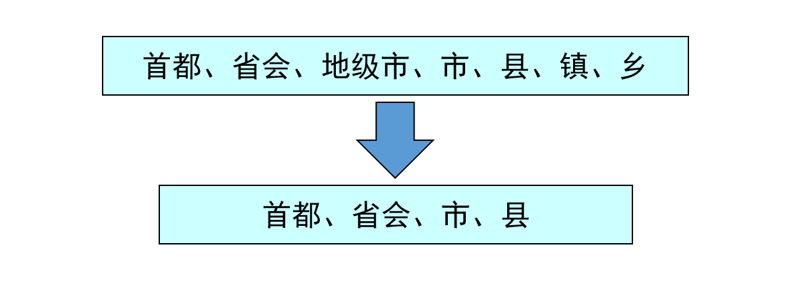
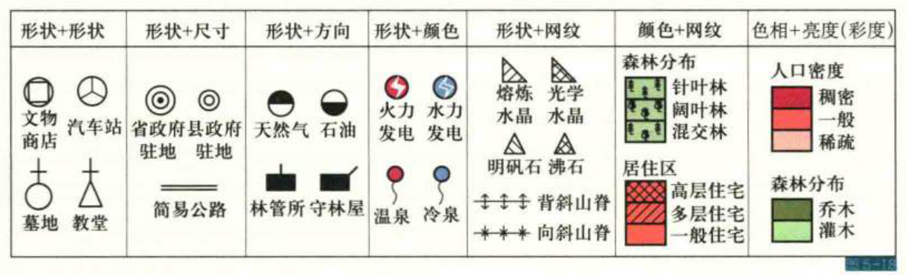
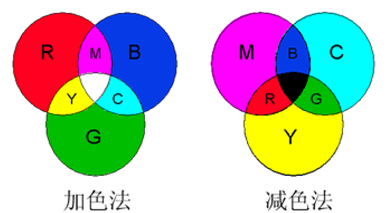
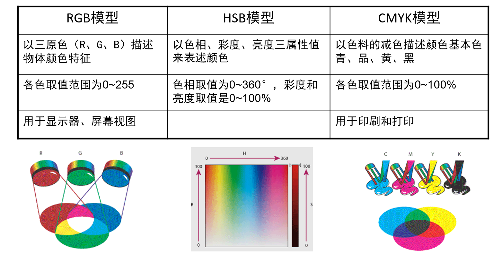
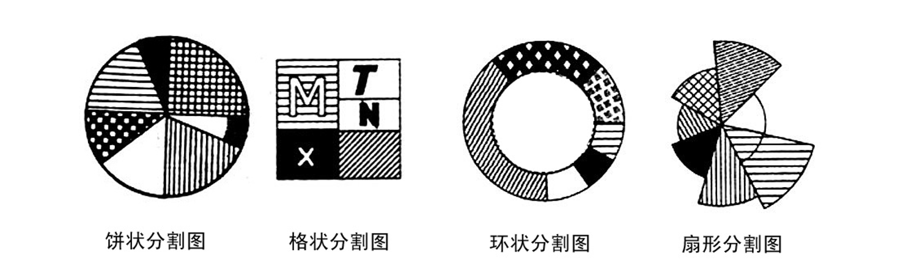

# 期末
地图主要特征、成图方法、分类

投影、数学法则

制图数据处理、量表系统、空间数据结构

地图概括、分类选取简化夸张

视觉变量*，

地理信息符号模型、专题制图

第八章，图

地图分析

三维特征表达、比例符号

# 第一章 导论
## *一、地图的基本概念
地图是根据一定的**数学法则**，将地球（或其他星体）上各种自然现象和社会现象，使用**地图语言**，通过**制图综合**，缩小表示在**平面**上，反映各种空间分布、组合、联系、数量和质量特征及其在事件中的变化和发展。

### *地图的主要特征
1. **地理信息的载体**：空间结构和时间序列的变化，以及各现象间的相互联系。
2. **数学法则的结构**（可量测性）：坐标、比例尺、投影是构成地图的数学法则。
3. **有目的的地图概括**（一览性）：分类、简化、夸张与符号化
4. **符号系统的运用**（直观性）：地理信息的图形表达借助地图符号，便于空间定位以显示各种现象及其属性的相互关联。

### 地图的功能
1. **认知功能**：地图是人类空间认知的结果，也是进行空间认知的工具。
- 空间认知：建立地图的空间概念，空间的位置、范围、格局、相互关系及其变化。
- 图形认知：运用图形思维和地图语言，对地图信息的质量特征、数量特征及在分布规律与区域差异上的认识。

2. **信息载负功能**：地图是地理空间信息的载体。
- **地图内容**：地图上看到的图形要素的总和
- **地图信息**：地图信息由直接信息和间接信息组成。直接信息指用图形符号直接表示的地理信息；间接信息经过解译、分析而获得的有关现象或实体规律的信息。

3. **信息传输功能**
信息传输过程时地图制图者（信息发送者）把对客观世界（制图对象）的认识进行选择、分类、简化等信息加工，经过符号化（编码）制成地图；通过地图将信息传输给用图者（信息接收者），用图者经过符号识别（译码），同时通过对地图的分析和解译，形成对客观世界（制图对象）的认识。
在制图与读图的过程中，信息的传输存在误差

4. **模拟功能**：地图是一种经过简化和抽象的，以符号、颜色和文字注记描述地理环境的某些特征和内在联系的空间模型。
过程/信息模拟，可视化信息
- **物质模型**：显示各种地理要素的普通地图
- **概念模型**：代替事物的调查与量测做各种模拟分析而产生的概念模型

## *二、地图的成图方法
#### 实测成图
在现场或记录载体上，利用各种测量设备进行测量作业，将成果缩小绘制在介质上的过程。
1. **野外地形测图**
2. **摄影测量成图**

#### 编绘成图
根据各种制图资料，以室内作业为主的过程。
1. **常规编图**：根据地图、航空像片判读成果、统计数据、文字资料及必要的外业调绘，应用传统的制图技术编制地图的方法。
2. **遥感制图**：利用航空和航天数据进行各种地图编制的过程

#### 数字制图法
应用计算机和图像输入、显示和输出设备，在制图软件的支持下，模拟手工作业各阶段进行地图设计和原图编绘的成图方法。

## *三、地图的分类
### *地图类别
1. **按区域范围**
- 星球图、地球图
- 世界图、半球图、大洲图、大洋图
- 国家图、次级行政区图
- 局部区域图，如海湾图、流域图等
2. **按比例尺分类**
- 大比例尺：1：10万或更大
- 中比例尺：1：10万至1：100万
- 小比例尺：1：100万及更小

国家基本比例尺地图有11种，将1：2.5万及更大的地图称为重点地图。

3. **按内容分类**
- 普通地图
- 专题地图
- 专用地图
- 特种地图
- 通用地图：为广大读者提供科学或一般参考的地图，如地形图
- 专用地图：为各种专门用途制作的地图
4. **按维数分类**
### 地图的多种形态
- **模拟地图**：地理信息经过人工抽象和符号化了的地图，是以纸质、丝绸或其他载体作为介质的产品，属于模拟地图。
- **数字地图**：数字形式记录和存储的地图。包括栅格和矢量的数字图形。据以生成地图的数字记录
- **电子地图**：在屏幕上，数字记录被符号化了的数字地图

## 四、地图学
地图学是以地理信息可视化为核心，探讨地图的理论实质、制作技术和使用方法的综合性科学。

### 地图学的学科体系和理论的发展
- **廖克体系**
理论地图学：地图空间认知理论/地图信息论/地图信息传输论/地图感受论/地图模型论/地图符号论
地图制图学：地图投影/普通地图制图学/专题地图制图学/遥感制图学/计算机制图学/地图制印学
应用地图学：地图分析与应用/地图解释与应用
- **王家耀体系**
理论地图学：基础理论/应用理论/地图学史
地图（地理）信息工程学：模拟地图制图
应用地图学

#### 地图学理论的探讨
- 地图空间认知理论
- 地图模型理论
- 地图信息与传递理论
- 地图符号与视觉感受理论

### 地图学相关学科

## 二、地图的基本内容

### 数学要素
- 坐标网：制作地图时绘制地图内容图形的控制网，利用地图时可以根据它确定地面点的位置和进行各种量算。地理坐标网/直角坐标网
- 控制点：测图和制图的控制基础没保证地图上的地理要素对坐标网具有正确的位置。平面控制点/高程控制点
- 地图比例尺：表示地图对实地的缩小程度，是图上线段与该线段在实地长度之比。
- 地图定向：一般地图图形均以北方定向

### 地理要素
- 自然要素：包括海洋要素、陆地水系、地貌、土质、植被、地质、气候、水文、土壤等。
- 社会要素：包括居民地、交通网、境界、行政中心、人口、经济、社会事业、历史等。
- 其他标志：方位五，革命和历史性纪念标志，磁力异常标志，经济标志，科学、文化、卫生等方面的标志。

普通地图包括基本地理要素，专题地图包含基础地理要素和主体要素。

### 整饰要素（图外辅助要素）
指为阅读和使用地图时提供的具有一定参考意义的说明性内容或工具性内容。
包括：图名、图号、接图表、图例、图廓、分度带、图解比例尺、坡度尺、三北方向图、图幅接合表、行政区划略图、各种附图，以及编图时使用的资料、资料略图、坐标系统、编图单位、编图事件及成图说明。

### 普通地图基本要素
定位基础，地貌，水系，土质与植被，境界与政区，居民地与设施，交通网，管线。

#### 地图信息
- 语义信息：地图符号的含义所包含的信息，即符号与实体的关系
- 语法信息：符号与符号的配合使用，分布，联系体现的地理规律所包含的信息
- 语用信息：读者所领悟的信息，与地图的质量和读者自身知识素养有关。

## 六、地图的分幅与编号

### 1. 地图分幅

#### 1. 矩形分幅

1. `拼接分幅`使用共同的图廓线,适用于挂图和大于1: 2000的地形图.
2. `不拼接分幅`没有共同边,常有重叠.适用地图集,专题地图等. > 重叠在(遥感影像)大部分时候都是必要的,因为需要校正.

优缺点：

- 图幅之间接合紧密，便于拼接使用
- 各图幅印刷面积相对平衡，有利于充分利用纸张和印刷机版面
- 可使分幅线有意识避开重要地物，以保持图像在图面上的完整
- 没有明确地理坐标，图幅缺少准确的地理位置概念
- 整个制图区域只能一次投影，变形较大

#### 2. 经纬线分幅

> 我国基本比例尺地形图就是按经纬线分幅的，是以1：100万地图为基础，按规定的经差和纬差划分图幅，使相邻比例尺地图的数量成简单的倍数关系
> 

优缺点：

- 明确地理位置概念，适用于很大区域范围的地图分幅
- 可分多次投影，变形较小
- 经纬线是曲线时，图幅拼接不方便
- 相同经差、纬差面积不同，不利于利用纸张和印刷机版面
- 破坏重要物体的完整性

### 2. 地图编号

多幅地图中每一幅图用一个特定的号码来标志，叫做地图编号。地图编号应具有系统性，逻辑性，不重复性等特点。

1. 自然序数编号：依次编号
2. 行列式编号：分别用字母或数字表示行号和列号。eg. (S/N)F53
3. 行列-自然序数编号：
4. 经纬度编号：图幅右图廓的经度除以该图幅的经差得行号，上图廓的纬度除以纬差该图幅的纬差得列号。
5. 图廓点坐标公里数编号：西南角图廓点坐标公里数编号。

### 3. 我国地形图分幅编号规则

1∶500、1∶1000、1∶2000、1∶5000、1∶1万、1∶2.5万、1∶5万、1∶10万、1∶20万、1∶50万、1∶100万

[在线预览|GB/T 13989-2012](http://c.gb688.cn/bzgk/gb/showGb?type=online&hcno=30799A9AF9BFA98E77D21ABC5F0984E2)

[我国基本地形图分幅与编号](https://www.notion.so/83da6241e753434fb7758cc26d312b53?pvs=21)

1. 在1：100万基础上，不断对半分幅，其中1：25万→1：10万，1：5千→1：2千是3分，1：2.5万→1：1万是2分
2. 1：100万比例尺地图分幅：（1）纬度60以下单幅经差6度，纬差4度；（2）纬度60到76双幅经差12度，纬差4度；（3）纬度76到88四幅经差24度，纬差4度；（4）纬度88以上单独为一幅。
3. 省略国际1：100万地图编号中用来标志北半球的字母代码N。
$$ X = $$
4. 1：1000，1：200的分幅从三位数字码变为四位数字码，正方形分幅和矩形分幅的编号方法。（1）坐标编号法；（2）流水编号法；（3）行列编号法。

## 七、地图简史

# 第二章 地图的数学基础
## 一、地球体
### 地球的基本特征

- **地球量度**：
- **物理表面**：
- **数学表面**：

### 地理坐标
球面坐标
#### 天文经纬度
[天文坐标系]
表示地面点在大地水准面上的位置。

基准：铅垂线和大地水准面

- 天文经度：观测点**当地铅垂线**所在南北方向平面（观测点的子午面）与本初子午面的夹角
- 天文纬度：观测点的铅垂线与赤道面的夹角
- 海拔高（正高）：观测点到观测点在大地水准面的投影点的垂线距离。

#### 大地经纬度
[大地坐标系]
表示地面点在参考椭球面的位置

基准：法线和参考椭球面

- 大地纬度B：地面点的**椭球法线**与参考椭球赤道面的夹角
- 大地经度L：地面某点法线与参考椭球短轴所在的子午面与本初子午面的夹角
- 大地高 $L$：某点沿法线方向到参考椭球面的距离

#### 地心经纬度
[地心坐标系] [参心坐标系]
- 地心纬度：原点连线与赤道面的夹角
- 地心经度：同大地经度

## 二、对地观测系统
### 大地坐标系统
#### 地心大地坐标系统
- 具有三维信息
- 高精度
- 动态框架
- 高效

### 大地控制网
#### 平面控制网

**椭球定位**：首先选择对一个国家比较适中的大地测量原点P，过P点作大地水准面的垂线叫水准面于P‘，设想地球椭球在P’点与大地体相切，这时，过P‘点椭球面的法线与水准面的垂线重合。用天文测量的方法求得P点天文坐标，并测出P点对另一点的方位角，作为P’点的大地坐标和大地方位角。

## 三、地图投影

### 1.地图投影的概念
将地球表面展开成平面

### 2. 地图投影的变形

- **变形椭圆**：地球上一个无穷小的圆——微分圆，在投影后变为一个微分椭圆。可以利用微分椭圆去解释变形特征。

- **主方向**：无论采用何种转换方法，球面上没一点至少有一对正交方向，在投影平面上仍能保持其正交关系（迪索定律）。投影后仍保持正交的一对线的方向称为主方向。微分椭圆长、短半轴的大小，等于该店主方向的长度比。

#### 长度比

#### 角度变化

#### 面积比

### 3. 地图投影分类
#### 按投影构成方法

1. 几何投影
- 方位投影：以平面位辅助投影面
- 圆柱投影：以圆柱面为辅助投影面
- 圆锥投影：
根据投影面的几何位置，分为正轴投影、横轴投影和斜轴投影。

2. 非几何投影
根据特定的制图需求，通过数学解析方法，获得平面与球面之间的点与点的函数关系。
- 伪方位投影：纬线为同心圆，除中央经线投影为直线，其余经线均投影成对称于中央经线的曲线
- 伪圆柱投影：
- 伪圆锥投影
- 多圆锥投影：借助多个圆锥表面与球体相切

#### 按形变性质：
- 等角投影：交通图，洋流图，风向图
- 等面积投影：对面积精度较高的自然社会经济地图
- 任意投影：一般参考图和中小学教学用图

### 4. 投影计算举例
1. **兰勃特等角圆锥投影**：制作中纬度地区中小比例尺地图
2. **墨卡托投影**：正轴等角切圆柱投影。保持了方向和相对位置的正确性，使等角航线在图上表现为直线。（等角航线：两点间的一条等方位线，以极点为渐近线的螺旋曲线。）
3. **高斯-克吕格**：等角横切椭圆柱投影。

### 4. 地图投影的选择
- 我国基本比例尺地形图除1：100万外均采用高斯-克吕格投影为地理基础
- 1：100万地形图采用Lambert兰伯特投影（正轴等角割圆锥投影）
- 大部分省区图以及大多数这一比例尺的地图也多采用兰伯特投影呃属于同一个投影系统的Albers投影（正轴等面积割圆锥投影）
[地图投影](https://www.notion.so/3912adfb20924a4794ce17ec30ed290e?pvs=21)

### 3. 方里网
平行于投影坐标轴的两组平行线构成的方格网，因为是每个整数公里绘出的坐标纵线和坐标横线，所以称为方里网。
- 作用：大比例尺地图上，方便展绘点位和读图上的地理坐标
- 建立方式：以中央经线投影后的直线为X轴，以赤道投影后的直线为Y轴，他们的交点为坐标原点。

## 四、地图比例尺

# 第三章 地图数据源
## 一、地面测量数据
1. 地形图——大比例尺实测地形图。（1）研究制图区域地理情况；（2）鉴别其他地图质量的主要依据；（3）编图时作为基础地图的主要依据
2. 各种专题地图。主题内容都表达详细、真实，可以用于研究地理环境，也可用于
3. 全国性的指标图。如山系图、河系类型图、河网密度图、居民地密度图、典型地貌分布图
4. 国界系列样图

## 二、多源遥感数据
### 航空像片
[航空摄影测量](../04-摄影测量学/02-摄影测量基础知识.md)

### 像片平面图与正射像片
### 卫星影像
1. 卫星像片
2. 航空像片：可用于更新单体建筑物,判认建筑物的高度
3. 地面摄影像片

### 像片解读与制图
#### 像片解读的任务
1. 确定某些地物和现象的存在，解释它们的性质；
2. 从图像上判断待定地物的延续方向、分布范围。确认它的边界；
3. 测量待定地物和现象的主要参数，如长度、宽度、高度、产状，并求出地理坐标或直角坐标；
4. 解释各种现象间在空间、时间及成因上的相互关系。

#### 像片解读的标志
##### 直接解译

1. 形状：像片上地物的顶部
2. 尺寸
3. 色调
4. 阴影：地物本身未被太阳照射的部分称为`本影`，周围造成的阴影称为`落影`

##### 间接解译
形态、位置、活动、结构和团、水系格局

#### 像片调绘
在覆盖着航空像片回卫星影像的聚酯绘图片上，针刺点位并注记它的属性和地理坐标

### 无人机遥感技术

## 三、全球导航卫星系统数据

## *四、制图数据与处理
### 地理资料
#### 数据类型
1. **空间数据**
- `空间特征`表示现象的空间位置或所处的地理空间
- `时间特征`现象或事件随时间的变化
- `属性特征`表示现象或事件的名称、类别、变量和数量等
2. **定性数据与定量数据**
- `定性数据`表示空间或时间上事物在性质上的差异，不考虑数量变化
- `定量数据`用可计数的值表示某一事物
3. **自然资源和社会-经济数据**
- `自然资源数据`包括位置、气候、地势、地质、水温、土壤、制备、资源等所有表征自然资源与环境的数据。
- `社会-经济资料`包括定期的人口普查、经济普查成果

#### 数据变换
有利于计算机存储，是一个量化过程
1. **定性数据转换成定量数据**
- `有序数据转换`：将有次序或有等级关系的定性数据用定量数据表示
- `二值数据转换`：
2. **数据本身转换**
将原始数据通过转换变成新值，便于计算与可视化，包括对数变换、模数变换、指数变换等。

### 数据的预处理
#### 数据分布的量表
> 量表系统是用于测量或评估特定变量或属性，实现“从数据到信息的转换”的工具。通常包含以下要素:
> - 定义：明确量表所要测量的具体概念或属性
> - 单位：确定用来表示测量结果的单位。
> - 标度：设定量表的范围和刻度
> - 方法：如何使用量表进行测量的方法，确保数据的一致性和准确性。

1. **定名量表**：依照制图对象的固有（定性）特征进行区分。众数最佳的数字统计量。
2. **顺序量表**：将数组按顺序排列，其结果没有绝对零值。运算方法是选择中位数，并以四分位法研究数据的排序位置或编号的离差。不能进行加减运算。
3. **间隔量表**：不仅表示数据的顺序，还能精确测量每个数据点之间的差异。数据之间的差距是等距的。可以进行加减运算
4. **比率量表**：间隔呈比率变化，有绝对零值

#### 两种现象的相关分析
在两幅相同区域地图上以格网点或地形特征点选取同名点记录其统计值。用相关系数描述两者的相关程度。

## 五、地理数据库与数字地球
### 地理数据库

# 第四章 地图概括
## 一、地图概括
采取分类、选取、简化、夸张等方法，提取空间信息中主要的本质信息。

> 对地图数据和图解形式经过科学处理，使其能表现出制图现象的基本特征和典型面貌。

外业测图中对地形、地物点进行分类和必要的取舍；内业成图时，对地理数据进行分类、简化、夸张处。

详细性与易读性的统一；地理适应性与几何精确性的统一。

> 几何精确性——位置精确性
> 地理适应性——表达制图区域主要特征，保持空间关系正确

### 影响地图概括的因素
主要通过影响地物在地图中的重要程度影响地图概括的程度与方向。
1. **地图的用途与主题**：是影响地图概括的主导因素
2. **地图比例尺**：限定了图幅大小与承载地理要素总量。
3. **制图区域地理特点**：地图概括要根据区域景观特征来确定选取指标和概括的原则，尽可能表现制图区域的自然景观或人文景观的结构和区域分布规律。
4. **制图数据质量**：地图数据源精度应高于新编地图的精度。经度高的空间数据，对地理实体的内反映比较丰富，对细部反映的比较详细。
5. **图解限制**：一是在地图上对图形表示精细程度的制图限制，二是人们由于受生理和心理因素作用对地图图形识别的限制。

### 手工概括与自动概括

## 二、模拟地图的概括内容与方法
分类、选取、简化、夸张
### 1. 分类
#### **按质量特征的分类**：
将空间数据依属性合并，用简化分类取代详细分类，或取消低级别类型。

专题地图的分类是根据学科体系的简化。

| 表 4-2   | 地质图 | 地貌图 | 土壤图 | 植被图 |
|----------|--------|--------|--------|--------|
| 大比例尺≥1：10万 | 表示群、组，有时表示统 | 表示地貌形态类型第四级（最低级） | 表示土种、变种，有时表示土属 | 表示植物群丛，有时表示群丛组 |
| 中比例尺1：10～100万 | 表示统，有时表示群 | 表示地貌形态类型第三级 | 表示土属亚类有时表示土种、土类 | 表示植物群丛组，有时表示群系 |
| 小比例尺≤1：100万 | 表示系，有时表示统 | 表示地貌形态类型第二级或第三级 | 表示亚类、土类 | 表示植物群系，有时表示群系组 |
#### 按数量特征的分类
例如基本等高线-半距等高线-加粗等高线-辅助等高线。常依比例尺可表达的程度进行。

### 2. 选取
**类别选取**：整个一类信息全部舍弃或选取——地图内容设计的任务。
**级别选取**：舍弃某一级别的信息，舍弃次要的、等级低的对象。

#### 资格法
- 按照一定**数量**标志和**质量**标志。（条件）
- 选取标志：（1）数量标志：长度、面积、产值；（2）质量标志：等级、品种、性质
- 优点：标准明确，简单易行；
- 缺点：一个标志不能全面衡量物体的重要程度；同一资格无法预计选取后的地图容量。

#### 定额法
- 规定出大内面积内应选取的制图物体的**数量**而进行选取的方法。
- 指标经过图解、计算分析及编图试验取得。
- 优点：预计地图容量；保证地图丰富内容而不失去易读性；
- 缺点：无法保证在不同地区保留相同质量指标

#### 区域指标法
- 根据制图区域的景观结构特征、区域分布规律及相关要素的分布特点选取指标。
- 对制图区域进行分区研究，将分区内的对象编列成图表和说明即为指标图。
- 选取指标区间应有交叉

### 确定选取指标的集中数量分析方法
1. **图解计算法**
以`地图符号的面积载负量`选取数量指标 $S=n(r+p)$。
2. **开方根规律法**
根据新编地图与资料地图的比例尺关系确定选取地图的数量。 $N_B = N_A \sqrt{M_A/M_B}$ 。

### 3. 简化
#### 轮廓特征的简化
对线状地物、分界线、面状地物的复杂轮廓进行简化，通常采取删除、合并等处理手段。
- 保留特征转折点
- 保持线状地物和面状地物经过简化后形状的相似性
- 保持不同弯曲段弯曲程度的对比关系
- 保持面状地物轮廓图形和线状地物弯曲状况的基本特征
- 保持弯曲和特征转折点的相对精确性

- 资格选取：弯曲的宽度与深度为指标。宽度与深度只有一个符合要求时，根据形状特征，删除或夸张使其符合标准。

#### 地物内部结构的简化
- 特征点的删减
- 碎部合并
- 图形结构的分割

起示意作用，表达街区、道路等的格局。

### 4. 夸张
在图形上减少多余碎部，夸大表示有重要意义的碎部。
1. **不依比例尺放大**
例如线状地物在宽度上放大；有特征意义的线状、面状地物轮廓的细小弯曲的夸张
2. **移位**
次要地物为主要地物移位；无主次之分均作相应移位。

### 地图概括对地图精度的影响
- 地图描绘产生的误差
- 符号唯一产生的误差
- 形状简化产生的误差

# 第五章 地图符号
## 一、地图符号设计基础
### 地图符号的功能
1. **信息传输**：地图符号系统表达和传递一切与地理空间相关的信息。
2. **思维拓展**：形象思维是人类产生创造性思想的源泉。

### 地图符号的分类
- 按比例分类：依比例符号、半比例符号、非比例符号
- 视点分类：俯视符号、侧视符号
- 定位关系：定位符号、说明符号
- 抽象程度：具象符号、抽象符号、文字符号
- 空间纬度：点状符号、线状符号、面状符号、体状符号、多维动态符号

## 二、符号的视觉变量及其设计
### 1. 视觉变量
构成图形符号的基本要素，也称`图形要素`，由6个变量组成：形状、尺寸、方向、亮度、色彩、纹理

1. **形状变量**：符号本身的图形轮廓
2. **尺寸变量**：在各几何维度上的度量变化。
符号大小与其所表达数值的比例关系，包括：绝对比率、相对比率、任意比率。
3. **方向变量**：单个符号图形本身的方向变化；网纹中同类纹理的方向变化
4. **颜色变量**：既可表达定性特征的不同，也可表达定量的差异。
5. **网纹变量**：具有一定形状大小的点、线组合排列成的图案。
子变量：样式、尺寸、排列（方式、顺序、方向、间隔）
####  视觉变量的组合

### 2. 地图符号‘形’的设计
1. **形状与方向设计**：应尽量保持符号与实体之间的相似与同构
- 以形分类
- 与实体相似或同构
- 力求变化

2. **尺寸设计**：主要用来表达地理要素属性的数量区别或等级高低。
- 顺序量表：各等级符号有明确的数量差异
- 间隔量表与比率量表：力求符号尺寸与属性数量指标保持一定的比率，分为绝对比率与相对比率

### 3. 动态视觉变量
引入6个特征描述：显示时刻、持续时间、显示次序、变化速率、频率、同步

## 三、色彩及地图色彩设计
### 1. 色彩的表示
#### 色彩混合
- 加色法：光的混合为加色法。是屏幕地图的设色依据
- 减色法：颜料的混合方法，印刷地图元的设色依据

#### 常用计算机表色系统

### 2. 地图用色设计
#### 定性特征设色
- 色相是用来区分要素的不同类型或不同定性等级最适当的视觉变量。
- 为不同类型的地图符号选定颜色，应从相似性和层次性两方面考虑。
- 政府机构和专业部门为某些类型的地图指定了用色标准。

#### 定量特征设色
- 常用渐变色阶表达事物空间分布的数量特征
- 单色阶渐变是通过同一色相的亮度或彩度变化来实现的
- 双色渐变或多色渐变色戒可同时表达定量特征及相应的质量特征差异

## 四、注记
地图上的标注和各种文字说明它是地图的基本内容之一。是地图的基本内容之一，注记也是一种地图符号。

### 注记的分类
可分为：`名称注记`、`说明注记`、`图幅注记`
- 名称注记：包括地名、河名、山名等。
- 说明注记：说明地理要素具体的属性值
- 图幅注记：对整幅图的各种说明文字，如图名、图例说明、制图说明等

### 注记的设计
- 内容设计：准确传达信息的同时力求简明扼要，避免使用缩写。
- 位置与排列：与被说明对象形成一体
- 字体及其大小、颜色：普通地图常用黑色注记表示居民地、蓝色表示水系、棕色表示地貌；注记尺寸反映地物重要程度、字体则反映地物的等级；变形字体可表示特殊地形要素。

# 第六章 地理信息的符号模型
## 一、对地图模型的理解
以符号的组合反应制图对象的时空分布，形成与对象对应的同构关系，从而构成客观世界的形象-符号模型。

#### 地图符号模型体系
- 萨里谢夫：个体符号法、线状符号法、质底法、等值线法、定位图表法、点描法、范围法、运动符号法、分级统计图表法、分区统计图法
- 应霍夫：（1）点状符号或定位、线状要素网、类型或类型网纹、连续要素、运动要素；（2）点值符号的散布、密度镶嵌、其他统计镶嵌、定位面积表、运动线统计图表；（3）时间或空间重叠、联合

将地图符号模型分为点、线、面、体、动态五个基本类型。

## 二、点状符号法
利用某种具有明确图面定位的独立个体符号，形成地理信息在地图上的点状表示，称为`定位符号法`

### 表达质量信息
以点状符号表示的制图对象，其定性信息常常表现为**多层次的视觉变量的分级组合**。

### 表达数量信息
1. **表达地图信息的强度或排序**
- 顺序量表
- 尺寸变量，辅以亮度、彩度变量
- 非比率定位符号

2. **表达地图信息的数量差别**
- 间隔/比率量表 
- 尺寸变量为主，精确表达差异。
- 定位比率符号，比率确定是关键

#### 比率符号
- **绝对/条件比率符号**：数据与面积呈正比例；呈函数关系，线性比率法、对数法、心理比率法。$ L = k* M^{0.57} $
- **连续/分级比率**：每个符号的大小与代表的数值一一对应；按统一规则确定代表各级数组的单一数值。

### 定位符号表示内部结构及其时空变化
#### 1. 分割图
反映了事物总量及其内部组成。通常使用环形图，避免遮挡地物。

#### 2. 坐标统计图
- 金字塔图
- 三角形图
- 玫瑰图

#### 3. 立体符号
- 球状
- 柱状
- 轴侧符号

#### 4. 定位处理
- **精确定位**：普通地图中，应使点状符号的中心、重心或底点与地物位置相重合
- **概略定位**：表达专题现象的点状符号有时只是概略定位，即只要求符号位置合理。

## 三、线状特征表达
**1. 定位特征：**
- 精确定位：明确且稳定空间路径的线状现象。如经纬线、境界线、油气管线、线性构造。
- 概略定位：动态变化或不易明确路径。如人口迁徙、洋流。

**2. 状态特征：**
- 静态：常规状态相对稳定或静止。如常年河、道路、边界线。
- 动态：沿一定路径、趋势移动、变化的线状现象。如物流、动物迁徙、大气运动。

### 线状符号表达质量信息
1. 定名：形状变量、颜色变量
2. 顺序/间隔/比率：尺寸变量、颜色变量
3. 结构与时间变化：事物的运动轨迹、趋势

反应移动的起点和终点、表示行进路线、流量与流速、性状指标、相互联系

## 四、面状符号
**空间分布形态**：连续分布\离散分布；渐变分布\突变分布
- 精确定域：行政区划、地籍管理
- 概略定域：动物分布、地震范围

### 1. 面状特征定性信息表达
1. **质底法**：
以充满全制图区域的不同颜色或图案的图斑，一般是精确定域，不允许空白与交叉。如类型图、区划图。
2. **离散分布**
通过轮廓线、颜色或网纹图案表示面状离散分布现象真实或隐含的分布范围的方法。
交叉与重叠：事物间的相互影响与渗透。

### 2. 面状信息定量信息表达
#### 以点状符号构成的定量表示：
1. **点值法**：用形状相同、大小与其代表的数值呈**固定比率**的圆点符号表达离散现象分布特征。
- 均匀布点法：统计区域内没有密度差别
- 定位布点法：在更小区划单元内布点，最后去除界限。

2. **分区统计图法**：将制图对象在统计分区的绝对数量指标以点状符号表达在相应区划单元内的方法。
3. **定位图表法**：通过定位于数据采集点的统计图标反应一定范围内的面状现象，借以表达事物在整个制图区域连续变化的数量分布特征。

#### 以线状符号表达：
1. **等值线法**：等值线来源于3维空间的离散点值，由它计算出具实际点位意义的等值点构成等值线。
2. **分层设色**：在等高线的基础上根据地图的用途、比例尺和区域特征、将等高线区域划分若干层级，并在每一层级的范围内渲染不同颜色，以色相、色调的差异表示地势高低起伏的方法。
3. **伪等值线**：将高程数据换为其他统计值，衍生的伪等值线，称为伪等值线。

#### 以面状符号表达：
1. **等值区域法**：以面状符号表示区域单元的相对数量指标，通过填绘颜色或图案体现区域间的数量差异。其数据特征在统计单元内是连续和恒定的，但在单元之间是离散的，突变的。
分级方法：分5~7级，分为固定间隔、规则间隔、变化间隔
2. **网格法**：按特定的网格形状将制图区域划分呈多个单元，以不同色彩或网纹表达制图对象空间分布特征。

### 3. 面状分布时空变化的表达
1. 以多幅序列图的方式形成时空变化显示
2. 将不同空间区域上依次发生变化的面状现象直接抽象成对应的时序面状符号。

## 五、三维特征表达
### 1. 等高线与测绘
- `等高距`：相邻两条等高线之间的高程差。
#### 等高线的特性
- 封闭连续曲线，同一等高线上数值处处相同。
- 彼此不相交；可能重叠
- 等高线图形是对制图现象空间形态较好的几何模拟与概括。
- 等高距相同的情况下，等值线越密，空间垂直变化愈大。

#### 等高线法的不足
视觉效果不明显；等高线间微地形不能清晰表达。
- 对等高线本身的改进
- 利用图形要素强化地形地貌表达的立体效果

### 2. 地表形态的多种表示方法：
- 写景法：也称透视法。
- 晕滃法：运用粗细长短疏密不同的短线划反映地形陡缓变化
- 分层设色法：根据地图用途、比例尺和区域特征，将等高线划分为不同高程范围带，并以不同颜色普染，通过色相、色调的差异表现地势高低。
- 晕渲法：按光源分为直照晕渲、斜照晕渲、综合光照晕渲。

## 六、地理信息动态表达

# 第七章 普通地图

## 一、地理图和地形图
- `普通地图`：以相对均衡的程度表示地表自然和人文要素基本特征的地图。分为`地理图`与`地形图`
#### 地理图
概括程度**较高**，以反应地理环境要素基本分布规律的普通地图。

特点：
- 高度概括
- 灵活多样
- 制图资料的多样性与精度不均衡性

类型：
- 区域性全图：反映区域总体形势、攻浏览区域全局的普通地图，通常以单体图幅完整表达区域地貌。
- 区域习惯分幅图：按一定的警察和尾插分幅的普通地图。
- 普通地图集：由大量反映区域基本地貌的普通地图构成，按区域面积的大小用多级比例尺的地图组合配置，以反映区域的自然地理和社会人文方面一般特征。

#### 地形图
按照统一的数学基础，统一的测量和编图规范要求，经过实地测绘或根据遥感数据和相关数据，以统一的图式图例编绘而成的一种普通地图。

国家基本地形图的特点：
- 具有统一的大地坐标系统和高程系统
- 具有完整比例尺和分幅编号系统
- 依据统一的规范和图式

国家基本地形图的功用：
实现详细的定性分析，同时可以实施精确的定位量测。
一个国家或地区记录、表达、获取基本地理空间信息最重要的形式，具有法律效应。

## 二、地形图内容及其表示方法
地形图基本内容要素分为3类共计10项：
- **自然地理要素**：水系、地形地貌、土质与植被
- **社会人文要素**：居民点、交通网、境界线、管线垣栅
- **其他要素**：坐标网、控制点、独立地物

### 自然要素
#### 水系
制图上，水系是仅次于地图坐标和控制点的地图控制骨架；地理上，对反映区域地理特征具有标志性作用，对人类活动由显著影响。
- 海洋要素主要是海岸，具体包括海岸线、干出线、干出滩。
- 河系，水涯线一般按摄影时的水位测定

#### 地形
地形是地形图上最基本的表现内容

#### 土质与植被
土质是**土壤的构造和性质**。
土质和植被是一种呈面状分布的地理要素。

### 人文要素
#### 居民地
人类因社会生产和生活需要而形成的居住和活动场所
居民地类型与行政等级
- 城市/乡镇/村庄

居民地的位置与形状
- 大比例尺地图：县市以上居民点可以概括为平面图形
- 小比例尺：通常用圈形符号

#### 交通网
陆路、水路、空中交通的总称。

## 三、国家基本地形图的分幅与编号
### 地图投影的分带
- 小比例尺地形图采用等角圆锥投影，按纬差4度经差6度分带。
- 大、中比例尺采用高斯-克吕格投影

#### 辅助要素
1. 地形图图廓整饰有关说明
2. 成图时间与更新周期
地形图的更新周期根据地形、地物的
3. 三北方向图
4. 坡度尺

## 四、国家基础地理信息库
通过数字方式进行计基础地理信息的获取、编辑、存储、发布、维护和更新。
- 地理数据库：数字线划地图数据库、数字栅格地图数据库、数字高程模型数据库、数字正射影像图数据库、地名数据库、元数据库
- 影像数据库
- 大地数据库
- 专题应用数据库

1. **数字线划图**
数字这是量化地图，目前数字地图的一种主要形式
2. **数字栅格地图**
又称数字像素地图，是纸质地形图或分版胶片经扫描后而获得的数字地图产品。
3. **数字影像图**
对航空像片或卫星影像经过像元纠正、图像镶嵌、加绘坐标网、线划符号、注记生成的与地图功能类似的影像数据集。
4. **数字高程模型**
通过建立在高斯投影面上的地表面一定间隔网点上的数据集合

# 第八章 专题地图
## 一、专题地图基本特征与分类
选题内容广泛、表现主题专一、构成要素的双重性、表现方法多样、图面配置灵活。
### 按内容分类
#### 1. 自然地图
反映自然现象的各种地图
地质图、地球物理图、地势图、地貌图、气象气候图、水文图、土壤图、植被图、动物地理图、综合自然地理图

#### 2. 人文地图
反映各种社会现象的数量与质量特征及其空间特征及其分布的专题地图，称为人文地图。
政区图、人口地图、经济地图、城市地图、社会事业地图、历史地图

#### 3. 环境地图
反映自然环境本底状况，人类活动对环境产生的 影像和破坏及所作出的环境质量评价，人类对环境采取的保护和智力措施等内容的专题地图，称为环境地图。
- 环境背景地图：反映人类活动影像前或很少受人类活动影像的自然环境本底状况
- 环境污染地图：主要反映污染源、污染物的分布和浓度。
- 环境质量评价与环境影响评价：
- 环境医学地图：自然环境因素及社会因素对疾病发生、传播影响的分布范围、严重程度、从而解释疾病发生。

#### 其他专题地图
教学地图、航海图、航空图、宇航地图、旅游地图

### 按内容概括分类
- **解析图**：仅反映单一专题要素、指标的专题地图
- **组合图**：同时反映两种以上要素或指标的专题地图
- **合成图**：将制图区域相关因素的多种指标，经综合分析，重新构建反映区域综合特征的分类指标，并以此体现区域差异。表达这种综合指标的专题地图，称为综合图。

## 二、专题地图的设计编辑
### 1. 专题地图数据获取加工
#### 数据类型
- 地图数据：普通地图/专题地图
- 遥感影像数据
- 实测和统计数据
- 文字资料

#### 专题地图数据加工
- 归并或改变分类：
- 改变数量指标：扩大数据的分级间隔或根据原始数据进行重新分级；换算称同一单位、时间数据
- 改变表示方法：随新编地图比例尺的缩小，表示方法也应相应改变
- 对搜集到的实测或统计数据，进行系统化整理。通过排序、列表，或者进一步对数据进行综合分析、对比分析、动态分析及相关分析等。

### 2. 地图底图设计与编辑

地理底图的作用：
- 建立专题底图的框架
- 转绘专题内容的控制系统
- 深入提取专题地图信息

地理底图的种类：
- 工作底图：内容详细，利于专题内容转绘，国家基本比例尺地形图常作为工作底图
- 出版底图：内容简略，主要作用是体现专题内容有关地理要素的相互关系

地理底图编制与数字化
- 工作底图的准备：为满足专题内容编绘的精度要求，工作底图内容应比出版底图内容详细，工作底图宜用浅色表示。
- 出版底图的绘制：常用浅淡颜色表示在第二层面上。
- 出版底图的数字化：可通过扫描数字化获取数字底图。

### 3. 专题地图表示方法选择与地图图例设计

#### 依据专题数据时空与量表特征选择表示

| 表示方法 | 定点符号法 | 定位图表法 | 线状符号法 | 运动线法 | 质底法 | 等值线法 | 范围法 | 点数法 | 分区统计图法 | 分级统计图法 |
| --- | --- | --- | --- | --- | --- | --- | --- | --- | --- | --- |
| **定点符号法** | √ | √ | √ | √ | √ | √ | √ | √ | V | √ |
| **定位图表法** |   | √ | √ | √ | √ | √ | √ | √ | √ | √ |
| **线状符号法** |   |   | √ | √ | √ | √ | √ | √ | √ | √ |
| **运动线法** |   |   |   | √ | √ | √ | √ | √ | √ | √ |
| **质底法** |   |   |   |   | √ | √ | √ | √ | √ | √ |
| **等值线法** |   |   |   |   |   | √ | √ | √ | √ | √ |
| **范围法**  |   |   |   |   |   |   | √ | √ | √ | √ |
| **点数法**  |   |   |   |   |   |   |   | √ | √ | √ |
| **分区统计图法** |   |   |   |   |   |   |   |   | √ | √ |
| **分级统计图法** |   |   |   |   |   |   |   |   |   | √ |

#### 依据地图用途、比例尺和区域特点选择
- 根据地图用途选择
- 依据专题数据量表特征：定名量表、顺序量表，课区别性质擦一、等级的各维度表示方法；
- 依据制图比例尺和区域特点选择：同以制图区域，由于图幅面积及可读精度发生变化，会使表示方法相应简化

#### 图例设计
完备性、一致性、系统性
> 专题地图的底图符号图例可以省略

### 4.专题底图的图面配置
#### 图面配置总体安排
- 符号及图形的清晰与易读
- 图面整体视觉对比度适当
- 正确处理图形与背景关系
- 实现图形配置的视觉平衡
- 图面设计有良好的层次结构

#### 图面内容具体安排
- 主图
在区域空间上，应突出主区与林区的图形与背景关系，增强主图区域的视觉对比度；
移图，制图区域的形状、比例尺与制图区域大小难以协调，将主图的一部分i
- 副图：显示主图在大区域范围内的位置
- 图名：为读图者提供区域和主题信息。内容区域、主题、时间
- 图例：
- 比例尺
- 图廓：单幅地图一般以图廓作为制图的区域范围，专题地图的图面配置，是由

## 三、遥感制图
- 卫星影像镶嵌图：不进行几何纠正
- 卫星影像图：进行几何纠正与影像增强
- 卫星影像地图：根据数字高程模型进行正射纠正，加绘部分符号与注记

#### 卫星影像的产生
- 几何纠正与重采样
- 数据融合
- 图像镶嵌
- 彩色合成

# 第九章 数字地图
## 一、关于数字地图制图及其相关技术
`数字地图制图`是利用计算机及相关设备和软件进行地图编制的过程。

数字地图/电子地图
数字地图的特点：
无缝组织、随需呈现、多维动态性、多媒体表达、
数字地图比例尺及所采用数据源的比例尺

#### 数字地图的应用
- 输出模拟地图
- 代替模拟地图

## 二、数字地图制图的理论与技术基础

### 空间数据结构与数据管理

#### 数字地图制图的硬、软件环境
- CAD，以平面制图为目的
- GIS软件，强调空间数据管理与分析

## 三、地理信息系统中的数字地图制图

# 第十章 地图分析
## 一、地图的评价
### 科学性
1. **地图的数学基础与几何精度**：
- 地图的数学基础，主要指地图的比例尺和投影
- 地图的几何精度，主要指地图上的定位精度
2. **地图的完备性及信息载负量**：
- 完备性：单幅地图反映对象的质量、数量及时间特征的基本内容和指标是否齐备，要素分类、分级是否正确科学；系列地图选题是否反映整个区域的各种相关要素或现象的基本内容和特征。
- 信息量：对比法和信息量测度
3. **地图概括的质量与地理适应性**：
- 地图的地理适应性与几何精确性的统一
4. **制图资料的现势性**：
- 地图内容与实地的符合程度，应以人文要素为主，如居民地、交通网、境界线等。
- 文字资料、地形图、专题地图及遥感图像资料
### 政治思想性
- 设计国家主权和立场的政治区划界限如国界的画法和走向、界河、海域、岛屿归属、地区归属、国外地名译法等
### 艺术性
1. 点线面符号及色彩的可区分程度
2. 符号、色彩的直观性、联想性和象征意义
3. 符号间的逻辑关系，如相互间的归类和从属关系
4。 美学表现力，分析地图对读图者的吸引力

## 二、地图分析
### 地图分析的作用
1. **研究各种要素或现象的分布特点和分布规律**
- 同一要素的分布特点、分布规律和区域差异
- 自然综合体或区域经济综合体的分布特点、分布规律以及区域间的差异。
2. **研究各种要素或现象之间的相互关系**：
3. **研究各种现象的动态变化**
4. **进行预测预报**：
5. **进行综合评价**：

## 三、地图分析的基本方法
### 1. 阅读分析
#### 整体分析
- 一般性阅读：了解整幅地图和指定路线的基本地理概况
- 综合阅读：采用归纳法对制图区域的自然景观或人文景观的分布规律和结构特征做出明确的结论
#### 单要素分析
- 将单幅地图的制图目标分解成若干单一要素和指标，然后逐一分析
#### 比较分析
- 寻求要素或现象之间的异同，找出相互联系和相互制约的关系，以解释一种要素或区域的本质特征。
#### 推理分析
- 根据图幅表达的各项要素及相互间关系，推断某些事物的状况或发展变化
### 2. 图解分析
#### 垂直切割的剖面图
- 在地形图上绘制出剖面线
- 规定剖面图的水平和垂直比例尺
- 在坐标纸上逐点绘出
#### 3维描写的块状图
#### 地貌切割密度u深度图
### 3. 复合分析
#### 地图与地图的复合分析
#### 地图与遥感图像的复合分析
