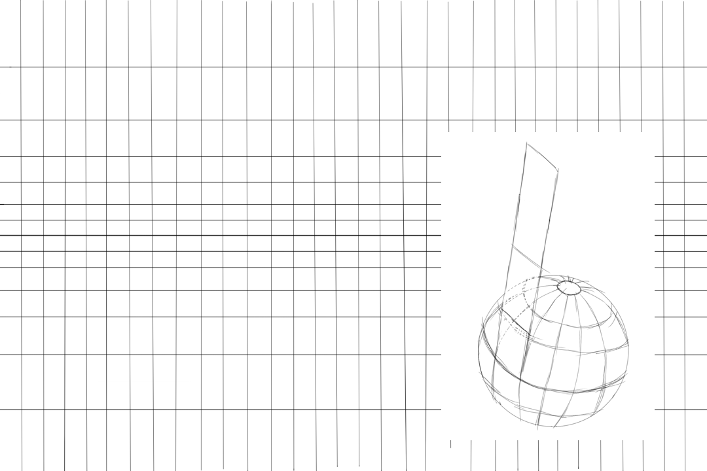
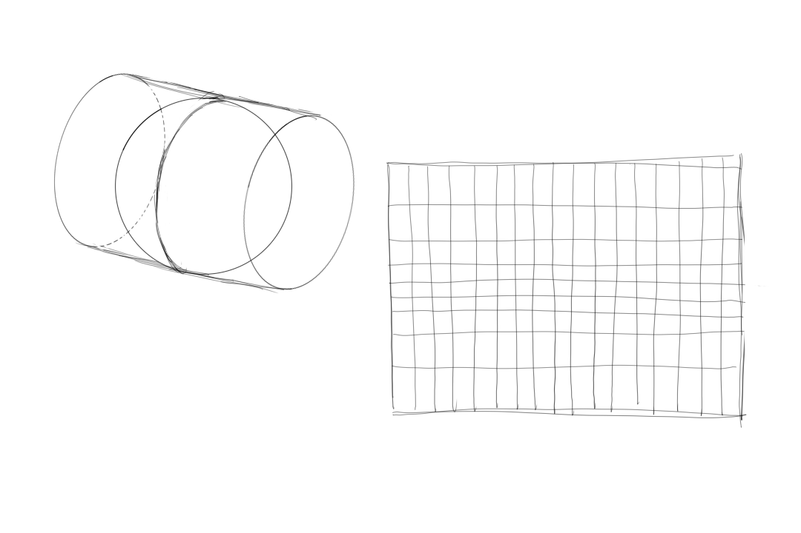
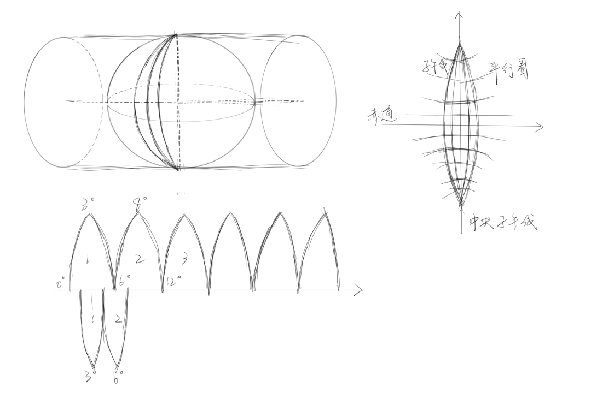
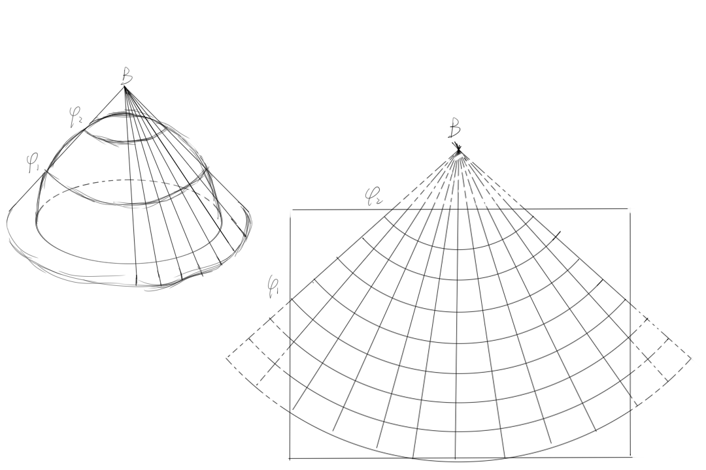
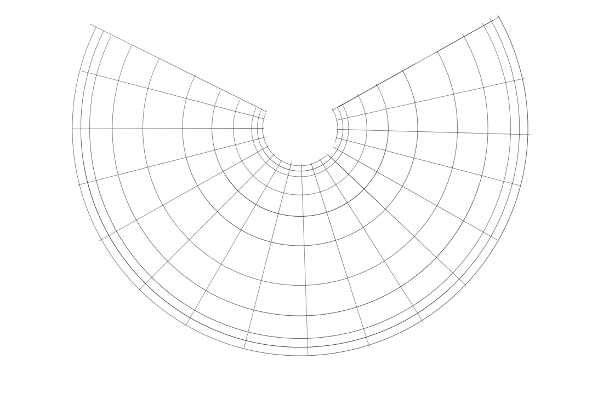
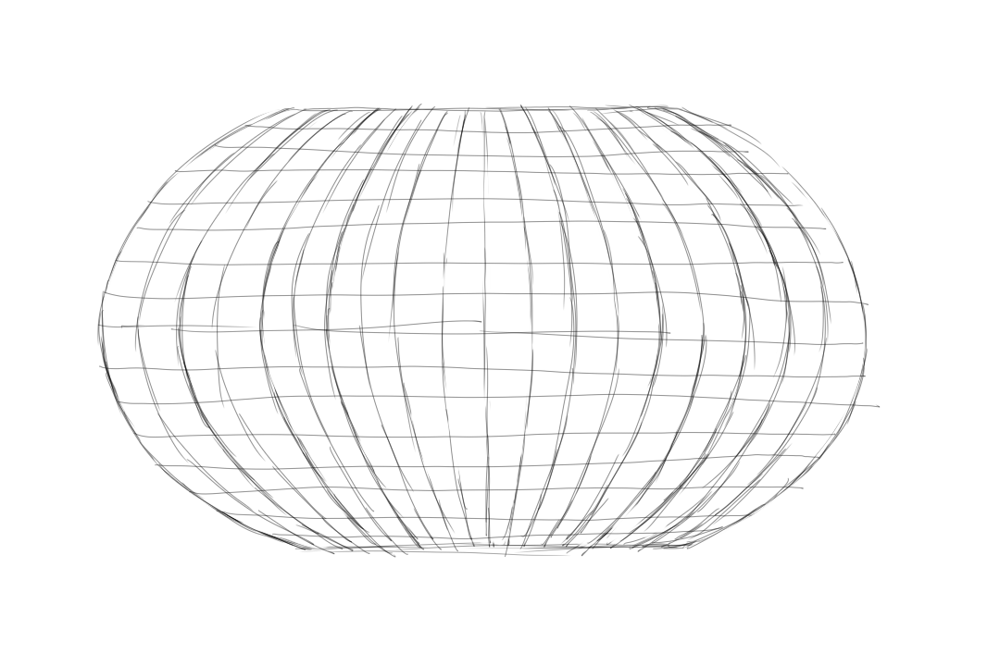
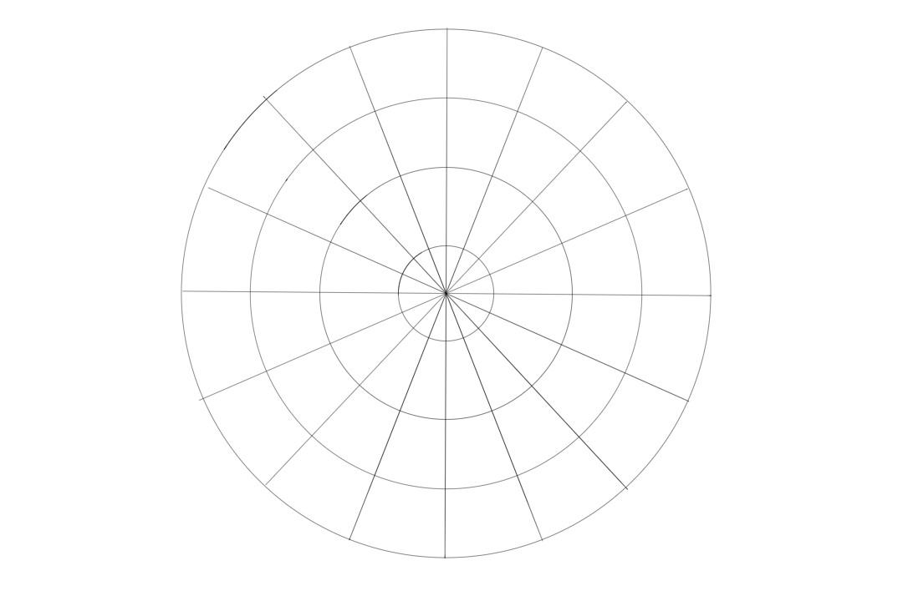

# 墨卡托投影
- 投影类型：正轴等角圆柱投影。
- 形变性质：没有角度变形，长度和面积变形明显，基准纬线无变形，从基准纬线出向两极变形逐渐增大。
- 适用情况：航海图和航空图；循着墨卡托投影图上两点间的直线航行，方向一直不变可以达到目的地

# 通用横轴墨卡托投影UTM
- 投影类型：横轴轴圆柱投影
- 形变性质：在每个6度带内保持较好的形状和距离准确性，但跨带时会有显著变形。
- 适用情况：适合军事、科研以及需要精确位置信息的应用领域；全球通用坐标系统的一部分。

# 高斯克吕格投影
- 投影类型：横轴等角切圆柱投影
- 形变性质：中央经线附近形状保持较好，远离中央经线处长度变形逐渐增大。
- 适用情况：适用于制作大比例尺地形图，如1:500,000及更大比例尺的地图，在中国及其他国家广泛使用。

# 兰勃特投影
- 投影类型：双标准纬线等角圆锥投影
- 形变性质：保持了局部形状的比例，但在远离标准纬线的地方会产生一定量的面积变形。
- 适用情况：适用于中纬度区域的天气预报图、航空图等，能够较好地表示特定区域而不失真。

# 阿尔伯斯投影
- 投影类型：双标准纬线等面积圆锥投影
- 形变性质：保证了面积的准确性，但形状会有所扭曲。
- 适用情况：用于需要准确显示面积比的地图，例如人口分布图、土地利用图等统计地图。

# 罗宾森投影
- 投影类型：折中投影
- 形变性质：尝试平衡各种类型的变形，使得整体看起来更加自然，但不严格保持任何一种几何属性。
- 适用情况：适合制作世界地图，特别是当美观性比精确度更重要时。

# 极地立体投影
- 投影类型：方位投影
- 形变性质：从一个极点看去，该投影可以很好地保持局部形状，但距离和面积随远离中心点而逐渐失真。
- 适用情况：特别适合绘制北极或南极地区的地图，对于极地研究非常有用。

# 简易圆柱投影
- 投影类型：等距圆柱投影
- 形变性质：赤道上没有变形，但越往两极方向变形越大，尤其是面积方面。
- 适用情况：主要用于教育目的的世界地图，展示地球的基本地理布局。