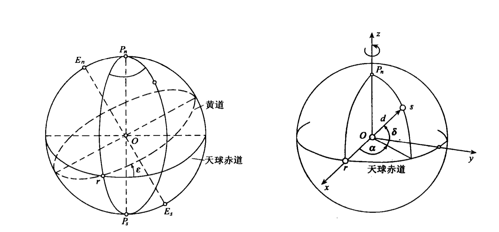

# 第一章 绪论
## 1.1 大地测量学的定义与作用
在一定的时间-空间参考系统中，测量和描绘地球及其他星体的一门学科。也包含了测定地球形状，包括外部重力场，以及在地球上进行必须顾及地球曲率的那些测量工作。

## 2.1 大地测量学的基本体系和内容
- **几何大地测量学**：基本任务是确定地球的形状和大小以及确定地面点的几何位置。
- **物理大地测量学**：基本任务是用物理方法（重力测量）确定地球形状及其外部重力场。
- **空间大地测量学**：研究以人造地球卫星及其他空间探测器为代表的空间大地测量的理论、技术与方法。

### 基本内容
1. 确定地球形状及外部重力场及其随时间的变化，建立统一的大地测量坐标系，研究地壳形变（包括地壳垂直升降及水平位移），测定极移以及海洋水面地形及其变化等。
2. 研究月球及太阳系行星的形状及重力场
3. 建立和维持具有高科技水平的国家和全球的天文大地水平控制网和精密水准网以及海洋大地控制网，以满足国民经济和国防建设的需要。
4. 研究为获得高精度测量成果的仪器和方法等。
5. 研究地球表面向椭球面或平面的投影数学变换及有关的大地测量计算。
6. 研究大规模、高精度和多类别的地面网、空间网及其联合网的数据处理的理论和方法。测量数据库建立及应用等。

## 1.3 大地测量学发展简史与展望
### 发展简史
1. 地球圆球阶段
2. 地球椭球阶段
3. 大地水准面阶段
4. 现代大地测量新阶段

# 第二章 坐标系统与时间系统
## 2.1 地球的运转
地球运转包括：
1. 与银河系一起在宇宙中运动
2. 在银河系内与太阳系一起运动
3. 与其他行星一起绕太阳运转
4. 绕其瞬时旋转轴旋转

### 2.1.1 地球绕太阳公转
地球绕太阳运转的轨道称为黄道
其他行星和月球会对地球的运动造成影响

### 2.1.2 地球自转
- 地球自转参数（ERP）：描述地球自转速度变化和极移。
- 地球定向参数（EOP）：地球自转参数加上章动和岁差。

某一时刻的旋转轴称为**瞬时旋转轴**，会发生变化。

#### 1. 地轴方向相对于空间的变化（岁差和章动）
`岁差`：地球旋转轴在空间中围绕黄极缓慢旋转，形成一个圆锥体，锥角等于黄赤交角。
`章动`：岁差的基础上叠加的18.6年的短周期圆周运动。原因是白道与黄道有一定的倾斜，导致月球引力产生的转矩的大小和方向不断变化。

岁差和章动共同影响下，称为**真旋转轴**或**瞬时轴**与**真赤道**；只考虑岁差，称为**平轴**与**平赤道。**

#### 2. 地轴相对于地球本体内部结构的相对位置变化（极移）
`极移`：由于地球体自身内部结构的相对位置变化，从而导致极点在地球表面上的位置随时间而变化。

某一观测瞬间地球北极所在的位置称为瞬时极，平均位置称为平极。

地球极点的变化会导致地面点纬度的变化。

#### 3. 地球自转速度变化
分为短周期变化与长期变化。

## 2.2 时间系统
对于时间的描述，可采用一维的时间坐标轴。有**时间原点**、**度量尺度**两大要素，度量单位采用**时刻**和**时间间隔**两种形式。时刻是时间轴上的坐标点，是相对与时间轴的原点而言的，是指发生某一现象的瞬间；时间间隔是两个时刻点之间的差值。
一个周期运动满足三个要求即可称为计量时间的方法：（1）连续；（2）稳定周期；（3）可观测

### 分类

- 以地球自转为基础：恒星时（ST）、世界时（UT）
- 以地球公转为基础：历书时（ET）、太阳系质心力学时（TDB）、地球质心力学时（TDT）
- 以物质内部原子运动特征为基础，原子时（TAI）

### 2.2.1 恒星时（ST）
以春分点作为基本参考点，由春分点的周日视运动确定的时间，称为恒星时。
春分点位置也发生变化，据此把恒星时分为真恒星时与平恒星时。

### 2.2.2 世界时（UT）
以真太阳作为基本参考点，由其周日视运动确定的时间，称为**真太阳时**。引入虚拟的在赤道上匀速运行的平太阳，平太阳连续经过同一子午圈的时间间隔，称为一个**平太阳日**，分为24个平太阳时。

以格林尼治子夜起算的平太阳时称为**世界时**。

### 2.2.3 历书时（ET）与力学时（DT）
由于地球自转速度不均匀，导致用其测得的时间不均匀。以地球公转运动为基准。

根据广义相对论，太阳质心系和地心系的时间不同。

### 2.2.4 原子时（AT）
以原子谐振信号周期为标准，并对它进行连续技术的时标。

### 2.2.5 协调世界时（UTC）
以原子时秒长为计量单位，在时刻上与平太阳时之差小于0.9秒的时间系统，称为世界协调时

### 2.2.6 卫星定位系统时间
GPST，原子时

## 2.3 坐标系统
坐标系统是由**坐标原点的位置**、**坐标轴的指向**和**尺度**所定义的。

### 2.3.1 基本概念

#### 1. 大地基准
能够最佳拟合地球形状的地球椭球的参数及椭球定位和定向。

#### 2. 天球
以地球质心为中心，以无穷大为半径的假想球体称为`天球`。
- 天轴与天极：地球自转轴的延伸直线为天轴；天轴与天球的交点为天极
- 天球赤道面与天球赤道：通过地球质心$O$与天轴垂直的平面。
- 天球子午面与子午圈：包含天轴的任意一点的平面为天轴子午面，与天球相交的大圆，称为天球子午圈。
- 时圈：通过天球的平面与天球相交的半个大圆
- 黄道与黄极：地球公转的轨道面与天球相交的大圆；通过天球中心，且垂直于黄道面的直线与天球的交点。
- 春分点：当太阳在黄道上从天球南半球向北半球运行时，黄道与天球赤道的交点r。

原点位于地球质心O，z轴指向天球北极，x轴指向春分点，称为**天球直角坐标系**。

#### 3. 大地测量参考系统
- **坐标参考系统**：
（1）**天球坐标系**：用于研究天体和人造卫星的定位和运动；
（2）**地球坐标系**：地球上物体的定位与运动。分为大地坐标系和直角坐标系。Z轴与地球平均自转轴相重合，X轴指向平均自转轴与平均格林尼治天文台所决定的子午面与赤道面的交点 $G_e$ 。
- **高程参考系统**：
以大地水准面为参照面的高程系统称为正高。以似大地水准面为参照面的高程系统称为正常高。
大地高H=正常高+高程异常=正高+大地水准面差距
- **重力参考系统**

#### 4. 大地测量参考框架
是大地测量参考系统的具体实现，通过大地测量手段确定的固定在地面上的控制网所构建的，分为坐标参考框架、高程参考框架与重力参考框架。
- 国家平面控制网
- 国家高程控制网
- 国家重力基本网

#### 5. 椭球定位与定向
- **椭球定位**：确定椭球中心的位置。
（1）局部定位：要求在一定范围内椭球面与大地水准面有最佳的符合，对椭球中心位置无特殊要求。
（2）地心定位：要求在全球范围内椭球面与大地水准面有最佳的符合，同时要求椭球中心与地球质心一致或最为接近。此时
- **椭球定向**：确定椭球旋转轴方向。必要条件：
（1）椭球短轴平行与地球自转轴；
（2）大地起始子午面平行于天文起始子午面。

经过局部定位的地球椭球叫做`参考椭球`，经过地心定位称为`总地球椭球`。

### 2.3.2 惯性坐标系与协议天球坐标系
- 惯性坐标系：在空间中固定不动或做匀速直线运动的坐标系。理想的坐标系。
- 协议惯性坐标系：一个相对于遥远恒星几乎不变化的参考框架
- 协议天球坐标系：会随着岁差、章动等效应而改变位置。

以太阳系质心为原点的协议天球坐标系称为太阳质心协议天球坐标系，地心为原点称为地心协议天球坐标系。

#### 协议天球+岁差（P）→瞬时平天球；
#### 瞬时平天球+章动（N）→瞬时真天球。

## 2.3.3 地固坐标系（地球坐标系）
固定在地球上于地球一起旋转的坐标系。地面上点的坐标值在地固坐标系中是固定不变的。分为**地心坐标系**（总地球椭球）与**参心坐标系**（参考椭球）。

一般采用协议地级方向CTP作为Z轴指向，称为**协议地球坐标系**。与之相应的称为瞬时地球坐标系。

#### 1. 协议地球坐标系+极移→瞬时地球坐标系；

#### 2. 瞬时天球坐标系+旋转→瞬时地球坐标系。

#### 3. 参心坐标系
1. 建立参心坐标系的工作：
（1）选择或求定椭球的几何参数；（2）确定椭球中心的位置（椭球定位）；（3）确定椭球短轴的指向（椭球定向）；（4）建立大地原点。
2. 参考椭球的定位与定向：参考椭球的定位和定向，一般是根据大地原点的天文大地观测和高程测量结果，计算大地原点上的 $L_K,B_K,H_K$ 和至某以相邻点的 $A_K$ 来实现的。
（1）**一点定位**：仅仅根据大地原点上的天文观测和高程测量结果即可确定椭球的定位和定向。
（2）**多点定位**：利用许多拉普拉斯点，采用最小二乘法求得椭球定位参数。多点定位的结果是椭球面在大地原点不再同大地水准面相切。
（3）大地原点和大地起算数据： $L_K,B_K,A_K$ 乘坐大地测量基准数据。
3. 1954年北京坐标系：克拉索夫斯基椭球参数，原点在前苏联普尔科沃。
（1）椭球参数由较大误差；（2）参考椭球面与我国大地水准面存在明显的自西向东的系统性倾斜；（3）几何大地测量和物理大地测量应用的参考面不统一。（4）定向不明确
4. 1980年国家大地坐标系：1975年国际大地测量与物理联合会第16届大会上推荐的4个椭球参数，原点泾阳县永乐镇。
（1）多点定位，椭球面同似大地水准面在我国境内最为密合；（2）定向明确：短轴平行于地球质心指向地极原点的方向；（3）高程基准采用1956年黄海高程系；
5. 新1954年北京坐标系：1954北京坐标系与1980国家大地坐标系的过渡坐标系。

#### 4. 地心坐标系

**地心空间直角坐标系**：原点 $O$ 与**地球质心**重合， $Z$ 轴指向地球北极， $X$ 轴指向格林尼治平均子午面与地球赤道的交点。

**地心大地坐标系**：地球椭球的中心与地球质心重合，椭球面与大地水准面在全球范围内最佳复合，椭球短轴与地球自转轴重合，大地纬度为过地面点的椭球发现与椭球赤道面的夹角，大地经度为过地面点的椭球子午面与格林尼治的大地子午面之间的夹角，大地高为地面点沿椭球发现至椭球面的距离。

1. **地心地固坐标系的建立方法**：（1）直接法，通过一定的观测资料，直接求得点的地心坐标的方法；（2）间接法：通过一定自来哦，求得地心坐标系和参心坐标系之间的转换参数
2. **WGS-84 世界大地坐标系**
3. **国际地球参考系统（ITRS）与国际地球参考框架（ITRF）**。

（1）国际地球自转服务（IERS）：维持国际天球参考系统和框架；位置国际地球参考系统和框架；为当前应用和长期研究提供及时准确的地球自转参数。

（2）国际地球参考系统（ITRS）：协议地球参考系统。

（3）国际地球参考框架（ITRF）：ITRS的具体实现，是通过IERS分布于全球的跟踪站的坐标和速度场来维持并提供给用户使用的。

1. CGCS2000：全球地心坐标系在我国的具体实现

#### 5. 站心坐标系

以测站为原点，测站上的法线（或垂线）为Z轴方向，被方向为X轴，东方向为Y轴，建立的测站就称为法线（或垂线）站心坐标系。用来描述测站点的相对空间位置关系，或者作为坐标转换的过渡坐标系。

1. 垂线站心直角坐标系
2. 法线站心直角坐标系

### 2.3.4 坐标系换算

### 1. 欧勒角与旋转矩阵

两个直角坐标系进行相互变换的旋转角称为欧勒角。

### 2. 不同空间直角坐标系转换

存在3个平移参数，3个旋转参数以及1个尺度变化参数。

### 3. 不同大地坐标系转换

存在3个平移参数，3个旋转参数，1个尺度变化参数以及2个地球椭球元素变化参数。

# 第三章 地球重力场与地球形状基本讨论

## 3.1 地球重力场及地球形状的基本理论

### 3.1.1 地球概说

#### 1. 地球基本形状介绍

#### 2. 地球大气简介

### 3.1.2 地球运动概说

#### 1. 地球的自转

太阳连续两次中天的时间间隔为**太阳日**，地球绕地轴旋转360度所需的时间为**恒星日**。

#### 2. 地球的公转

开普勒行星运动三大定律

- 行星绕太阳运动的轨道是椭圆，而太阳在椭圆的一个交点上
- 行星的向径在相等的时间内，扫过的面积也相等
- 行星绕太阳公转的恒星周期的平方和行星轨道长半径的立方成正比例。

### 3.1.3 地球基本参数

#### 1. 几何参数：

#### 2. 地球正常引力位参数

## 3.2 地球重力场的基本原理

1. 地球外部重力场是大地测量中绝大多数观测量的参考系，因此，为了将观测量归算到由几何定义的参考系中，就必须知道这个重力场。
2. 假如地面重力值的分布情况是已知的话，那么就可以结合大地测量中的其他观测量一起，来确定地球表面的形状。
3. 对于高程测量而言，最重要的参考面——大地水准面，亦即最理想化的海洋面是重力场中的一个水准面
4. 通过对地球外部重力场的深入分析，人们可以获得关于地球内部结构及性质的信息，因此通过向英国重力场参数的被应用，大地测量学已称为地球物理学的辅助科学。
5. 地球外部重力场是现代空间探测技术的理论基础，特别是对空间探测器的发射与控制，对月球大地测量以及太阳系其他行星的深空大地测量都具有重要意义和作用。

### 3.2.1 引力与离心力

引力与离心力的合力称为地球重力

#### 1. 引力

认为地球为圆球，其物质以同一密度按同心层的方式分布

#### 2. 离心力

### 3.2.2 引力位与离心力位

#### 1. 引力位

$$
V=f*\int\limits_{(M)}\dfrac{dm}{r}
$$

#### 2. 离心力位

$$
Q=\dfrac{\omega^2}{2}(x^2+y^2)
$$

### 3.2.3 重力位

$$
W=f*\int\limits_M\dfrac{dm}{r}+\dfrac{\omega^2}{2}(x^2+y^2)
$$

按三坐标轴求偏导的重力分力，可以计算其模与三个方向余弦。

重力位对任意方向的偏导数等于重力在改方向上的分力

$$
\dfrac{\partial W}{\partial l}=g_l=g\cos(g,l)
$$

$g$ 与 $l$ 相垂直时，W为常数，对不同的常数值，有不同的曲面，称为重力等位面，也就是水准面。

### 3.2.4 地球的正常重力位和正常重力

要精确计算出地球重力位，必须知道地球表面的形状及内部物质密度，但前者正是我们要研究的，后者分布极其不规则，目前也无法知道。故根据上式不能精确求得地球的重力位，为此引进一个与其近似的地球重力位——正常重力位。

正常重力位是一个函数简单、不涉及地球形状和密度便可直接计算得到的地球重力位的近似值的辅助重力位

#### 1. 地球引力位的数学表达式

**地球惯性矩**

#### 2. 地球正常重力位

#### 3. 正常重力公式

#### 4. 正常重力场参数

分别是 $U_0$ , $A_0=fM$, $A_2=f(A-C)$, $\omega$

### 3.2.5 正常椭球和水准椭球，总的地球椭球和参考椭球

物理大地测量研究地球重力场时也需要引进所谓的**正常椭球**所产生的正常重力场作为实际地球重力场的近似值。

引入正常椭球后，真的地球重力位被分成正常重力位和扰动为两部分，实际重力也被分成正常重力和重力异常两部分。

目前采用水准椭球作为正常椭球。

正常椭球的定位是使其中心与地球质心重合，正常椭球的定向是使其短轴与地轴重合，起始子午面与起始天文子午面重合。

总的地球椭球：中心与地球质心重合，短轴与地轴重合，起始子午面与起始天文子午面重合。总地球椭球于大地体最为密合，也就是说，要满足全球范围内的大地水浑面差距 $N$ 的平方和最小。可以定义为最密合于大地体的正常椭球。

## 3.3 高程系统

### 3.3.1 一般说明

大地高由**地形高**与**大地水准面高度**组成。

- 地形高基本上确定着地球自然表面的地貌。
- 大地水准面高度又称大地水准面差距，似大地水准面高度又称高程异常

**理论闭合差**：不考虑仪器本身的误差与观察误差，由同一起始水准点出发，由几何水准测量经不同的水准线路测量同一未知点的高程是不相同的，换句话说，由同一起始点测量水准闭合环线的高程闭合差不等于零，其闭合差称为水准理论闭合差。水准理论闭合差是由于水准面不平行的原因引起的。

[几何水准测量原理](https://www.notion.so/75f3e65af0a34db0bf23170315ff02f0?pvs=21)

### 3.3.2 正高系统

正高系统是以大地水准面为高程基准面，地面上任意一点的正高指该点言垂线方向指大地水准面的距离

$$
H_正^B=\dfrac{1}{g_m^B}\int\limits_{OAB}gdh
$$

### 3.3.3 正常高系统

**似大地水准面**：由地面沿垂线向下量取正常高所得的点形成的连续曲面。

海洋面上大地水准面和似大地水准面重合。所以大地水准面的高程原点对似大地水准面也是适用的。我国采用正常高高程系统作为我国高程的统一系统。

### 3.3.4 力高和地区力高高程系统

正高系统与正常高系统解决了由水准面不平行而引起的水准环线闭合差。

同一重力位水准面上的两点，重力的方向可能不同，导致正高或正常高不相等。

将正常高公式中的 $\gamma_m^A$ 用纬度 $45$ 处的正常重力 $\gamma_{45}$ 代替，称为**力高**。一点的力高就是水准面在纬度 $45$ 处的正常高。

也可以用地区平均纬度的正常重力代替，称为地区力高

### 3.3.5 国家高程基准

#### 1. 高程基准面

通常采用大地水准面作为高程基准面。

验潮确定海水面的平均位置，假定大地水准面就是通过这点处实测的平均海水面。

地面上的点相对于高程基准面的高度，通常称为绝对高程或海拔高程，也简称为标高或高程。

#### 2. 水准原点

为了长期、牢固地表示出高程基准面的位置，并便于高程基准面与国家高程控制网的连接和传递，通常要在确定 国家高程基准面的验潮站附近建造一座十分坚固，精度可靠，能长久保存的国家水准原点。用精密水准测量方法测定国家水准原点与国家高程基准面的高差，用以确定国家水准原点以国家高程基准面起算的高程，依此高程作为全国各地推算高程的依据。

#### 3. 1956年黄海高程系统

以浙江坎门验潮站的平均海水面和青岛验潮站1952~1953年观测的平均海水面归算当时各系统的水准测量成果，这个基准面被定名为“1954年黄海平均海水面”。

存在明显的不足和缺陷：观测资料少，潮汐数据时间短，无法消除长周期潮汐变化的影响；潮汐数据记录由个别错误，存在系统性差异；对我国沿海海面状况缺乏深入了解，无法估计我国海绵存在的倾斜问题。

水准原点高程为 72.289 m。

#### 4. 1985国家高程基准

根据青岛验潮站1952~1979年中19年的验潮资料计算得到的。

水准原点的高程为 72.260 m。

## 3.4 关于测定垂线偏差和大地水准面差距的基本概念

### 3.4.1 关于测定垂线偏差的基本概念

地面一点上的重力向量 $g$ 和相应椭球面上的法线向量 $n$ 之间的夹角定义为该点的**垂线偏差**。垂线同总地球椭球（或参考椭球）法线构成的角度称为绝对（或相对）垂线偏差，它们统称为**天文大地垂线偏差**。实际重力场中的重力向量 $g$ 同正常重力场中的正常重力向量 $\gamma$ 之间的夹角称为**重力垂线偏差。**

以下主要研究天文大地垂线偏差。

天文坐标（ $\varphi, \enspace \lambda$ ），大地坐标系（B，L）， $\xi$、 $\eta$ 是垂线偏差在子午圈和卯酉圈上的分量。

$$
\begin{cases}
\xi = \varphi-B\\
\eta=(\lambda-L)\cos\varphi
\end{cases}
$$

[天球坐标系/天文坐标系/地理坐标系](https://www.notion.so/609b920f9cee4ab2aa7465473fb329b4?pvs=21)

#### 1. 天文大地测量方法

进行大地测量与天文测量，获取大地坐标与天文坐标。

#### 2. 重力测量方法

借助于大地水准面和地球椭球面上的重力异常。

#### 3. 天文重力方法

#### 4. GPS测量方法

### 3.4.2 关于测定大地水准面差距的基本概念

#### 1. 用地球重力场模型法计算大地水准面差距

大地水准面上一点 $P$ 的实际重力位 $W$ 与正常椭球面上相应点 $P_0$ 的正常重力位 $U$ 之差称为该点的扰动位 $T$。

#### 2. 利用斯托克斯积分公式计算大地水准面差距

#### 3. 卫星无线电测高方法研究大地水准面

#### 4. 利用GPS高程拟合法研究似大地水准面

## 3.5 关于确定地球形状的基本概念

### 3.5.1 天文大地测量方法

### 3.5.2 重力测量方法

### 3.5.3 空间大地测量方法

# 第四章 地球椭球及其数学投影变换的基本理论

# 4.1 地球椭球的基本几何参数及其相互关系

## 4.1.1 地球椭球的基本几何参数

子午圈/平行圈

### 五个基本参数：

椭圆长半轴：  $a$

椭圆短半轴：  $b$

椭圆扁率：  $\alpha=\dfrac{a-b}{a}$

椭圆的第一偏心率：  $e=\dfrac{\sqrt{a^2-b^2}} a$

椭圆的第二偏心率：  $e'=\dfrac {\sqrt{a^2-b^2}} b$

偏心率：子午椭圆的焦点离开中心的距离与椭圆半径之比。

> 知道包括一个长度参数的两个参数就足够决定椭球的形状与大小。
> 
- 其他符号：

$$
c=\dfrac {a^2} b,\enspace
t=\tan B, \enspace
\eta^2=e'^2 \cos^2 B
$$

- 辅助函数：

$$
\begin{cases}
W=\sqrt{1-{e^2 \sin^2 B}} \\
V=\sqrt{1+{e'^2 \cos^2 B}}
\end{cases}
$$

著名椭球参数：贝塞尔椭球、克拉克椭球、海福特椭球、克拉索夫斯基椭球、1975年国际椭球、WCS-84椭球体。

## 4.1.2 地球椭球参数间的相互关系

$$
\begin{cases}
e^2=\dfrac{e'^2}{1+e'^2},\enspace
e'^2=\dfrac{e^2}{1-e^2}\\
a=b \sqrt{1+e'^2},\enspace
b=a \sqrt{1-e^2}\\
c=a \sqrt{1+e'^2},\enspace
a=c \sqrt{1-e^2}\\
e'=e \sqrt{1+e'^2},\enspace
e=e' \sqrt{1-e^2}\\
V=W \sqrt{1+e'^2},\enspace
W=V \sqrt{1-e^2}\\
e^2=2 \alpha -\alpha^2 \approx 2 \alpha
\end{cases}
$$

$$
\begin{dcases}
W=\sqrt{1-e^2}*V=(\dfrac b a)*V\\
V=\sqrt{1+e'^2}*W=(\dfrac a b)*W\\
W^2=1-e^2\sin^2B=(1-e^2)V^2\\
V^2=1+\eta^2=(1+e^2)W^2
\end{dcases}
$$

# 4.2 椭球面上常用坐标系及其相互关系

## 4.2.1 各种坐标系的建立

### 1. 大地坐标系

1. 大地纬度：椭球面上一点的法线与赤道面的夹角叫做该点的大地纬度。
2. 大地经度：
3. 大地高：它同正常高及正高有如下关系

$$
\begin{cases}
H=H_{正常}+\xi(高程异常）\\
H=H_{正}+N(大地水准面差距)
\end{cases}
$$

- 在测图及制图中应用
- 与同一点的天文坐标比较，可以确定垂线偏差的大小

### 2. 空间直角坐标系

### 3. 子午面直角坐标系

设椭球面上一点P的大地经度L，在过点P的子午面上，以子午圈椭圆中心为原点，建立x，y平面直角坐标系。

### 4. 地心纬度坐标系及归化纬度坐标系

地心纬度坐标系：椭球面上一点与椭圆中心O的连线与长半轴夹角成为地心纬度

归化纬度坐标系：以椭球长半径为半径作辅助圆。

如果点不再椭球面上，那么应按法线投影到椭球面上。同时有大地高H

以上三种坐标系用于大地测量的公式推导。

### 5. 大地极坐标系

在椭球面上，以任意点P为原点，过点P的子午线为极轴，某一点与P的连线为极半径，位置可以用S，A表示。

## 4.2.2 各坐标系间的关系

### 1. 子午面直角坐标系同大地坐标系的关系

x,y与B的关系

法线pn在赤道两侧的长度

x=N cos B

y=N(1-e^2) sin B

### 2. 空间直角坐标系同子午面直角坐标系的关系

### 3. 空间直角坐标系同大地坐标系的关系

### 4. 大地纬度，归化纬度与地心纬度的关系

大地纬度与归化纬度

归化纬度与地心纬度

大地纬度与地心纬度

## 4.2.3 站心地平坐标系

左手系

x.y.z用方位角与天顶距

# 4.3 椭球面上的几种曲率半径

法截面与法截线：过椭圆面上一点作法线，包含法线的面称为法截面，法截面与椭球面的交线叫做法截线。

一条法线对应无数个法截面与法截线。不同方向的法截线曲率半径不同。

## 4.3.1 子午圈曲率半径

$$
M=\dfrac{\mathrm{d} S}{\mathrm{d} B}
=\dfrac{a(1-e^2)}{W^3}
=\dfrac{c}{V^3}
=\dfrac{N}{V^2}
$$

## 4.3.2 卯酉圈曲率半径

与子午面垂直的法截面称为**卯酉面**。

**麦尼尔定理**：假设通过曲面上一点引两条截弧，一为法截弧，一为斜截弧，且在该点上这条截弧具有公共切线，这时斜截弧在该点处的曲率半径等于法截弧的曲率半径乘以两截弧平面夹角的余弦。

由平行圈曲率半径推知卯酉圈曲率半径。

$$
N= \dfrac a W = \dfrac c V
$$

## 4.3.3 主曲率半径的计算

$$
\begin{cases}
M=m_0+m_2\sin^2B+m_4\sin^4B+m_6\sin^6B+m_8\sin^8B\\
N=n_0+n_2\sin^2B+n_4\sin^4B+n_6\sin^6B+n_8\sin^8B
\end{cases}
$$

## 4.3.4 任意法截弧的曲率半径

$$
\dfrac 1 {R_A} = \dfrac {\cos^2A} M + \dfrac {\sin^2A} N
$$

## 4.3.5 平均曲率半径

由于R的数值随方位变化而变化，这给测量计算带来不便。在测量工作中往往根据一定的精度要求，在一定范围内，把椭球当作球面来处理，为此就要推球这个球面的半径——平均曲率半径。

**平均曲率半径 $R$** ：经过曲面任意一点所有可能方向上的法截线曲率半径 $R_A$ 的算数平均值。

$$
R = \dfrac N V = \dfrac c {V^2} = \sqrt{MN}
$$

## 4.3.6 M,N,R的关系

# 4.4 椭球面上的弧长计算

## 4.4.1 子午线弧长计算公式

从赤道开始到已知纬度B间的子午线弧长的计算公式

求子午线上两个纬度 $B_1$ 及 $B_2$ 间的弧长，只需按子午线弧长的计算公式分别算出相应的 $X_1$ 及 $X_2$ ，而后取差即为所求弧长。

$$
X= \int_0^BM\mathrm{d}B
$$

## 4.4.2 由子午线弧长求大地纬度

用于高斯投影坐标反算。

### 迭代法

### 直接解法

## 4.4.3 平行圈弧长公式

[3. 子午面直角坐标系](https://www.notion.so/3-d76986b958ba4bf389da1395c85dc594?pvs=21) 

## 4.4.4 子午线弧长何平行圈弧长变化的比较

## 4.4.5 椭球面梯形图幅面积的计算

# 4.5 大地线

椭球面上两点的最短距离。

## 4.5.1 相对法截线

当椭球面上两点不在同一子午圈或平行圈时，两点法线互不相交，故两条法截线不重合，这两条法截线称为两点的**相对法截线**。

## 4.5.2 大地线的定义和性质

椭球面上两点间的最短程曲线称为**大地线**。该线上各点的主法线与该点的曲面法线重合。

**几何特征**

1. 大地线是椭球面上两点间的最短程曲线。
2. 大地线是无数法截线的连线。
3. 椭球面上的大地线是双重弯曲的曲线。
4. 大地线位于相对法截线之间。与相对法截线长度差甚微。
5. 不在同一子午圈与同一平行圈上的两点的正反法截线是不重合的，他们之间的夹角为Δ，在一等三角测量中可达到千分之四。大地线是两点间最短线，而且位于相对法截线之间，并靠近正法截线，它与正法截线的夹角：δ=1/3*Δ

## 4.5.3 大地线的微分方程和克莱劳方程

$\mathrm{d}L$ , $\mathrm{d}B$ , $\mathrm{d}A$ 与 $\mathrm{d}S$ 的关系

**大地线微分方程：**

**克莱劳定理**：在旋转椭球面上，大地线各点平行圈半径与该点大地方位角的正弦的乘积为常数。

$$
\ln\sin A +\ln r = \ln C\\
r*\sin A = C
$$

大地线常数等于 椭球半径与该大地线穿越赤道时大地方位角的正弦乘积或等于 该点大地线上具有最大纬度的那一点的平行圈半径。

# 4.6 将地面观测值归算到椭球面

参考椭球面是测量计算的基准面

（1）以椭球面的法线为基准

（2）将地面观测元素化为椭球面上大地线的相应元素

## 4.6.1 将地面观测的水平方向归算至椭球面

将水平方向归算至椭球面上，包括**垂线偏差改正**、**标高差改正**及**截面差改正**，习惯上称此三项改正为**三差改正**。

垂线偏差改正与标高差改正应用于一二等测量。截面差改正用于一等测量。

### **垂线偏差改正**

把以垂线为依据的地面观测的水平方向值归算到以法线为依据的方向值应加的改正称为**垂线偏差改正**。

垂线偏差改正的数值主要与测站点的垂线偏差和观测方向天顶距有关。

### **标高差改正**

不在同一子午面或同一平行圈上的两点的法线是不共面的。如果照准点高出椭球面某一高度，则照准面就不能通过过照准点的法线同椭球面的交点，由此引起的方向偏差称为**标高差改正**。标高差改正主要与照准点的高程有关。

### **截面差改正**

用两点间的大地线代替相对法截弧，这样的法截弧方向化为大地线方向应加的改正叫**截面差改正**。

截面差改正主要与测站点至照准点间的距离S有关。

## 4.6.2 将地面观测的长度归算至椭球面

包括基线尺量距的归算和电磁波测距的归算。

### **基线尺量距归算**

基线平均高程面上的长度归算到参考椭球面上的大地线长度

1. **垂线偏差的影响**

假设垂线偏差沿基线线性变化。

$$
\Delta s_u = \dfrac {u_1''+u_2''}{2p''}\sum\Delta h
= \dfrac{u_1''+u_2''}{2p''}(H_2-H_1)
$$

$u_1''$ , $u_2''$ 为在基线端点1和2处，垂线偏差在基线上的分量。 $\sum\Delta h$ 为各个测段测量的高差总和。

1. **高程的影响**

水准面离开椭球体面一定距离，引起长度归算的改正。

$$
S=S_0(1+\dfrac{H_m}{R})^{-1}
$$

$R$ 为基线方向法截线曲率半径。

### **2. 电磁波测距的归算**

两点间斜距归算为两点投影点间的大地线长度

## 4.6.3 用勒让德定理理解球面三角形

国家一等三角形可以当作球面三角形

# 4.7 大地测量主题结算概述

## 4.7.1 大地主题解算的一般说明

**大地元素**：包括大地经度 $L$ ，大地纬度 $B$ ，两点大地线长度 $S$，正反大地方位角 $A_12$ 、 $A_21$。

已知某些大地元素推算另一些大地元素，称为**大地主题解算**。

1. 正算：已知 $P_1$ 点的大地坐标（ $L_1$， $B_1$），大地线长 $S$ 及其大地方位角 $A_{12}$，计算点的大地坐标（ $L_2$， $B_2$）和 $P_2$ 点的反方位角 $A_{21}$
2. 反算：已知 $P_1$ , $P_2$ ，求 $S$ , $A_{12}$ , $A_{21}$。

从解析意义来讲，就是研究大地极坐标与大地坐标间的转换。

### 1. 以大地线在大地坐标系中的微分方程为基础

$$
\begin{cases}
B_2-B_1 = \displaystyle\int_{P_1}^{P_2}\dfrac{\cos A}M \mathrm{d} S\\
L_2-L_1=
\displaystyle\int_{P_1}^{P_2}\dfrac{\sin A}{N\cos B}\mathrm{d}S\\
A_2-A_1\pm 180 = 
\displaystyle\int_{P_1}^{P_2}\dfrac{\tan B \sin A} N \mathrm{d} S
\end{cases}
$$

解算精度与距离有关，距离越长，收敛越慢

### 2. 以白塞尔大地投影为基础

1. 按椭球面上的已知值计算球面相应值，实现椭球面向球面的过渡。
2. 在球面上解算大地问题
3. 按球面上的数值计算椭球面相应数值，实现球面向椭球面的过渡

### 3. 地图投影理论

椭球面对球面的正形投影和等距离投影/椭球面对平面的正形投影

受距离限制

### 4. 对大地线方程进行数值积分

直接进行数学积分。

易于编写程序。

缺点是长距离计算精度低，近极地无法使用

### 5. 依据大地线外的其他线

弦线、法截线

## 4.7.2 勒让德级数式

[1. 以大地线在大地坐标系中的微分方程为基础](https://www.notion.so/1-29202d240c8843a4a2fd0f3f1813c481?pvs=21) 

## 4.7.3 高斯平均引数正算公式

- 把勒让德级数在 $P_1$ 点展开改在大地线长度中点 $M_{S/2}$ 处展开，以使级数的公式项数减少，收敛快，精度高。
- 考虑到求定中点 $M$ 的 $B_{S/2}$ 和 $A_{S/2}$ 复杂性，将 $M$ 点用大地线两端点平均纬度及平均方位角相对应的 $m$ 点来代替大地线的中点 $M_{S/2}$ 。
- 迭代计算

## 4.7.4 高斯平均引数反算公式

## 4.7.5 白塞尔大地主题解算方法

[2. 以白塞尔大地投影为基础](https://www.notion.so/2-60c0991bdcd44634b254a7aa5bcfacfc?pvs=21) 

纳比尔法则：球面三角形的六个元素

# 4.8 地图数学投影变换的基本概念

## 4.8.1 地图数学投影变换的意义和投影方程

**地图投影**：将椭球面上的元素（包括坐标、方位和距离）按一定的数学法则投影到平面上。

地图投影主要研究内容就是探讨所需要的投影方法及建立椭球面元素和投影面相应元素之间的解析关系式。

## 4.8.2 地图投影的变形

### 1. 长度比

当原平面上线段长度趋近于0时，投影面上的线段长度与原线段长度之比。

### 2. 主方向与变形椭圆

- **主方向**：投影后一点的长度比依方向不同而变化 。其中最大及最小长度比的方向，称为主方向。
在椭球面的任意一点上，必定有一对相互垂直的方向，它在平面上的投影也是相互垂直的，即最大与最小长度比的方向。
- **变形椭圆**：以某顶点为圆心，以主方向上长度比为长、短半轴的椭圆方程。

### 3. 投影变形

- **长度变形**

$$
m=r=\sqrt{a^2\cos^2\alpha+b^2\sin^2\alpha}
$$

- **方向变形**

设从主方向起 $OP$ 的方向角为 $\alpha$ , 投影后 $O'P'$ 的方位角 $\alpha'$ ，则（ $\alpha'-\alpha$）称为方向形变。

最大方向变形：

$$
\tan\alpha_0=\pm\sqrt{\dfrac ab},\enspace
\tan\alpha_0'=\pm\sqrt{\dfrac ba}
$$

- **角度变形**

最大角度变形是最大方向变形的两倍

- **面积变形**

$$
P=\dfrac{\pi ab}\pi=ab
$$

## 4.8.3 地图投影的分类

## 4.8.4 高斯投影简要说明

# 4.9 高斯平面直角坐标系

## 4.9.1 高斯投影概述

### **1. 控制测量的要求**

1. 采用正形投影：（1）三角测量中大量的角度观测元素在投影前后保持不变，免除大量投影计算工作；（2）有限范围内使地图上图形同椭球上原形保持相似。
2. 长度和面积变形不大，并能够应用简单公式计算由于这些形变带来的改正数。
3. 单一起算点的统一坐标系→分带投影。

### 2. 高斯投影条件

- 正形投影：投影长度比在一个点上与方向无关。
- 中央子午线投影后为一直线，且是投影点的对称轴。
- 中央子午线投影后长度不变。

### 3. 椭球面元素化算到高斯投影面

正形投影中椭球面三角形的三边为曲面，用弦线代替

1. 将起始点 $P$ 的大地坐标（ $L,B$ ）归算为高斯平面直角坐标 $x,y$ ；为了检核还应该进行反算。
2. 将椭球面上起算边大地方位角 $A_{PK}$ 归算到高斯平面上相应边 $P'K'$ 的坐标方位角 $\alpha_{P’K’}$，这是通过计算该点的子午线收敛角 $\gamma$ 及方向改化 $\delta$ 实现的。
3. 将椭球面上个三角形内角归算到高斯平面上的由相应直线组成的三角形内角。这是通过计算各方向的曲率改化即方向改化来实现的
4. 将椭球面上起算边 $PK$ 的长度 $S$ 归算到高斯平面上的直线长度 $s$ 。这是通过计算距离改化 $\Delta s$ 实现的。

## 4.9.2 正形投影的一般条件

长度比与方向无关

1. 长度比
建立x, y, l, q的关系
    
    
    
    
    
2. 柯西·黎曼条件：与方位角无关
    
    
    

## 4.9.3 高斯投影坐标正反算公式

高斯平面坐标与大地坐标的关系式。

正算时在中央子午线展开 $l$ 的幂级数。

反算时在中央子午线展开 $y$ 的幂级数。

## 4.9.4 高斯投影坐标系计算的实用公式及算例

## 4.9.5 平面子午线收敛角公式

子午线在高斯平面上的描写的切线与坐标北方向的夹角。

由大地坐标与平面坐标都可以计算

## 4.9.6 方向改化公式

椭球面上的三角网是由大地线组成的，大地线在高斯平面上的投影是曲线，为了在平面哈桑利用平面三角学公式进行计算，须把大地线的投影曲线用其弦来代替。因此需要在水平方向观测值中加上由于“曲改直“而带来的所谓”方向改正数“。

### 公式推导

为了计算方向改正的数值，必须预先知道点的平面坐标。然而要精确知道点的平面u总表却又要先算出方向改正值。采用逐次趋近计算。

## 4.9.7 距离改化公式

大地线在高斯椭球面上的投影 $s$ 为一条曲线，将其改化为直线所加的距离改正 $\Delta S$ 称为距离改正。

## 4.9.8 高斯投影的邻带坐标换算

### 1. 以下情况下需要进行坐标邻带换算

- 位于两带的点，为了能在同一带内进行平差计算，必须进行换带计算。
- 在分解子午线附近地区测图时，需要用到另一带的三角点作为控制，必须将这些点的坐标换算到同一带中。
- 大比例尺测图要求用 3 度带、1.5 度带或任意带，产生了与 6 度带的换算。

### 2. 换算方法

利用高斯投影正、反算公式进行邻带换算。本质时利用椭球面上的坐标过渡。

# 4.10 通用横轴墨卡托投影和高斯投影族的概念

## 4.10.1 通用墨卡托投影概念

UTM投影：横轴等角割椭圆柱投影。它的平面直角系与高斯投影 相同，且和高斯投影坐标有一个简单的比例关系

## 4.10.2 高斯投影族的概念

投影条件

- 中央经线和赤道投影后为相互垂直的直线，且为投影的对称轴。
- 投影具有等角性质。
- 中央经线上的长度比 $m_0=f(B)$。

# 4.11 兰勃托投影概述（Lambert）

## 4.11.1 兰勃托投影基本概念

正形正轴圆锥投影

## 4.11.2 兰勃托投影坐标正、反算公式

## 4.11.3 兰勃托投影长度比、投影带划分及应用
# 第五章 大地测量基本技术与方法

传统大地测量将建立平面控制网与高程控制网分开进行，分别以地球椭球面和大地水准面为参考面确定地面点的坐标与高程。

控制测量外业的基准面是**水准面**，计算的基准面是**参考椭球面**。

# 5.1 国家平面大地控制网建立的基本原理

## 5.1.1 建立国家平面大地控制网的方法

### 常规大地测量方法

1. **三角测量**

起算元素：已知坐标，边长和已知方位角；观测元素：三角网中观测的所有方向；推算元素：边长，坐标方位角和各点的坐标。

1. **导线测量**

起算元素：已知一点坐标，一边方位角；观测元素：导线边和转折角；推算元素：各点坐标。

优点：（1）布设灵活，隐蔽地区容易克服地形障碍；（2）导线测量只要求相邻两点通视故可降低觇标高度；（3）网内边长直接测量，边长精度均匀。

缺点：（1）导线结构简单，检核困难；（2）

1. **三边测量与边角同测**
- 三边测量：只测边长，不测角度
- 边角同测：测角与部分边长
- 边角全测：

### 天文测量法

在地面上架设仪器，通过观测天体位置确定地面点的地理位置，即天文经度，天文纬度，与至另一点的天文方位角。

在大地测量中，天文观测必不可少。因为其测量误差不会积累，可用于控制。

> 通常称国家大地控制网为天文大地网
> 

### 现代定位新技术

1. GNSS测量
2. 甚长基线干涉测量系统
3. 惯性测量系统

## 5.1.2 建立国家平面大地控制网的基本原则

在我国大部分领域上布设国家大地网，实现需进行全面规划，统筹安排，兼顾数量、质量、经费和时间的关系，拟定处具体的实施细则，作为布网的依据。

### 1. 分级布设，逐级控制

先以精度高而系数的一等三角所，尽可能沿经纬线纵横交叉地迅速地布满全国，形成统一的骨干控制网，然后再一等锁环内主句布设二、三、四等三角网。

### 2. 精度

### 3.密度

### 4. 统一技术规格与要求

## 5.1.3 国家平面大地控制网的布设方案

### 1. 常规大地测量方法布设国家三角网

> 拉普拉斯点：进行大地观测与天文观测
> 
1. 一等三角所布设方案：一等三角所系是国家平面控制网的骨干，其作用是在全国范围内迅速建立一个统一坐标系的框架，为控制二等及以下各级三角网的建立并未研究地球的形状和大小提供资料
2. 二等三角锁、网布设方案：二等三角网即使地形测图的基本控制，又是加密三、四等三角网的基础，它和一等三角锁网同属国家高级控制点。
3. 三、四等三角网：为了控制大比例尺测图和工程建设需要，在一、二等锁网的基础上，还需布设三、四等三角网，使其大地点的密度与测图比例尺相适应，一边作为图根测量的基础。三、四等三角点的布设尽可能采用插网的方法，也可采用插点法布设。
4. 在特殊困难地区采用了相应的方法，如在青藏高原地区，采用相应精度的一等精密导线代替一等三角锁；连接辽东半岛和山东半岛的一等三角锁布设了横跨渤海湾的大地四边形

### 2. 利用现代技术

用GPS技术建立起来的控制网叫GPS网。可以分为全球或全球性的高精度GPS网，另一种是区域性GPS网。

## 5.1.4 大地控制网优化设计简介

大地控制网建立的过程包括图上设计、踏勘选点、造标埋石、外业观测、平差计算和成果分析。

最优化就是在相同的条件下从所有可能方案中选择最佳的一个，以达到预定的或最有目标的学科。

控制网的优化设计主要由两个方面的内容：

- 在新网的设计中，为了使控制网在整体或局部上达到语气的精度，研究如何合理地确定网的结构，观测量的必要精度及最佳分布
- 在已建成的控制网中，研究如何利用现代高精度的观测量，来改善控制网的精度，以满足最新科学技术的需要。

### 设计目标

控制网设计的目标，指的是控制网应达到的质量标准，它使设计的依据和目的，同时又是评定网的质量的指标。

质量标准包括精度标准、可靠性标准、费用标准、可区分标准及灵敏度标准等，其中常用的是前三个指标。

- **精度标准**：以观测值近存在**随机误差**为前提，适用坐标参数的方差-协方差阵 $D_{XX}$ 或协因数阵 $Q_{XX}$ 来度量。
- **可靠性标准**：考虑观测值中不仅含有随机误差，还含有**粗差**为前提，并把粗差归入函数模型之中来评价网的质量。网的可靠性，是指控制网能够发现观测值中存在的粗差和抵抗残存粗差队平差结果的影响的能力。
- **费用标准**

# 5.2 国家高程控制网建立的基本原理

包括**高程起算基准面**和相对于这个基准面的**水准原点**，就构成了国家高程基准。

## 5.2.1 国家高程控制网的布设规则

**目的和任务**：

- 在全国领土上建立统一的高程控制网，为地形图和各项建设提供必要的高程控制基础。
- 为地壳垂直运动、平均海绵倾斜及其变化和大地水准面形状等地球科学研究提供精确的高程数据。

**规则**：

1. 从高到低、逐级控制
2. 水准点分布应满足一定的密度
3. 水准测量达到足够的精度：一等水准点达到尽可能高的精度
4. 一等水准网应定期复测：国家一等水准网应定期复测，复测周期主要取决于水准测量精度和地壳垂直运动速率，一般未15~20年复测一次。二等水准网按实际需要可进行不定期复测。

## 5.2.2 国家水准网的布设方案及精度要求

各等级水准测量路线必须自行闭合或闭合与高等级的水准路线上，与其构成环形或附合路线，一边控制水准测量系统误差的积累和便于在高等级的水准换中布设低等级的水准路线。

水准路线附近的验潮站基准点、沉降观测基准点、地壳形变基准点以及水文站、气象站等应根据实际需要按相应等级水准进行联测。

## 5.2.3 水准路线的设计、选点和埋石

## 5.2.4 水准路线上的重力测量

## 5.2.5 我国国家水准网的布设概况

# 5.3 工程测量控制网建立的基本原理

## 5.3.1 工程测量控制网的分类

### 测图控制网

在工程设计阶段建立的用于测绘大比例尺地形图的测量控制网。这种测图控制网也是地籍测量的基本控制。

### 施工控制网

这是在工程施工阶段建立的用于工程施工放样的测量控制网。这一阶段，施工测量的主要任务是将图纸上设计的建筑物放样到实地上。

### 变形观测专用控制网

工程竣工后的运营阶段，建立的一监测建筑物变形未目的的变形观测专用控制网。而这种变形的量级一般都很小，为了能精确地测出其变化，要求变形监测网具有较高的精度。

有时称**施工控制网**与**变形观测专用控制网**为专用控制网。

## 5.3.2 工程平面控制网的布设原则

1. 分级布网，逐级控制
2. 要有足够的精度
3. 要有足够的密度
4. 要有统一的规格

## 5.3.3 工程平面控制网的布设方案

**工测控制网有以下特点**：

1. 同相应等级的国家三角网比较，工测三角网的平均边长显著地缩短。
2. 工测三角网的等级较多。
3. 各等级控制网均可作为测区的首级控制。因为工程测量的服务对象很广泛，决定了根据测区面积的大小，各等级的控制网均可作为测区的首级控制。
4. 三四等三角测量的起始边，按首级网和加密网分别对待。首级网起诉岸边的精度以电磁波测距所能达到的精度考虑。对于加密网，上一等级控制网的最弱边的精度应能满足次一等级控制网对起始边的精度要求。

## 5.3.4 工程高程控制网的布设

### 水准测量建立工程高程控制网

### 三角高程测量建立工程高等控制网

# 5.4 大地测量仪器

## 5.4.1 精密测角仪器——经纬仪

### 精密电子经纬仪及其特点

1. 角度标准设备采用编码度盘光栅度盘。
2. 微处理器是电子速测仪的中心部件
3. 竖轴倾斜自动测量和改正系统是供仪器自动整平及整平剩余误差对水平盘读数和竖盘读数的自动改正。
4. 有些电子全站仪的望远镜即使目标水平方向及垂直角观测的瞄准装置，也是测距信号的发射和接受装置。
5. 现代电子经纬仪向自动照准、自动调焦并建有设想功能的高自动化和多功能化的方向发展。

### 精密光学经纬仪及其特点

1. 角度标准设备——度盘及其读数系统都由光学玻璃组成
2. 目标照准设备——望远镜均微消色差的或经过消色差矫正过的，尺寸较短的内调焦望远镜。
3. 设有强制归心机构，精密光学对电器和对中杆以及快速安平机构等
4. 经纬仪由优质可靠的邮寄材料和合金制造。

## 5.4.2 电磁波测距仪

电磁波测距仪主要可区分为两种类型

- 脉冲式测距仪。它直接测定仪器发出的脉冲信号往返于北侧距离的传播时间，进而按上式求得距离值的一类测距仪
- 相位式测距仪。它是测定仪器发射的测距信号往返于北侧距离的之后相位 $\varphi$ 来间接推算信号的传播时间 $t$ ，从而求得所测距离的一类测距仪。

除上述分类外，还有许多其他分类方法：按测程分、按载波源分、按载波数分、按反射目标分。

## 5.4.3 全站仪

## 5.4.4 GPS接收机

## 5.4.5 TPS和GPS集成

## 5.4.6 精密水准测量的仪器——水准仪

# 5.5 电磁波在大气中的传播

## 5.5.1 一般概念

## 5.5.2 电磁波在大气中的衰减

## 5.5.3 电磁波的传播速度

## 5.5.4 电磁波的波道弯曲

# 5.6 精密角度测量方法

## 5.6.1 精密测角的误差来源及影响

### 外界条件的影响

1. 大气层密度的变化和大气透明度对目标成像质量的影响
2. 水平折光的影响
3. 照准目标的相位差
4. 温度变化对视准轴的影响
5. 外界条件对觇标内架稳定性的影响

### 仪器误差的影响

1. **水平度盘**位移的影响
2. **照准部**旋转不正确的影响
3. 照准部**水平微动螺旋**作用不正确的影响
4. **垂直微动螺旋**作用不正确的影响

### 照准误差和读数误差的影响

## 5.6.2 精密测角的一般原则

## 5.6.3 方向观测法

## 5.6.4 分组方向观测法

## 5.6.5 归心改正

# 5.7 精密的电磁波测距方法

## 5.7.1 电磁波测距基本原理

### 1. 电磁波测距基本原理公式

### 2. 相位式测距原理公式

## 5.7.2 N值解算的一般原理

### 1. 可变频率法

测距时，连续变动调制频率时期调制波长也作相应的连续变化。

### 2. 固定频率法

为了解决扩大测程和提高精度的矛盾，相位式测距仪一般采用一组测尺共同测距，即用精测频率测定余长以保证精度，设置多级频率（粗测频率）来解算N（通常称为多级固定频率测距仪）而保证测程。

## 5.7.3 距离观测值的改正

### 1. 气象改正

### 2. 仪器加常数改正和乘常数改正

### 3. 波道曲率改正

### 4. 归心改正

### 5. 周期误差改正

## 5.7.4 测距的误差来源和精度表达式

一部分是与距离长短无关的测相误差、常数误差，称为固定误差；另一部分是与距离成比例的真空光速值误差、频率误差、大气折射率误差

为了方便，我们一般近似地用公式 $m=a+b*D$ 的线性形式作为测距的精度表达式。其中 $a$ 为固定误差， $b$ 为比例误差系数。

# 5.8 精密水准测量的方法

## 5.8.1 精密水准测量的误差来源及影响

### 1. 仪器误差

- **$i$ 角误差**：视准轴不水平，使水准标尺上的读数产生误差，并且与视距成正比。规定二等水准测量前后视距差应小于等于1 m，前后视距累积差应小于3 m。
- **$\varphi$ 角误差**：当仪器的垂直轴倾斜时
- **水准标尺每米长度误差的影响**：比例误差
- **两水准标尺零点差的影响**：固定误差

### 2. 外界因素引起的误差

- 温度变化对 $i$ 角的影响：奇数站：后（基）-前（基）-前（辅）-后（辅）；偶数站：前-后-后-前
- 仪器和水准标尺（尺台或尺桩）垂直位移的影响
- 大气**垂直折光**影响
- 磁场对补偿式自动安平水准仪的影响

### 3. 观测误差

## 5.8.2 精密水准测量的实施

## 5.8.3 水准测量的概算

在水准测量概算前必须对水准测量的外业观测资料进行严格的检查，在确认无误、各项先查都复合要求后，方可进行概算工作。概算的主要内容有：观测高差的各项改正数的计算和水准点概略高程表的编算等。

### 1. 水准标尺每米长度误差的改正数计算

### 2. 正常水准面不平行的改正数计算

### 3. 水准路线闭合差计算

### 4. 高差改正数的计算

## 5.8.4 跨河精密水准测量

# 5.9 天文测量方法

## 5.9.1 一般说明

## 5.9.2 天球及天球上的点和弧

## 5.9.3 天球坐标系及其同天文测量的关系

## 5.9.4 天文观测简介

# 5.10 重力测量方法

## 5.10.1 概述

## 5.10.2 绝对重力测量

## 5.10.3 相对重力测量

## 5.10.4 重力基准与重力系统

# 5.11 GPS测量方法

# 5.12 大地测量数据处理的数学模型

# 5.13 大地测量数据库简介