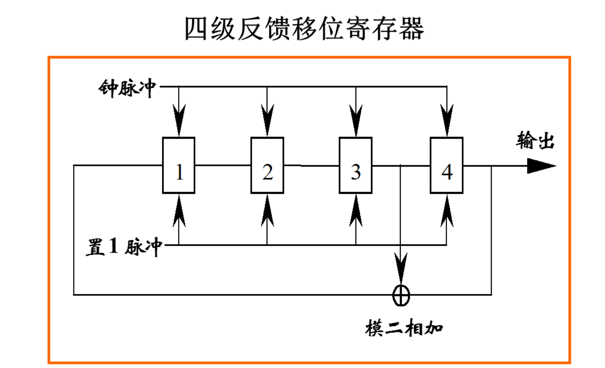
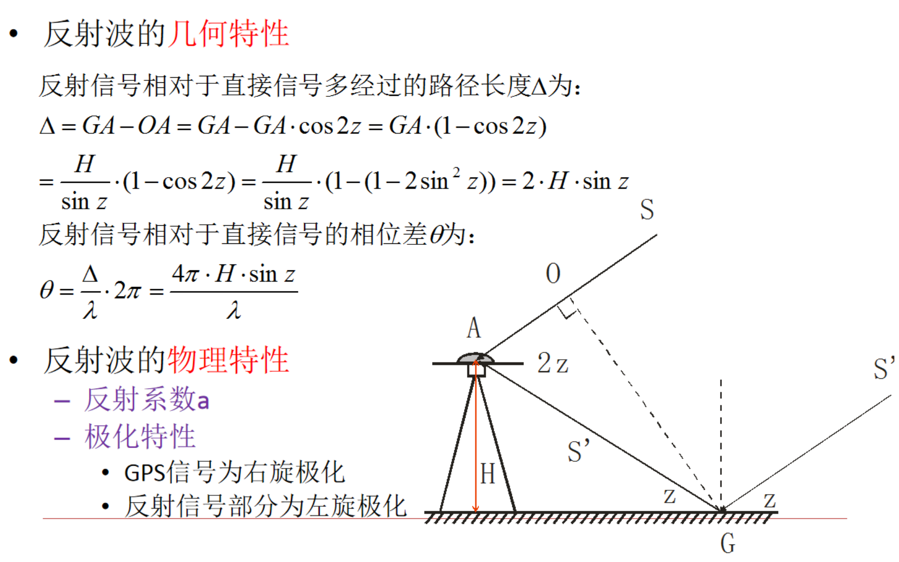
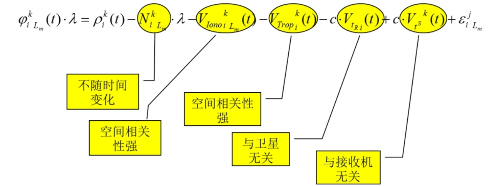

第一章各导航系统与特点
第二章
第三章 伪随机噪声码 卫星位置计算
第四章
第五章 测码伪距与测相伪距
静态测量特点

# 第一章 绪论
## 一、全球定位系统的产生与发展
- `GPS`，导航卫星测时与测距全球定位系统
- `GNSS`，全球导航卫星系统，包括美国的`GPS`，俄罗斯的`GLONASS`、欧盟的`Galileo`，和中国北斗卫星导航系统。

### 子午仪卫星定位系统

利用多普勒效应，计算无线电频率偏移，计算卫星位置。第一个卫星定位系统`子午仪卫星定位系统`。

#### 系统组成
- 空间部分：卫星
- 地面控制部分：跟踪站、计算中心、注入站、控制中心和海军天文台
- 用户部分：多普勒接收机

#### 局限性
- 单次定位时间长；非连续，无法成为一个独立的导航系统。
- 测量时间长，效率低；定位精度低。

## GPS系统组成

### 空间星座

24颗卫星均匀分布在6个轨道平面内，轨道为椭圆形，运行周期11小时58分

- 接收从地面监控部分发射的导航信息
- 执行从地面监控部分发射的控制指令
- 进行部分必要的数据处理，向地面发送导航信息
- 通过推进器调整自身的运行姿态

### 地面控制部分

GPS的地面监控部分由分布全球的19个地面站构成，包括主控站、监测2站、注入站以及通信和辅助系统。

### 用户部分

GPS接收机，接收导航卫星发出的信号，对卫星信号进行处理后依据所得数据确定接收机所在地理位置。

## 其他卫星导航定位系统
 
### 北斗三号
通过卫星的相互定位，实现不依赖全球建站的全部卫星的定位。
#### 未来方向
- 多信源多传感器融合：惯性导航、视觉导航、天文导航、光达、雷达、无线电机会信号
- 技术和系统融合
- 多产业融合

# 第二章 GPS测量所涉及的时间系统和坐标系统
## 一、卫星轨道
卫星在空间运行的轨迹称为`轨道`，描述卫星轨道位置和状态的参数称为`轨道参数`。

### 影响因素与研究方法
卫星实际运行轨道十分复杂，难以用简单而精确的数学模型加以描述。
- **地球质心引力**（中心引力）：将地球视为密度均匀的球体
- **摄动力**（非中心引力）：日月引力、大气阻力、太阳光压、地球潮汐力

在中心引力的作用下的运动称为`无摄运动`；受摄动力的卫星运动称为`受摄运动`。

## 二、无摄运动
根据万有引力定律来研究地球和卫星之间的相对运动，称为`二体问题`。

[开普勒定律](开普勒定律.md)

### 开普勒轨道6参数
- $a$轨道椭圆长半径
- $e$偏心率，确定轨道形状
- $i$轨道面倾角：卫星孤岛平面与地球赤道面之间的夹角
- $\Omega$升交点赤经，地球赤道面上升交点与春分点之间的地心夹角，确定卫星轨道平面与地球体之间的相对定向
- $\omega _s$近地点角距：轨道平面上，升交i的那与近地点之间的地心夹角，表达了开普勒椭圆在轨道平面上的定向
- $f_s$卫星真近点角，轨道平面上卫星与近地点之间的地心角距，确定卫星在轨道上的瞬时位置

### 真近点角$f_s$的计算

平近点角 $M_s$ ，平均角速度 $n$

$M_s = n(t-t_0)$

平近点角与偏近点角 $E_s$ 的关系

$E_s = M_s + e_s \sin E_s$

真近点角 $f_s$ ：

$f_s = \arctan (\dfrac{\sqrt{1-e^2} \sin E_s}{\cos E_s -e_s})$

## 三、摄动运动
建立适当的轨道摄动模型，以便对开普勒轨道进行修正，满足精确定位需求
- 轨道平面在空间的旋转
- 近地点在轨道面内的旋转

### 受摄轨道根数
$   \begin{cases} x = -\dfrac{GM}{r^3} + K_x \\
    y = -\dfrac{GM}{r^3} + K_y \\
    z = -\dfrac{GM}{r^3} + K_z  \end{cases} $
观测历元T内，摄动力全部消失，卫星将沿着这一瞬间的受摄轨道根数的开普勒椭圆作圆周运动

## 四、卫星的星历
卫星星历是描述运动轨道的信息，是一组对应某一时刻的轨道根数及其变率。

### 广播星历

### 精密星历
一些国家根据各自建立的跟踪站获取的精密观测资料，分为 `超快速预报星历`、`快速预报星历`、`事后精密星历`.

## 五、卫星坐标计算
### 1. 计算真近点角
#### 平均角速度
$ n_0 = \dfrac{\sqrt{GM}}{(\sqrt{A})^3} $

$ n = n_0 + \Delta n $

$\sqrt{A}$与摄动参数$\Delta n$
#### 平近点角
$ M = M_0 + n(t-t_{oe}) $
#### 偏近点角
$ E = M + e\sin E $
#### 真近点角
$f_s = \arctan (\dfrac{\sqrt{1-e^2} \sin E_s}{\cos E_s -e_s})$

### 2. 计算升交角距及摄动改正项
#### 升交角距
$ u' = \omega + f $
#### 摄动改正项：升交角距、卫星矢径、卫星轨道倾角
$   \begin{cases} \delta _u = C_{uc}\cos 2u' + C_{us}\sin 2u'   \\  \delta _r = C_{rc}\cos 2u' + C_{rs}\sin 2u' \\  \delta _i = C_{ic}\cos 2u' + C_{is}\sin 2u' \end{cases} $

### 3. 计算经过摄动改正的升交角距、卫星的地心距离及轨道倾角
将上步求得的改正项加到$u'$、$r'$、$i_0$

### 4. 计算卫星在轨道坐标系中的坐标
坐标原点位于地心，X轴指向升交点
$   \begin{cases} x = r\cos u   \\ y = r\sin u \end{cases}  $

### 5. 计算升交点经度
$   \Omega = \Omega_{t_{oe}} + \dot\Omega(t-t_{oe}) $

### 6. 计算卫星在地固坐标系下的坐标
将坐标轴依次旋转

# 第三章 全球定位系统的组成及信号结构
## 一、GPS卫星信号的组成
所有信号由原子钟的基本频率`倍频`或`分频`生成

### 1. 载波信号
运载调制信号的高频振荡波，可用于测距和测定多普勒频移。
包括：L1、L2、L5。采用多个载波频率的主要目的是消除电离层延迟，组成更多的线性组合观测值。
- 传输测距码和导航电文信息
- 作为测距信号使用

### 2. 测距码
用于测定从卫星至接收机间的距离的二进制码。
#### 原理
`编码`，将文字、图片、音频信息按照一定规则，表示为二进制数的过程。
`随机噪声码`：不可复制、没有周期、良好的自相关性。
`自相关系数`： $ R(t) = A_u - B_u / A_u + B_u $
$ A_u $ 为相同码元数， $ B_u $ 为相异码元数，通过测定使两端码序列相关性最好的平移码元数判断接收到测距码的时间延迟。
GPS采用`伪随机噪声码`：
- 具有良好自相关性，同时具有确定的编码规则

`模二相加`即`异或`。将4位寄存器中的信号依次输出，同时对3号与4号位的信号做异或运算，结果填充到空置的1号位上。

得到的伪随机码的长度 $ n^2-1 $，$ n $ 为寄存器数量。

#### GPS测距码
GPS采用两种测距码，`C\A码`与`P码`
- C\A码：由10级反馈移位寄存器产生，码长1023比特，测距精度2.9m，又称`粗码`
- P码，属于复合伪噪声码，码长 2.35e14 比特，周期约267天。被调制在L1和L2上。一般根据C\A码的电文信息捕获P码，定位精度0.29m。
- 因为P码的捕获依赖于C\A码，容易被攻击，目前使用`M码`作为军用码。

### 3. 卫星的导航电文
`导航电文`是包含有关卫星的星历、卫星工作状态、时间系统、卫星钟运行状态、轨道设定改正、大气折射改正和由C\A码捕获P码等导航信息的数据码。

- 以帧为单位发送，一个主帧长度为1500bit，播发需要30s。
- 一个主帧包括5个子帧，每个子帧播发时间为6s。
- 一个子帧由10个字组成，每个字播发时间0.6s。
- 第4、5帧各包括25个页面，因此用户需要花费25*30s才能接受到一组完整的导航电文。
- 第123子帧中的内容没小时更换一次，第45帧在地面输入新的历书后更换。

## 导航电文的内容
- `遥测字`，捕获导航电文的前导，包括同步码、遥测电文（地面监控系统在注入数据时的相关信息）、空闲部分和奇偶检验。
- `交接字`，捕获P码的Z计数，前10个bit时从起始时刻的星期数，后19个bit时本星期$X_1$码（1.5s）的周期数。
- `URA值`，用户测距精度的指数，一个数理统计指标
- 卫星健康状况
- $L_1$信号与$L_2$信号的群延。即信号开始生成到最后离开卫星发射天线的相位中心之间的时间。其公共部分被吸收到卫星钟差中。

## 二、卫星载波信号调制
$
    A\cos(\omega t +\phi _0)
$
可采用方式：
- `调幅`：改变载波振幅$A$
- `调频`：改变频率
- `调相`：载波相位

GPS采用二进制相位调制法。调制信号为0，载波相位不变化；调制信号为1，载波相位倒相。

## 三、GPS卫星位置的计算

### 1. 用广播星历计算卫星位置
1. 计算卫星运动平均角速度$n$
广播星历给出参数$\sqrt A$和摄动参数$\Delta n$：
$
    n = n_0 + \Delta n,\enspace n_0 = \dfrac {\sqrt{GM}}{(\sqrt A)^3}
$

2. 计算观测瞬间卫星的平近点角 $M$
$M_0$为参考时刻$t_{oe}$的平近点角，由广播星历给出。
$
    M = M_0 + n(t-t_{oe})
$

3. 计算偏近点角
弧度表示的开普勒方程：$E = M + e\sin E$

4. 计算真近点角$f$
$e$为卫星轨道偏心率，由广播星历给出
$
    f = \arctan \dfrac {\sqrt{1-e^2}\sin E} {\cos E-e}
$

5. 计算升交角距$u'$
$\omega$为近地点角距，有广播星历给出
$
    u' = \omega + f
$

6. 计算摄动改正项$\delta _u$、$\delta _r$、$\delta _i$
摄动参数$C_{ue}, C_{us}, C_{re}, C_{rs}, C_{ie}, C_{is}$，由广播星历给出。
$
    \begin{cases}\delta _u = C_{uc} \cos 2u' + C_{us} \sin 2u'  \\ \delta _r = C_{re}\cos 2u' + C_{rs}\sin 2u'\\ \delta _i=C_{ie}\cos 2u'+C_{is}\sin2u' \end{cases}
$

7. 对$u', r', i_0$进行摄动改正
$a=(\sqrt A)^2, i_0, \dfrac{\textnormal{d}i}{\textnormal{d}t}$由广播星历给出。
$
    \begin{cases}u=u'+\delta _u\\ r=r'+\delta _r=a(1-e\cos E)+\delta _r\\ i=i_0+\delta _i+\dfrac{\textnormal{d}i}{\textnormal{d}t}(t-t_{oe}\end{cases}
$

8. 计算卫星再轨道面坐标系中的位置
$
    \begin{cases}x=r\cos u\\y=r\sin u\end{cases}
$

9. 计算观测瞬间升交点精度$L$

# 第四章 GPS定位中的误差源

## 误差分类

**1. 卫星有关误差**：
卫星星历误差、卫星钟误差、相对论效应、信号在卫星内的时延、卫星天线相位中心偏差。

**2. 与信号传播有关**：
电离层误差、对流层延迟、多路径效应。

**3. 与接收机有关**：
接收机钟误差、接收机位置误差、信号在接收机内的时延、接收机天线相位中心偏差、接收机测量噪声。

其中：**卫星的轨道误差**、**卫星钟差**、**接收机钟差**、**大气折射的误差**为系统误差。
- 引入未知参数并求解
- 建立系统误差模型
- 将不同观测站，对相同卫星的同步观测值求差
- 简单忽略

## 卫星有关误差
### 1. 卫星星历误差
### 2. 卫星钟钟差
一般可表示为：

$\Delta t = a_0 + a_1(t_1 - t_0) + a_2(t-t_0)^2 + \int _{t_0}^t \gamma(t)\textnormal{d}t$

$a_0$为$t_0$时刻钟差，$a_1$为$t_0$时刻钟速（频偏）；$a_2$为$t_0$时刻该钟加速度的一半（频漂）。最后是随即向，采用钟的稳定度来描述。

### 3. 相对论效应
#### 近似改正
在狭义相对论效应和广义相对论效应的综合影响下，频率差约为：

$\Delta f = \Delta f_1 + \Delta f_2 = \dfrac f {c^2}(\dfrac{\mu}R -\dfrac{\mu}r - \dfrac{V_s^2}2)$

地面上生产原子钟时将钟的频率降低 $4.443\times10^{-10}\cdot f$。

#### 精确改正
GPS卫星的运行速度$V_s$和到地心的距离$r$动态变化。采用双差观测值进行相对定位时可以忽略，单点定位时，有：

$\begin{cases} \Delta t = -\dfrac{2\sqrt{a\mu}}{c^2} e\sin E(ns)\\ \Delta \rho = -\dfrac{2\sqrt{a\mu}}{c}e\sin E(m) \end{cases}$

#### 地面钟的狭义相对论效应
地面钟也需要改正，可以将地面站与地心的距离$R$视为常数

### 4. 信号在卫星内的时延
不同的测距信号生产时间不同。

### 5. 卫星天线相位中心偏差

2. **卫星轨道偏差**

卫星星历所给出的卫星轨道与卫星的实际轨道之差。

精密的轨道信息是精密定位的基础。

相对定位中，相邻测站星历误差具有很强的相关性，影响较小。

处理方法：
- 采用精密星历
- 同步观测值求差

## 信号传播有关的误差

### 1. 电离层延迟
电离层：弥散介质
影响电磁波的传播速度。对不同频率的电磁波影响不同。
`群波`：不同频率波的叠加。在弥散介质中，单频率波与群波的传播不同。
载波相位是单一相波，测距码是群波。

#### 折射率

相折射率：$ n_p = \sqrt{1- \dfrac{N_e E_t^2}{4\pi^2f^2\varepsilon_0 m_e}}$

略去微小项 $ n_p = 1- 40.28 \dfrac{N_e}{f^2}$

$ n_g = 1+ 40.28 \dfrac{N_e}{f^2} $

#### 双频改正

### 2. 对流层延迟

与大气压、温度、湿度有关

### 3. 多路径效应

天线周围地物一次或多次反射的卫星信号，信号叠加引起测量参考点位置变化，是观测量产生误差。

屏蔽左旋信号

#### 防止多路径效应

1. 观测上，选择合适的测站，避开易产生多路径的环境。
2. 采用抗多路径的设备：1）抗多路径天线，带抑径板或扼流圈的天线；2）窄相关技术、MET技术

## 与接收设备有关的误差
### 1. 接收机钟误差
### 2. 接收机的位置误差
### 3. 接收机的测量噪声
### 4. 接收机天线相位中心偏差
### 5. 信号在接收机内的时延
### 观测误差
包括分辨误差与安置误差
- 分辨误差：一般认为约为信号波长的1%
- 安置误差：有天线的置平

### 接收机钟差

$ 1\mu s $的同步误差可以引起 $300m$ 的误差

#### 处理方法
- 作为未知数，在数据处理中求解
- 利用观测值求差方法

### 天线相位中心位置偏差

天线的相位中心与仪器的几何中心不一致

## 其他误差来源

### 地球自转
协议地球坐标系相对卫星的瞬时位置，在卫星的传播过程中发生改变。

### 相对论误差

# 第五章 距离测量与定位方法
## 一、测距码测定站星距离
- 确定卫星的位置
- 确定站星距离

### 测距方法
1. **主动测距**：双程
2. **被动测距**：单程

### GPS测量的基本观测方程
$\tau _a$、$\tau _b$为卫星信号真正发射与到达的时间。$V_{t^S}$、$V_{t_R}$为卫星与接收机的钟差。经过电离层改正$V_{ion}$与对流层$V_{trop}$改正 

$ \tilde \rho = c * (t_R -t^S) = c * (\tau_b - \tau_a) + cV_{t^S} - cV_{t_R} - V_{ion} - V_{trop}$

$ \tilde \rho = \rho - V_{ion} - V_{trop} + cV_{t^S} - cV_{t_R} $

#### 误差方程

$   V_i = -l_i dX - m_i dY - n_i dZ - cV_{t_R} + (\rho_0)_i - \rho_i + cV_{t^{S}_i} - (V_{ion})_i - (V_{trop})_i    $

包含四个待定参数，因而至少需要同时观测4颗以上卫星

## 二、载波相位测量
- 测距码码元长度大，测距精度低；载波波长短，精度高

$ \rho = (\phi _i + N_i) * \lambda_i + cV_{t_R} - cV_{t^S} + (V_{ion})_i + V_{trop} $

### 重建载波
将非连续的载波信号恢复冲连续的载波信号
#### 码相关法：
将所接收到的调制信号与接收机产生的复制码相乘。需要了解码的结构。
- 可同时获得伪距观测值和导航电文
- 可获得全波长的载波
- 信噪比较好
#### 平方法
$ [\pm A \cos(\omega t + \phi)]^2 = \dfrac{A^2} 2 (1 + \cos 2\omega t + 2 \phi) $
- 去掉了测距码和导航电文
- 波长为原来一半，整周模糊度更难确定
- 结果信噪比较差
#### 互相关技术
因为电离层延迟不同，$L_1$与$L_2$上两组$Y$码先后到达接收机，延迟时间$\tau '$可以精确求出电离层改正
#### Z跟踪技术

### 测量原理
理论卫地距即相位差与波长之积：
$   \rho = \lambda (\phi _S - \phi _R) $

1. **首次观测**
相位差由整数部分与不足整周部分组成：

$   \phi = Fr(\phi) + N     $

2. **后续观测**
持续观测，记录信号相位变化过程中的整波段数$int(\phi)$对同一卫星信号所进行的连续的载波相位观测值含有同一整周未知数$N$

$\tilde\Phi = int(\phi) + Fr(\phi) + N$

### 载波相位观测方程
$   \tilde\phi _i \lambda = \sqrt{(X^i - X)^2 + (Y^i - Y)^2 + (Z^i -Z)^2} - cV_{t_R} + cV_{t^S} - N_i\lambda - (V_{ion})_i - (V_{trop})_is  $

#### 误差方程
$   v_i = -l_i \textnormal{d}X - m_i\textnormal{d}Y - n_i\textnormal{d}Z - N_i \lambda - cV_{t_R} + cV_{t^S} + L_i  $
$   L_i = (\rho_0)_i - \lambda \phi_i - (V_ion)_i -V_{trop} $

## 三、观测值的线性组合
消除卫星钟差、接收机钟差及整周模糊度等位置参数。

### 1. 单差
将观测值直接相减，主要指在接收机间求一次差。

$   \begin{cases} \tilde\phi^P_i(t_1) = \dfrac f c \rho^P_i(t_1) - fV_{t_i}(t_1) + fV_{t^P}(t_1) - N^P_i - \dfrac f c (V^t_{ion})^P_i - \dfrac f c (V^t_{trop})^P _i  \\    \tilde\phi^P_j(t_1) = \dfrac f c \rho^P_j(t_1) - fV_{t_j}(t_1) + fV_{t^P}(t_1) - N^P_j - \dfrac f c (V^t_{ion})^P_j - \dfrac f c (V^t_{trop})^P _j  
\end{cases} $

$   \rho^P_i(t_1) = \sqrt{(X^i - X)^2 + (Y^i - Y)^2 + (Z^i -Z)^2}$

相减后简化为

$   \Delta\phi^P_{ij}(t_1) = \dfrac f c \Delta\rho^P_{ij}(t_1) - fV_{t_{ij}}(t_1) - \Delta N^P_{ij} - \dfrac f c(V_{ion}^t)^P_{ij} - \dfrac f c (V_{trop})^P_{ij} $

消除了卫星钟差的影响，削弱了电离层折射、对流层折射、卫星轨道误差的影响

### 2. 双差
不同测站，同步观测一组卫星所得单差之差。（星间差分）
在双差观测方程式中，**接收机钟的相对钟差**也被消去。

### 3.三差
不同历元，同步观测同一组卫星，所得观测量双差之差。（历元间差分）
消除**整周未知数**

### 差分观测缺陷
- 数据利用率低
- 引入基线矢量代替位置矢量
- 差分观测值 间具有了相关性，使问题处理复杂化
- 某些参数无法求出

### 2. 同类型不同频率

组合形式：

$
    \phi_{m,n} = n \tilde \phi _1 + m \tilde \phi _2
$

如何确定 $m, n$ ？
- 整周模糊度仍未整数
- 具有适当波长
- 不受电离层延迟影像
- 测量噪声小

1. **宽巷观测值**

$n=1,\enspace m=-1$

波长86mm，精度略低，整周模糊度容易确定。

一般用于中间过程

2. **窄巷组合观测值**

$ n = 1 ,\enspace m=1$

波长短，模糊度难以确定。测距精度高。

3. **无电离层影像组合**

$
    \phi _{n,m} = \dfrac {f_1^2} {f_1^2-f_2^2} \phi_1
    - \dfrac{f_1 f_2} {f_1^2-f_2^2} \phi_2
$

模糊度不具有整数特性，电离层折射延迟为0

用于长基线解算，电离层活跃期或活跃地区基线解算。

### 3. 不同类型观测值的线性组合

### 不同类型的双频观测值的线性组合

- 消除电离层延迟、卫星钟差、接收机钟差、卫地距离
- 残余测量噪声、多路径误差

1. **确定宽巷观测值整周模糊度**

2. **确定整周模糊度、周跳探测和修复**

### 不同类型单频观测值线性组合

- 消除电离层延迟
- 残余测量噪声、多路径误差
- 较长时间观测可显著提高精度

## 四、周跳的探测与修复

当由于某种原因使接收机无法保持对卫星信号的连续追踪时，在卫星信号重新被锁定后，整周模糊度$N_0$将发生变化。

- 信号被遮挡，导致卫星信号无法被跟踪
- 仪器故障，导致差频信号无法产生
- 卫星信号信噪比过低，导致整周计数错误
- 接收机在告诉动态的环境下进行观测，导致接收机无法正确跟踪信号
- 卫星瞬时故障，无法产生信号。

**探测与修复**：设法找出周跳发生的时间和大小
- 根据观测值及其线性组合的时间序列是否符合变化规律来进行探测和修复：`屏幕扫描法`，`高次差法`、`多项式拟合法`。
- 用双频P码伪距观测值来探测、修复周跳
- 用观测值残差来进行检验
- 辅助性措施：采用`双差观测值`或`星间单差观测值`，采用`三差观测值`，根据残差来探测、修复周跳。

### 屏幕扫描法

人工在屏幕上观察观测值曲线发变化是否连续

- 费时，只能发现大周跳
- 由于原始的载波观测值变化很快，通常观察的是某种观测值的组合

### 高次差法
载波相位测量的观测值$N_0+Int(\phi)+Fr(\phi)$随时间不断变化，但其四次差应趋近于0。残留的四次差主要由接收机钟差等原因引起。

接收机钟差对此方法有效性影响较大。克服接收机钟差影响——**星间单差观测值**

### 多项式拟合法

根据n个相位测量观测值拟合一个n阶多项式，据此多项式预估下一个观测值并与实测值比较，从而发现并修正整周计数。通常取3-4阶
- 观测值可以是真正的相位观测值，也可以是单差或双差观测值。

### 残差法

根据平差后的残差进行周跳的探测与修复

- 可以发现小周跳

## 五、整周模糊度

- 采用伪距观测值确定：需要较精确的伪距观测值和电离层延迟修正值
- 采用较精确的卫星星历和先验站坐标确定
- 通过平差计算：当作待定未知参数在方程中一起解算，分为固定解和浮点解。

### 将模糊度作为待定参数通过平差计算进行估计

初始解误差大，模糊度参数难以确定时称为`实数解`。整周模糊度参数取整时所球的的基线向量称为整数解，或固定解。

- 求初始解
- 将整周模糊度固定为整数
- 求固定解

### 固定模糊度的基本方法与原理

- 确定一个合适的置信区间
- 从备选组中寻找正确解

### FARA

### LAMBDA法

### 已知基线法

### 交换天线法

## 六、单点定位（绝对定位）
根据卫星星历所给出的观测瞬间卫星在空间的位置和卫星钟差，以及由一台GPS接收机所测定的从卫星至接收机的距离，通过距离交会的方法来独立测定该接收机在地球坐标系中的三维坐标。
### 标准单点定位
利用**广播星历**所给出的卫星轨道和卫星钟差以及**伪距**观测值来进行。

### 精密单点定位
利用**精密星历**作为已知坐标起算数据，精密卫星钟差代替用户GNSS定位观测值方程中的卫星钟差参数。 

难点：
- 非差相位的周跳探测
- 正确处理各项改正
- 参数的估计方法：参数太多；参数分数动态变化

#### 技术特点：
单机定位

#### 优势：
- 不需要架设台站
- 单台接收机实现高精度的静态、动态定位
- 直接得到ITRF框架的三维地心坐标
- 获取绝对天顶对流延迟参数
- 多系统集成

### 广域实时精密定位技术

## 七、相对定位

- 确定进行同步观测的接收机之间相对位置（基线向量）的定位方法，称为`相对定位`、`测定基线向量`或`基线测量`。
- 一段时间内坐标固定不变，确定这些点的坐标称为`静态定位`。如测定板块运动和检测地壳形变。
- 每个观测瞬间坐标各不相同，确定这些坐标称为`动态定位`。
- `准动态定位`，迁站过程中保持对卫星的连续观测，将初始化阶段测定的整周模糊度保持并传递至下一个待定点。

### 特点：
- 优点：定位精度高
- 缺点：多台接受共同作业，作业复杂；数据吹复杂；不能直接获取直接坐标

### 静态相对定位

观测值为载波相位观测值或测码伪距观测值。

### 动态相对定位

确定运动载体相对于基准站的基线向量。未知数个数多于观测方程的个数。

#### 确定整周模糊度

- 初始化法
- 模糊度在航解算

## 八、差分GPS

绝对定位精度不能满足要求。

`差分GPS`：利用设置在坐标已知点上的GPS接收机测定GPS测量定位误差，用以提高在一定范围内其他GPS接收机（流动站）测量定位精度的方法。

### 基本原理

1. **误差的空间相关性**
主要误差：卫星轨道误差、卫星钟差、大气延迟、多路径效应。

以上各类误差除多路径效应均具有较强的空间相关性。

2. **差分GPS基本原理**
利用设在坐标已知点上的GPS接收机测定具有空间相关性的误差或其对测量定位结果的影响，共流动站改正观测值或定位结果

3. **差分改正数的类型**
- `距离改正数`：
- `位置改正数`：

4. **位置差分**

### RTK：实时动态载波相位测量
实现了精密定位实时化从而提供了精密控制测量、精密测图、精密工程放样和精密工程监控的实时化技术。

### 单基准站局域差分

1. **结构**
基准站，数据通讯链和用户

2. **数学模型**
加权平均、偏导数法、最小方差法

3. **特点**
- 优点：差分精度高、可靠性高、差分范围增大
- 缺点：范围有限，模型不完善

### 多基准站局域差分

### 广域差分

# 第六章 GNSS测量设计与实施
## GNSS测量的技术设计
GPS静态测量优势：
- 测量精度高
- 选点灵活、无需造标
- 全天候观测
- 观测时间短、效率高
- 观测、处理自动化
- 可测量三维坐标
### GNSS测量的设计依据
1. **GPS测量规范、规程等**
> - 全球定位系统（GPS）测量型接收机检定规程
> - 卫星定位城市测量技术标准
> - 全球导航卫星系统测量规范
2. **测量任务书（合同）**
施策范围、目的、技术指标（精度）
3. **等级要求**

### GNSS控制网的精度、密度设计
- 国标中GNSS测量按精度分为A、B、C、D、E五个等级。

基线中误差：

$   \omega = \sqrt{a_0^2 + (b_0 \times D)^2}    $

### GNSS控制网的基准设计
包括：
- `方位基准`：可由GNSS基线向量共同确定
- `尺度基准`：可由地面已知点边长
- `位置基准`： 1. 应将新旧控制点进行联测。 2. 坐标系统尽量与测区过去的坐标系统一致 3. 所选为高等级点，联测点分布均匀 4. GNSS网平差后得到的是大地高，为了得到正常高，应使一定数量的GNSS点与水准点重合，或部分GNSS点联测水准。 

### GNSS控制网图形设计
- `观测时段`：测站上开始接受卫星信号到观测停止，**连续**观测的时间间隔，简称时段。
- `同步观测`：两台或两台以上接收机同时对同一组卫星进行的观测。
- `同步观测环`：三台或三台以上接收机同步观测获得的基线向量所构成的闭合环。
- `异步观测环`：由非同步观测获得的基线向量构成的闭合环。
- `数据剔除率`：同一时段中，删除的观测值个数与获得的观测值总数的比值。
- `基线向量`：对同步观测所采集的数据进l行处理，所获得的同步观测测站间的坐标差。
- `截止高度角`：接收机观测卫星的高度角限值，低于此值的卫星不被观测。
- `重复基线`：具有两个时段以上同步观测结果的基线向量。
- `采样间隔`：接收机连续两个观测历元间的时间间隔。
- `独立基线`：由相互函数独立的差分观测值所确定出的基线向量。当某一时段有m台接收机进行同步观测时，可得到$m-1$条独立基线。

#### 计算
$ S_{min} = ceil(n \cdot m / N)$

$S_{min}$为观测时段数，$n$为网点数，$m$为每点平均设站次数，$N$为接收机数
- 总基线数：$ J_总 = S\cdot N \cdot (N-1) /2 $
- 必要基线数：$ J_必 = n-1 $
- 独立基线数：$ J_独 = S\cdot (N-1) $
- 多余基线数：$ J_多 = S\cdot (N-1) - (n-1) $

#### GNSS控制网的布网形式
1. **跟踪站式**：每个测站一台接收机，长期观测；精度高，运行成本高；用于A级网
2. **会战式**：若干台接收机在同一批点上连续观测，然后转移
- 一次组织多台GPS接收机，集中共同作业。
- 可以较好消除卫星轨道误差
- 使用B级网

3. **多基准站方式**：若干台长期固定观测接收机，称为基准站。另外一些接收机在基准站周围进行同步观测

4. **同步图形拓展**：多台接收机在不同测站上进行同步观测然后迁移。每次同步观测形成一个同步图形。不同同步图形有若干各公共点
- 效率高
- 图形强度弱，可靠性低
- 用于等外GPS测量

5. **单基准站式**：一台接收机作为基准站

#### 调度方案
1. **点连式**
2. **边连式**：相邻同步图形由一条公共基线连接。几何强度较高，抗粗差能力较强。观测时段大大增加。
3. **网连式**：相邻同步图形间有3个以上公共点，网的图形条件很强。

### GNSS网的技术设计原则
1. GNSS网不能存在自由基线
2. 网的闭合环的基线个数不能过多
3. 至少应与3-5个地面网点重合，地面水准点
4. 交通便利视野开阔，同时考虑通视问题

## GNSS测量的实施

测前：
- 项目立项
- 方案设计
- 施工设计
- 测绘资料收集整理
- 仪器检验、检定
- 踏勘、选点、埋石

测中：
- 作业队

$   S_{min} = ceil(n\cdot m /N) $
总天数 = ceil($S_{min}$/单天观测期数) + 机动天数 + 休息日

### 成果核验
#### 数据剔除率：
观测值改正数大于某一阈值时，认为该观测值含有粗差，需要将其删除
同一时段有效观测值个数与获得的总观测数量的比值，不应小于80%
#### 重复观测边的检核：
同一基线边观测多个时段，得到重复观测边
不同时段观测结果的互差，应小于相应类别规定精度的$2\sqrt{2}$倍
同一条边三个以上观测结果，任意时段观测结果与均值的差不应超限
#### 同步环闭合差：
同步观测基线所组成的闭合环的闭合差
#### 异步环闭合差：
相互独立的基线所组成的闭合环的闭合差
3. **同步闭合环的检核**：环线坐标闭合差应为0.

# 第七章：GNSS数据处理

### 单基线解
一次进同时提取两台GNSS接收机的同步观测数据进行基线解算。

- 模型简单，参数

#### 影响基线解算的因素
1. **起点坐标不准确**
选择坐标准确度更高的点作为基线解算的起点。
2. **卫星观测时间短**
删除观测时间较短卫星的数据
3. **周跳探测、修复不正确**
在周跳发生出增加新发模糊度参数后删除周跳严重的时间段
4. **多路径效应**
5. **对流层或电离层折射影响过大**
- 提高截止高度角
- 分别采用模型对对流层与电离层进行改正
- 使用双频观测值

### 网平差
#### 无约束平差
无或最少约束条件数
#### 约束平差
多余最少约束条件数
#### 联合平差
观测值包括GNSS观测值和地面常规观测值；确定各点在指定坐标参照系下的坐标

2019高压油管
2018高温作业专用服装