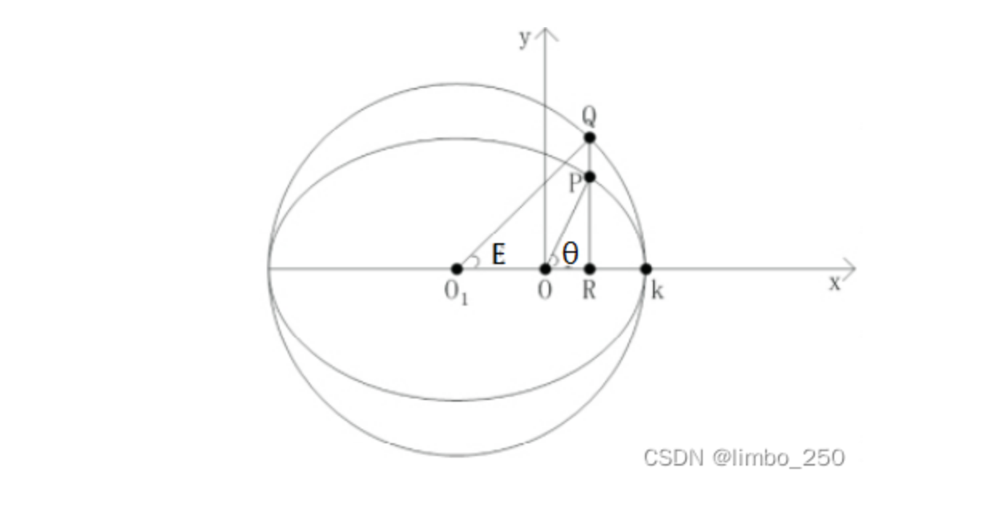

### 卫星轨道在GNSS中的定义

卫星在空间运行的轨迹称为`轨道`，描述卫星轨道位置和状态的参数称为`轨道参数`。

### 影响因素与研究方法

卫星实际运行轨道十分复杂，难以用简单而精确的数学模型加以描述。

- **地球质心引力**（中心引力）：将地球视为密度均匀的球体
- **摄动力**（非中心引力）：日月引力、大气阻力、太阳光压、地球潮汐力

在中心引力的作用下的运动称为`无摄运动`；受摄动力的卫星运动称为`受摄运动`。

# 二、无摄运动

根据万有引力定律来研究地球和卫星之间的相对运动，称为`二体问题`。

[开普勒定律](../开普勒定律.md)

### 开普勒轨道6参数

长半轴、偏心率（轨道的形状和大小）

轨道面倾角、升交点赤经（轨道平面与地球体的相对关系）

近地点角距（椭圆在轨道平面的定向）、卫星过近地点时刻（瞬时位置）

椭圆中心与垂线与圆弧交点，称为`偏近点角`。

平近点角 $M_s$ ，平均角速度 $n$
$M_s = n(t-t_0)$

平近点角与偏近点角 $E_s$ 的关系
$E_s = M_s + e_s \sin E_s$

真近点角 $f_s$ ：
$f_s = \arctan (\dfrac{\sqrt{1-e^2} \sin E_s}{\cos E_s -e_s}$

# 三、摄动运动

建立适当的轨道摄动模型，以便对开普勒轨道进行修正，满足精确定位需求

- 轨道平面在空间的旋转
- 近地点在轨道面内的旋转
- 

### 受摄轨道根数

$
    x = -\dfrac{GM}{r^3} + K_x \\
    y = -\dfrac{GM}{r^3} + K_y \\
    z = -\dfrac{GM}{r^3} + K_z
$

# 四、卫星的星历
卫星星历是描述运动轨道的信息，是一组对应某一时刻的轨道根数及其变率。

### 广播星历

### 精密星历
一些国家根据各自建立的跟踪站获取的精密观测资料，分为 `超快速预报星历`、`快速预报星历`、`事后精密星历`.

### 计算
1. 计算真近点角
$   n_0 = \sqrt{\dfrac{GM}{a_s^3}} \\
    M_S = M_0 + n(t-t_{oe}) \\
    E_S = M_S + e\sin E_S$
2. 计算升交角距及轨道摄动改正项
$$
3. 计算经过摄动改正的升交角距
$$
4. 计算卫星在轨道坐标系中的坐标
$$
5. 计算升交点经度
6. 计算卫星在地固坐标系下的坐标