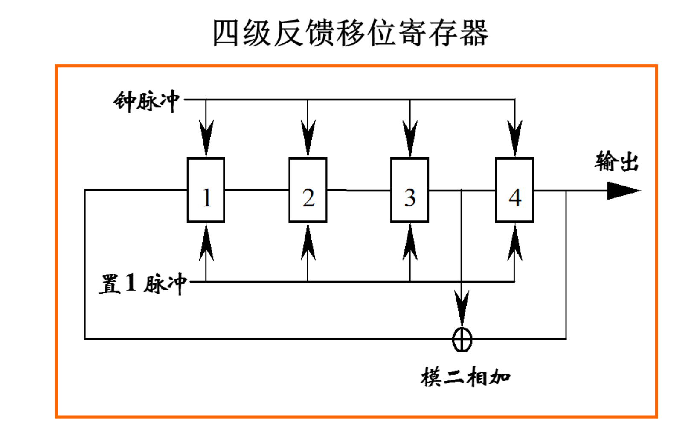

# 一、GPS卫星信号的组成
## GPS发射的三类信号

所有信号由原子钟的基本频率`倍频`或`分频`生成

### 1. 载波信号

运载调制信号的高频振荡波，可用于测距和测定多普勒频移。

包括：L1、L2、L5。采用多个载波频率的主要目的是消除电离层延迟，组成更多的线性组合观测值。

### 2. 测距码

用于测定从卫星至接收机间的距离的二进制码。

#### 原理

`编码`，将文字、图片、音频信息按照一定规则，表示为二进制数的过程。

`随机噪声码`：不可复制、没有周期、良好的自相关性。

`自相关系数`： $ R(t) = A_u - B_u / A_u + B_u $

$ A_u $ 为相同码元数， $ B_u $ 为相异码元数，通过测定使两端码序列相关性最好的平移码元数判断接收到测距码的时间延迟。

GPS采用`伪随机噪声码`：
- 具有良好自相关性，同时具有确定的编码规则

`模二相加`即`异或`。将4位寄存器中的信号依次输出，同时对3号与4号位的信号做异或运算，结果填充到空置的1号位上。

得到的伪随机码的长度 $ n^2-1 $，$ n $ 为寄存器数量。

#### GPS测距码
GPS采用两种测距码，`C\A码`与`P码`
- C\A码：由10级反馈移位寄存器产生，码长1023比特，测距精度2.9m，又称`粗码`
- P码，属于复合伪噪声码，码长 2.35e14 比特，周期约267天。被调制在L1和L2上。一般根据C\A码的电文信息捕获P码，定位精度0.29m。
- 因为P码的捕获依赖于C\A码，容易被攻击，目前使用`M码`作为军用码。

### 3. 卫星的导航电文

`导航电文`是包含有关卫星的星历、卫星工作状态、时间系统、卫星钟运行状态、轨道设定改正、大气折射改正和由C\A码捕获P码等导航信息的数据码。

- 以帧为单位发送，一个主帧长度为1500bit，播发需要30s。
- 一个主帧包括5个子帧，每个子帧播发时间为6s。
- 一个子帧由10个字组成，每个字播发时间0.6s。
- 第4、5帧各包括25个页面，因此用户需要花费25*30s才能接受到一组完整的导航电文。
- 第123子帧中的内容没小时更换一次，第45帧在地面输入新的历书后更换。

## 导航电文的内容
- `遥测字`，捕获导航电文的前导，包括同步码、遥测电文（地面监控系统在注入数据时的相关信息）、空闲部分和奇偶检验。
- `交接字`，捕获P码的Z计数，前10个bit时从起始时刻的星期数，后19个bit时本星期$X_1$码（1.5s）的周期数。
- `URA值`，用户测距精度的指数，一个数理统计指标
- 卫星健康状况
- $L_1$信号与$L_2$信号的群延。即信号开始生成到最后离开卫星发射天线的相位中心之间的时间。其公共部分被吸收到卫星钟差中。

# 二、卫星载波信号调制
$
    A\cos(\omwga t +\phi _0)
$
可采用方式：
- `调幅`：改变载波振幅$A$
- `调频`：改变频率
- `调相`：载波相位

GPS采用二进制相位调制法。调制信号为0，载波相位不变化；调制信号为1，载波相位倒相。

# 三、GPS卫星位置的计算

### 1. 用广播星历计算卫星位置
1. 计算卫星运动平均角速度$n$
广播星历给出参数$\sqrt A$和摄动参数$\Delta n$：
$
    n = n_0 + \Delta n,\enspace n_0 = \dfrac {\sqrt{GM}}{(\sqrt A)^3}
$

2. 计算观测瞬间卫星的平近点角 $M$
$M_0$为参考时刻$t_{oe}$的平近点角，由广播星历给出。
$
    M = M_0 + n(t-t_{oe})
$

3. 计算偏近点角
弧度表示的开普勒方程：$E = M + e\sin E$

4. 计算真近点角$f$
$e$为卫星轨道偏心率，由广播星历给出
$
    f = \arctan \dfrac {\sqrt{1-e^2}\sin E} {\cos E-e}
$

5. 计算升交角距$u'$
$\omega$为近地点角距，有广播星历给出
$
    u' = \omega + f
$

6. 计算摄动改正项$\delta _u$、$\delta _r$、$\delta _i$
摄动参数$C_{ue}, C_{us}, C_{re}, C_{rs}, C_{ie}, C_{is}$，由广播星历给出。
$
    \begin{cases}\delta _u = C_{uc} \cos 2u' + C_{us} \sin 2u'  \\ \delta _r = C_{re}\cos 2u' + C_{rs}\sin 2u'\\ \delta _i=C_{ie}\cos 2u'+C_{is}\sin2u' \end{cases}
$

7. 对$u', r', i_0$进行摄动改正
$a=(\sqrt A)^2, i_0, \dfrac{\textnormal{d}i}{\textnormal{d}t}$由广播星历给出。
$
    \begin{cases}u=u'+\delta _u\\ r=r'+\delta _r=a(1-e\cos E)+\delta _r\\ i=i_0+\delta _i+\dfrac{\textnormal{d}i}{\textnormal{d}t}(t-t_{oe}\end{cases}
$

8. 计算卫星再轨道面坐标系中的位置
$
    \begin{cases}x=r\cos u\\y=r\sin u\end{cases}
$

9. 计算观测瞬间升交点精度$L$
