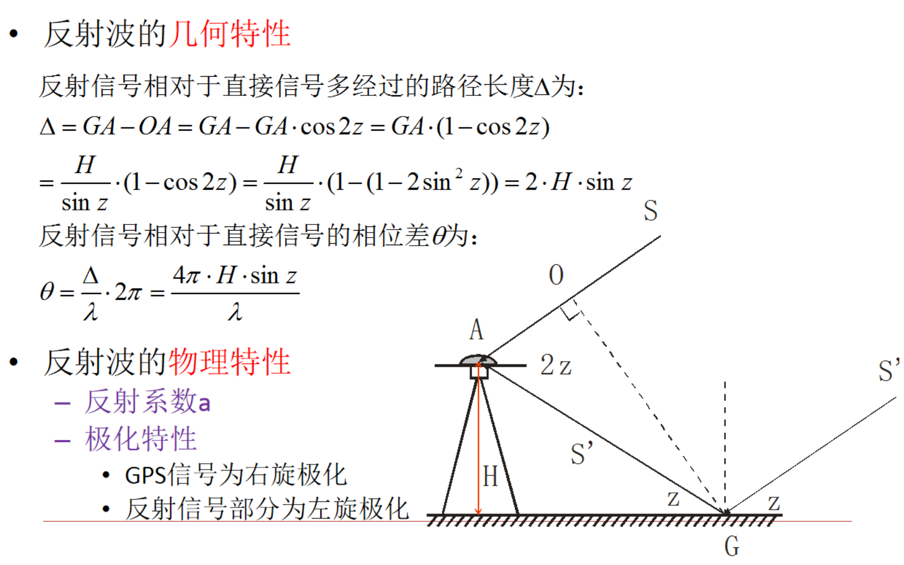

# 误差

## 误差分类

**卫星有关误差**：

卫星星历误差、卫星钟误差、相对论效应、信号在卫星内的时延、卫星天线相位中心偏差。

**与信号传播有关**：

电离层误差、对流层延迟、多路径效应。

**与接收机有关**：

接收机钟误差、接收机位置误差、信号在接收机内的时延、接收机天线相位中心偏差、接收机测量噪声。

其中：**卫星的轨道误差**、**卫星钟差**、**接收机钟差**、**大气折射的误差**为系统误差。

- 引入未知参数并求解
- 建立系统误差模型
- 将不同观测站，对相同卫星的同步观测值求差
- 简单忽略

## 卫星有关误差

1. **卫星钟差**

原子钟存在`钟差`与`漂移`。

修正信息由导航电文提供：

$ \delta t^j = a_0 + a_1(t-t_{oe}) + a_2(t-t_{oe}) $

2. **卫星轨道偏差**

卫星星历所给出的卫星轨道与卫星的实际轨道之差。

精密的轨道信息是精密定位的基础。

相对定位中，相邻测站星历误差具有很强的相关性，影响较小。

处理方法：
- 采用精密星历
- 同步观测值求差

## 信号传播有关的误差

### 1. **电离层折射**

电离层：弥散介质

影响电磁波的传播速度。对不同频率的电磁波影响不同。

`群波`：不同频率波的叠加。在弥散介质中，单频率波与群波的传播不同。

载波相位是单一相波，测距码是群波。

#### 折射率

相折射率：$ n_p = \sqrt{1- \dfrac{N_e E_t^2}{4\pi^2f^2\varepsilon_0 m_e}}$

略去微小项 $ n_p = 1- 40.28 \dfrac{N_e}{f^2}$

$ n_g = 1+ 40.28 \dfrac{N_e}{f^2} $

#### 双频改正

2. **对流层折射**

与大气压、温度、湿度有关

### 2. 多路径效应

天线周围地物一次或多次反射的卫星信号，信号叠加引起测量参考点位置变化，是观测量产生误差。

屏蔽左旋信号

#### 防止多路径效应

1. 观测上，选择合适的测站，避开易产生多路径的环境。
2. 采用抗多路径的设备：1）抗多路径天线，带抑径板或扼流圈的天线；2）窄相关技术、MET技术

## 与接收设备有关的误差

### 观测误差
包括分辨误差与安置误差
- 分辨误差：一般认为约为信号波长的1%
- 安置误差：有天线的置平

### 接收机钟差

$ 1\mu s $的同步误差可以引起 $300m$ 的误差

#### 处理方法
- 作为未知数，在数据处理中求解
- 利用观测值求差方法

### 天线相位中心位置偏差

天线的相位中心与仪器的几何中心不一致

## 其他误差来源

### 地球自转

协议地球坐标系相对卫星的瞬时位置，在卫星的传播过程中发生改变。

### 相对论误差
