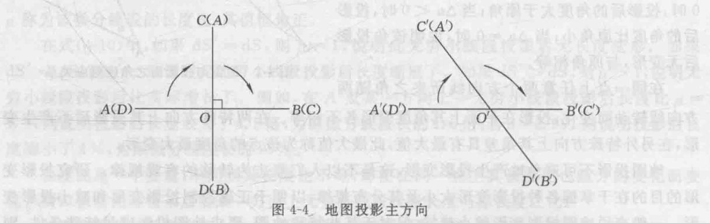
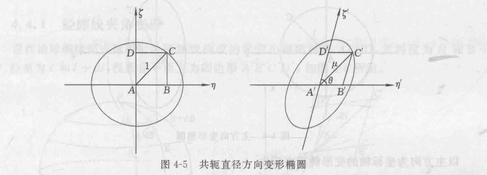
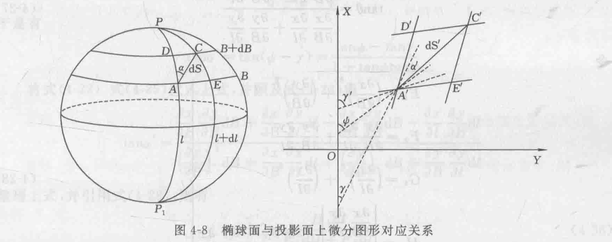

# 第一章 绪论
- `地形图`：用地形测量的方法将地表面的地形、地物按一定比例用符号表示在平面的图纸上。
- `透视投影`：在地球体内部安置一个发光点，将地球上的经纬线网投影到球外的一个平面上。属于局部投影。
- `广义投影`：设想平面上两组相互交叉的线条，唯一地与地球上的经纬线一一对应
## 一、地图投影的基本方法
1. **几何透视法**
2. **数学分析法**

# 第二章 地球体的有关参数和公式
> 见大地测量学

# 第四章 地图投影的方法、变形和分类
## 1. 地图投影的变形
> 底图投影可以保持个别点和线投影在平面上不产生变形。在这些点或线上，实际比例尺才与标注比例尺一致
### 长度比、长度变形
地面上微分线段$ds$，投影在平面上为$ds'$
长度比：$\mu = \dfrac{\textnormal{d}S'}{\textnormal{d}S}$
长度变形：$v_\mu = \mu-1 = \dfrac{\textnormal{d}S'-\textnormal{d}S}{\textnormal{d}S}$

### 面积比与面积变形
与长度比类似：$P = \dfrac{\textnormal{d}F'}{\textnormal{d}F}$

### 角度变形
投影面上任意两个方向线所夹之角为$u'$，地球面上相对应的两个方向所夹之角为$u$，$\Delta u$为角度变形：$\Delta u = u' - u$

各方向角度变形不同，两特殊方向角度无变形，在另外角度上具有最大值，称为该点的**角度最大变形**

## 2. 变形椭圆
### 主方向

地球椭球面或球面上任意一点，存在一组互相正交的方向投影后仍然正交，呈此两方向为主方向。

### 共轭直径

$ m = \dfrac{A'D'}{AD} = \dfrac{\epsilon '}{\epsilon}, \enspace n = \dfrac{A'B'}{AB} = \dfrac{\ita '}{\ita}$
### 变形椭圆

有阿坡隆尼亚定理：

$\begin{cases} a^2 + b^2 = m^2 + n^2 \\ ab = mn\sin\theta \end{cases}$

解得：

$\begin{cases} a+b = \sqrt{m^2+n^2+2mn\sin \theta} \\ a-b = \sqrt{m^2+n^2-2mn\sin\theta}\end{cases}$

## 3. 角度变形
### 经纬线夹角变形

$\tan\phi = \dfrac {\textnormal{d}y}{\textnormal{d}x} = \dfrac {\dfrac {\partial y}{\partial B}\textnormal{d}B + \dfrac{\partial y}{\partial l}\textnormal{d}l}{\dfrac {\partial x}{\partial B}\textnormal{d}B + \dfrac{\partial x}{\partial l}\textnormal{d}l}$

$A'$点处经线于$X$轴夹角$\gamma$，纬线与$X$轴夹角$\gamma '$。分别有$\textnormal{d} l =0$或$\textnormal{d}B=0$。经纬线夹角$\theta$：

$\tan\theta = \tan(\gamma'-\gamma) = \dfrac{\tan\gamma'-\tan\gamma}{1+\tan\gamma'\tan\gamma} = \dfrac{\dfrac{\partial x}{\partial B}\dfrac{\partial y}{\partial l}- \dfrac{\partial y}{\partial B}\dfrac{\partial x}{\partial l}}{\dfrac{\partial x}{\partial B}\dfrac{\partial x}{\partial l}- \dfrac{\partial y}{\partial B}\dfrac{\partial y}{\partial l}}$

### 方位角变形
地球面上过A点方向线AC与过A点之经线AD方向所夹之角即为该方向的方位角。其在投影面上为$\alpha'$，有

$\alpha' = \phi -\gamma$

$\tan\alpha= \tan(\phi-\gamma) = \dfrac{\tan\phi -\tan\gamma}{1+\tan\phi\tan\gamma}$

### 角度最大变形
