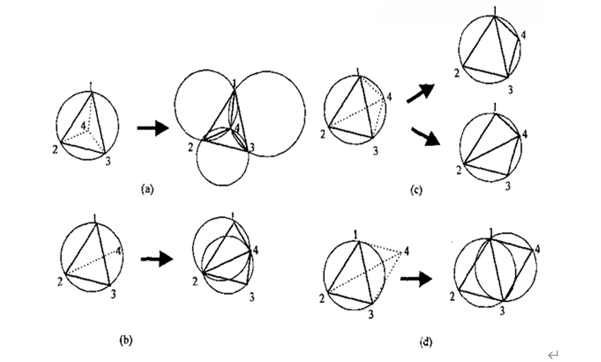
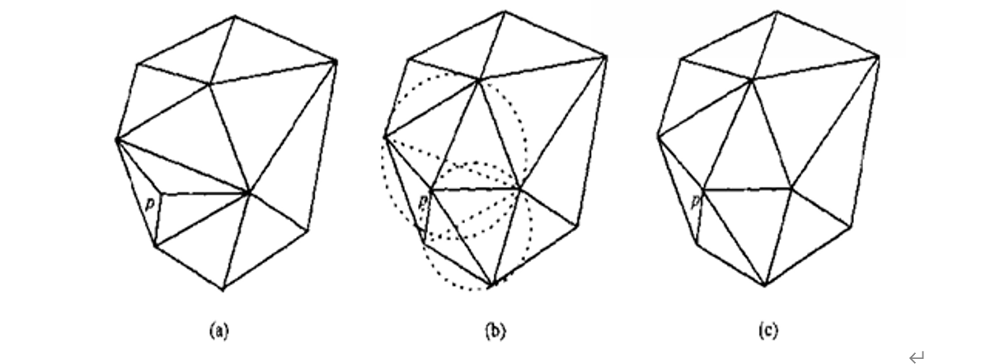

TIN模型咋不含约束条件的情况下有三点基本要求：

1. TIN模型唯一；
2. 模型中每个三角形应尽量接近等边三角形，使得三角网几何形状最佳；
3. 最邻近点构建三角形，使得三角形边长之和最小；

所有三角网中Delaunary三角网表现最佳。

Delaunary三角形外接圆内不包含其他点，这一特性构成了从一系列不重合的平面点建立Delaunary三角网的基本法则，称为`空圆法则`。

`局部优化算法（LOP）`：在构网过程中，在原有的三角网中插入新的点集不需要每次都遍历整个三角网查找不符合三角的三角形，交换凸四边形的对角线，保留短的那条对角线，使三角网中所有三角形的最小角度最大化，可以获得等角性最好的三角网。

