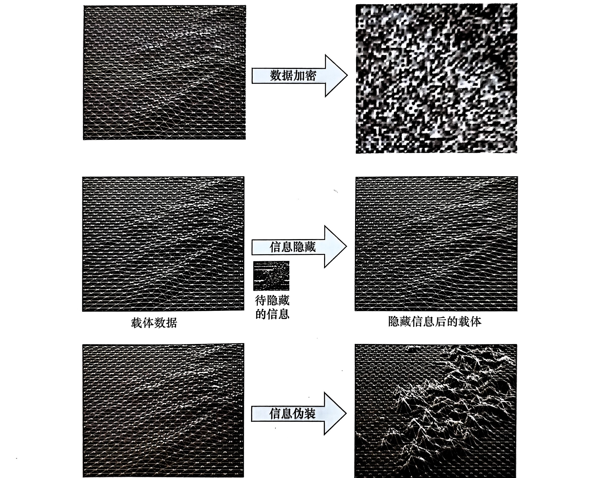

# DEM信息伪装基本概念与理论基础
| 术语 | 英文全称（译名） | 特点及含义 |
|------|------------------|-----------|
| DEM  | Digital Elevation Model（数字高程模型） | 以绝对高程或海拔表示的地形模型 |
| DTM  | Digital Terrain Model（数字地形模型） | 泛指地形表面自然、人文、社会景观模型 |
| DHM  | Digital Height Model（数字高程模型） | 以任意高程表示的地形模型，包括绝对高程和相对高程 |
| DGM  | Digital Ground Model（数字地面模型） | 具有连续变化特征的地表实体模型 |
|      | Digital Geomorphology Model（数字地貌模型） | 表达地貌形态的数字模型，如坡度、坡向等 |
| DTED | Digital Terrain Elevation Model（数字地形高程模型） | 以格网结构组织的地形高程模型，为美国国家地理空间情报局（NGA）标准数据产品 |
| DSM  | Digital Surface Model（数字表面模型） | 数字表面模型，指包含了地表建筑物、桥梁和树木等高度的地面高程模型 |

DEM数据的主要目的是将源域（实际地形）转换到另一种空间与（数字高程模型）上。
本质上，数字高程模型表示的就是该区域上一个三维向量的有限序列：

$ V_i = (X_i, Y_i, Z_i) \enspace i = 1, 2, 3, \dots, n$

当平面位置排列规则时，其坐标数据可以省略，通过记录其空间范围、格网间距及对应每个各网点的高程矩阵，可以推断出所有格网点的平面坐标和高程信息。
若不存在这种关系，则表示的是不规则DEM数据。

## DEM信息伪装的技术要求
1. **安全性**：攻击者不能判断伪装数据是否进行了特殊处理；得到伪装数据不能再短时间内提取出受保护的信息。
2. **鲁棒性**：伪装后的数据有承受外来攻击的能力。
3. **差异性**：原始数据与伪装数据差异要大，恢复后数据与原始数据差异小。
4. **迷惑性**：仅从表现形式上很难判断数据的真伪，甚至忽略数据正确性的判断。
5. **可逆性**：可以恢复。不同权限的用户还原得到不同精度的DEM。
6. **时效性**：执行效率高
7. **可认证性**：用来分析伪装数据在传输过程中是否遭到过非法用户的攻击。

## 分类
- 按伪装范围可以分为局部伪装和整体伪装。
- 按处理方式可以分为基于结构和基于内容。
- 按作用域可分为基于空间域和基于频率域。

# 基于结构的DEM信息伪装

# 基于内容的DEM信息伪装

# 数据重点区域的信息伪装

# 线状特征的信息伪装

# 不规则格网的信息伪装

# 算法评价模型与辅助选择分析
