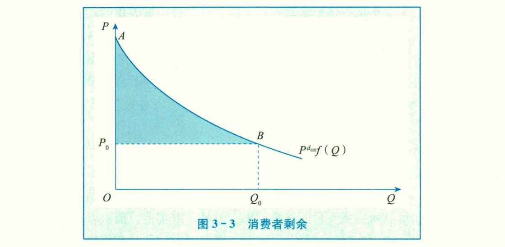
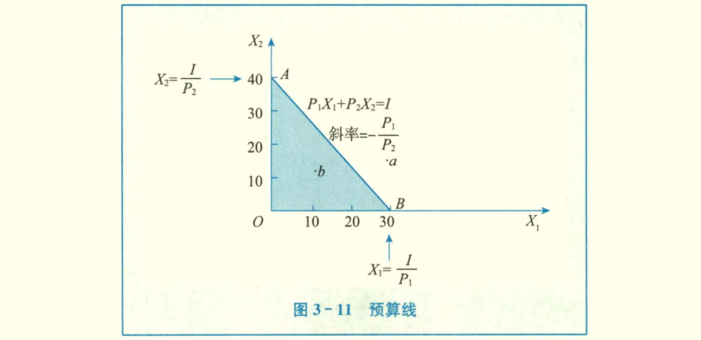

# 需求、供给与价格均衡
## 一、需求

在一定时期内，在各种可能的价格水平，人们**愿意**且**能够**购买的商品数量。

自身价格、替代品的价格、互补品的价格。

#### 商品之间的关系
- 替代
- 互补

#### 商品
- 奢侈品
- 正常商品
- 劣质品

#### 影响需求的因素

- 商品本身价格
- 替代品的价格

- 消费者的收入、社会分配的公平程度
- 消费者的偏好
- 消费者对未来的预期

- 人口数量与结构的变动
- 政府的消费政策

#### 需求曲线

需求量与价格呈反方向变动。

商品持有数少的时候，边际效用高，愿意付出的成本更多；持有数更多时，边际效用低，愿意付出的成本低。

不影响结论的情况下，大多使用线性函数

$ Qd = \alpha - \beta (P)$ 

- `需求量的变动`沿着需求曲线的变动，由商品价格的变化带来的
- `需求的变动`需求的变动，由商品价格以外的因素造成。需求点的纵坐标不变。

- `吉芬商品`：（收入极低的情况下）价格与需求成正相关的商品（爱尔兰灾荒时期的土豆）。

## 二、供给

一定的时期内，以各种可能的价格水平，厂商愿意且能够供应的商品量。

#### 供给曲线

> 劳动力的供给曲线

#### 影响供应的因素

- 厂商目标
- 厂商对未来的预期

- 商品本身的价格
- 相关商品的价格

- 生产要素的价格
- 生产技术的变动

- `新质生产力`，资本与劳动的比例更高

### 劳动与资本

## 三、市场均衡

`均衡`，经济事物中，有关变量，在一定条件下，相互作用，所达到的一种相对静止的状态。

供求双方在竞争过程中自发形成的，是一个价格自发决定的过程

#### 供求定理
1. 供给不变
需求增加使需求曲线向右上方移动，均衡价格上升，均衡数量增加。

2. 需求不变
供给增加使供给曲线向下移动，均衡价格减少，均衡数量增加

## 四、弹性

`弹性`是相对数之间的相互关系，一个量变动1%，另一个量变动百分之多少的概念。

弧弹性公式： 曲线上两点之间的弹性

$ e = \dfrac {\Delta Y} {\Delta X} · \dfrac X Y $ 

点弹性公式： 单个点上的弹性

$ e = \dfrac {d Y} {d X} · \dfrac X Y $

### `需求价格弹性` （加符号取正值）

$ e_d = - \dfrac {\Delta Q} {\Delta P} · \dfrac P Q $

起点不同时同一段弧弧弹性不同，统一取价格与需求量的平均值代替。

- **无限弹性**：价格一定，需求无限
- **弹性缺乏**：需求变动比率小于价格变动比率

> 线性供给曲线的延长线与y正半轴相交，弹性大于1；y负半轴相交，弹性小于1

### `供给价格弹性`

任何两个具有函数关系的经济变量之间都可以建立弹性。

`供给价格弹性`表示现在一定时期内一种商品的**供给量**变动对于该**商品价格**变动过的反映程度

### 需求的交叉弹性

X商品价格变化带来Y商品需求量。

大于零，两种商品为替代关系；小于零为互补关系。

### 需求的收入弹性

X为收入，Y为需求量

1. 正常商品
- 收入富有弹性：奢侈品
- 收入单位弹性：如衣服
- 收入缺乏弹性：必需品
- 收入无弹性：如食盐
- 收入负弹性：劣等品

`恩格尔系数`：在一个家庭或国家中，食物指出在收入中所占的比例随着收入的增加而减少。

> 三座大山：教育、医疗、房产

## 五、供求分析实例

### 价格限制
#### 最高限价

最高限价地域市场价格，导致供不应求，
#### 最低限价

- 利于社会平等与安定
- 

# 第二章：消费者选择
## 一、效用理论
`效用`：消费者从商品中得到的满足程度。

理性消费者的最优选择，有限的收入合理用于不同商品，以达到最大效用。

### 基数效用与序数效用
- 基数效用
用具体的数字衡量，效用可以计量并加求总和，使用边际效用分析法。
- 序数效用
只能表示满足程度的高低与顺序。

### 基数效用论和边际效用分析法
- `总效用`（TU）：消费者一定事件内从一定数量商品消费中所得到的效用量的总和。
- `边际效用`（MU）：消费者在一定事件内增加一单位商品的消费所得到的效用量的增量。
> 边际效应递减：一定时间内，在其他商品的消费量保持不变，随着消费者对某种商品消费量的增加，消费者从该商品连续增加的每一消费单位中所得到的效用增量即边际效用是递减的。

#### 货币的边际效用
用货币购买商品，就是用货币的效用换商品的效用。

商品的边际效用递减规律对货币也同样使用。但在分析消费者行为时，可以认为不变。
- 消费者一定时期收入一定
- 商品单位价格站消费者总货币收入量的很小部分

#### 消费者均衡的条件
假设：
- 消费者的偏好既定
- 消费者收入既定
- 商品价格既定
均衡条件：
- 全部的钱花完
- 单位收入在每种商品的边际条件相等

#### 消费者剩余
需求曲线实际上是消费者在一定商品数量基础上愿意支付价格的水平

消费者愿意支付的差额和实际市场价格之间的差额，构成了消费者剩余。

消费者剩余是消费者的主观心理评价，通常被用来度量和分析社会福利问题。

### 序数效应论
效用只能根据偏好程度排列出顺序，即消费者对可能消费的商品进行先后排序

- 完全性：任何种类商品都可以排序
- 可传递性
- 非饱和性：每种商品都没有饱和点，总认为多比少好

可以推导出————`无差异曲线`

## 二、无差异曲线

`无差异曲线`：表示X、Y两种商品的不同组合，给消费者带来效用完全相等的一条曲线。

特征：
- 像右下方倾斜，斜率为负
- 凸向原点
- 同一平面有无数条无差异曲线
- 无差异曲线不能相交

`边际替代率`：维持效用水平不变的情况下，消费者增加某一单位某种商品的消费数量时所要放弃的另一种商品的数量。

$MRS _{12} = -\dfrac{\Delta X_2}{\Delta X_1} = \dfrac {MU_1}{MU_2}$

某一商品数量越多，对另一商品的边际替代率越来越少。

### 无差异曲线的特殊形状

1. **完全替代**
两种商品之间的替代比例固定不变，边际替代率是一个常数。
2. **完全互补**
两种商品必须按固定不变的比例同时被使用的情况。

## 三、预算约束线
收入与商品价格给定的条件下，消费者所能购买到的两种商品的最大组合的线。

### 预算线的移动
1. 商品价格不变，消费者收入变化：平移
2. 消费者收入不变，商品价格同比例同方向变化：平移
3. $P_1$变化$P_2$不变：横截距变化
4. 纵截距变化

### 消费者均衡条件
- 商品组合必须带来最大效用
- 最优指出位于给定预算线上
$
    \dfrac{MU_1}{P_1} = \dfrac{MU_2}{P_2}
$

即商品组合是消费者在既定支出水平上，所能实现的最大化效用。

## 四、消费者均衡

# 习题集
## Chapter1
## Chapter2
## Chapter3
1. （1）
$
    MRS = \dfrac {\Delta X_1} {\Delta X_2} = \dfrac 1 {U'} = 
$
