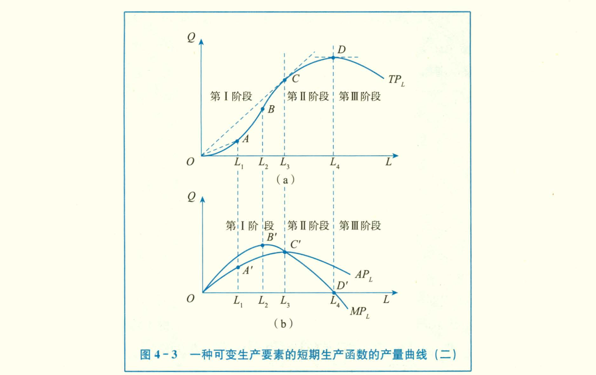

# 第一章：需求、供给与价格均衡
## 一、需求

在一定时期内，在各种可能的价格水平，人们**愿意**且**能够**购买的商品数量。

自身价格、替代品的价格、互补品的价格。

#### 商品之间的关系
- 替代
- 互补

#### 商品
- 奢侈品
- 正常商品
- 劣质品

#### 影响需求的因素

- 商品本身价格
- 替代品的价格

- 消费者的收入、社会分配的公平程度
- 消费者的偏好
- 消费者对未来的预期

- 人口数量与结构的变动
- 政府的消费政策

#### 需求曲线

需求量与价格呈反方向变动。

商品持有数少的时候，边际效用高，愿意付出的成本更多；持有数更多时，边际效用低，愿意付出的成本低。

不影响结论的情况下，大多使用线性函数

$ Qd = \alpha - \beta (P)$ 

- `需求量的变动`沿着需求曲线的变动，由商品价格的变化带来的
- `需求的变动`需求的变动，由商品价格以外的因素造成。需求点的纵坐标不变。

- `吉芬商品`：（收入极低的情况下）价格与需求成正相关的商品（爱尔兰灾荒时期的土豆）。

## 二、供给

一定的时期内，以各种可能的价格水平，厂商愿意且能够供应的商品量。

#### 供给曲线

> 劳动力的供给曲线

#### 影响供应的因素

- 厂商目标
- 厂商对未来的预期

- 商品本身的价格
- 相关商品的价格

- 生产要素的价格
- 生产技术的变动

- `新质生产力`，资本与劳动的比例更高

### 劳动与资本

## 三、市场均衡

`均衡`，经济事物中，有关变量，在一定条件下，相互作用，所达到的一种相对静止的状态。

供求双方在竞争过程中自发形成的，是一个价格自发决定的过程

#### 供求定理
1. 供给不变
需求增加使需求曲线向右上方移动，均衡价格上升，均衡数量增加。

2. 需求不变
供给增加使供给曲线向下移动，均衡价格减少，均衡数量增加

## 四、弹性

`弹性`是相对数之间的相互关系，一个量变动1%，另一个量变动百分之多少的概念。

弧弹性公式： 曲线上两点之间的弹性

$ e = \dfrac {\Delta Y} {\Delta X} · \dfrac X Y $ 

点弹性公式： 单个点上的弹性

$ e = \dfrac {d Y} {d X} · \dfrac X Y $

### `需求价格弹性` （加符号取正值）

$ e_d = - \dfrac {\Delta Q} {\Delta P} · \dfrac P Q $

起点不同时同一段弧弧弹性不同，统一取价格与需求量的平均值代替。

- **无限弹性**：价格一定，需求无限
- **弹性缺乏**：需求变动比率小于价格变动比率

> 线性供给曲线的延长线与y正半轴相交，弹性大于1；y负半轴相交，弹性小于1

### `供给价格弹性`

任何两个具有函数关系的经济变量之间都可以建立弹性。

`供给价格弹性`表示现在一定时期内一种商品的**供给量**变动对于该**商品价格**变动过的反映程度

### 需求的交叉弹性

X商品价格变化带来Y商品需求量。

大于零，两种商品为替代关系；小于零为互补关系。

### 需求的收入弹性

X为收入，Y为需求量

1. 正常商品
- 收入富有弹性：奢侈品
- 收入单位弹性：如衣服
- 收入缺乏弹性：必需品
- 收入无弹性：如食盐
- 收入负弹性：劣等品

`恩格尔系数`：在一个家庭或国家中，食物指出在收入中所占的比例随着收入的增加而减少。

> 三座大山：教育、医疗、房产

## 五、供求分析实例

### 价格限制
#### 最高限价

最高限价地域市场价格，导致供不应求，
#### 最低限价

- 利于社会平等与安定
- 

# 第二章：消费者选择
## 一、效用理论
`效用`：消费者从商品中得到的满足程度。

理性消费者的最优选择，有限的收入合理用于不同商品，以达到最大效用。

### 基数效用与序数效用
- 基数效用
用具体的数字衡量，效用可以计量并加求总和，使用边际效用分析法。
- 序数效用
只能表示满足程度的高低与顺序。

### 基数效用论和边际效用分析法
- `总效用`（TU）：消费者一定事件内从一定数量商品消费中所得到的效用量的总和。
- `边际效用`（MU）：消费者在一定事件内增加一单位商品的消费所得到的效用量的增量。
> 边际效应递减：一定时间内，在其他商品的消费量保持不变，随着消费者对某种商品消费量的增加，消费者从该商品连续增加的每一消费单位中所得到的效用增量即边际效用是递减的。

#### 货币的边际效用
用货币购买商品，就是用货币的效用换商品的效用。

商品的边际效用递减规律对货币也同样使用。但在分析消费者行为时，可以认为不变。
- 消费者一定时期收入一定
- 商品单位价格站消费者总货币收入量的很小部分

#### 消费者均衡的条件
假设：
- 消费者的偏好既定
- 消费者收入既定
- 商品价格既定
均衡条件：
- 全部的钱花完
- 单位收入在每种商品的边际条件相等

#### 消费者剩余
需求曲线实际上是消费者在一定商品数量基础上愿意支付价格的水平

消费者愿意支付的差额和实际市场价格之间的差额，构成了消费者剩余。

消费者剩余是消费者的主观心理评价，通常被用来度量和分析社会福利问题。

### 序数效应论
效用只能根据偏好程度排列出顺序，即消费者对可能消费的商品进行先后排序

- 完全性：任何种类商品都可以排序
- 可传递性
- 非饱和性：每种商品都没有饱和点，总认为多比少好

可以推导出————`无差异曲线`

## 二、无差异曲线

`无差异曲线`：表示X、Y两种商品的不同组合，给消费者带来效用完全相等的一条曲线。

特征：
- 像右下方倾斜，斜率为负
- 凸向原点
- 同一平面有无数条无差异曲线
- 无差异曲线不能相交

`边际替代率`：维持效用水平不变的情况下，消费者增加某一单位某种商品的消费数量时所要放弃的另一种商品的数量。

$MRS _{12} = -\dfrac{\Delta X_2}{\Delta X_1} = \dfrac {MU_1}{MU_2}$

某一商品数量越多，对另一商品的边际替代率越来越少。

### 无差异曲线的特殊形状

1. **完全替代**
两种商品之间的替代比例固定不变，边际替代率是一个常数。
2. **完全互补**
两种商品必须按固定不变的比例同时被使用的情况。

## 三、预算约束线
收入与商品价格给定的条件下，消费者所能购买到的两种商品的最大组合的线。

### 预算线的移动
1. 商品价格不变，消费者收入变化：平移
2. 消费者收入不变，商品价格同比例同方向变化：平移
3. $P_1$变化$P_2$不变：横截距变化
4. 纵截距变化

### 消费者均衡条件
- 商品组合必须带来最大效用
- 最优指出位于给定预算线上
$
    \dfrac{MU_1}{P_1} = \dfrac{MU_2}{P_2}
$

即商品组合是消费者在既定支出水平上，所能实现的最大化效用。

## 四、消费者均衡
- **价格-消费曲线**
其他条件保持不变时，一种商品价格的变化会使消费者效用最大化的均衡点的位置发生移动。

`价格-消费曲线`是在消费者的偏好、收入以及其他商品价格不变的条件下，与某种商品的不同价格水平相联系的消费者效用最大化的均衡点的轨迹。

- **消费者需求曲线**
将**价格-消费曲线**上每一均衡点的商品价格与商品需求数值绘制在商品的**价格-数量坐标图**上，可以得到单个`消费者的需求曲线`。

- **收入-消费曲线**
其他条件不不变而仅有消费者收入水平发生变化时，消费者效用最大化的均衡点位置发生变化。

`收入-消费曲线`是在消费者的偏好和商品价格不变的情况下，与消费者的不同收入水平相联系的消费者效用最大化的均衡点的轨迹。

- **恩格尔曲线**
表示消费者在每一收入水平对某商品的需求量。

## 五、替代效应和收入效应
商品价格变化时引起对需求量的变化，可以分解为收入效应和替代效应
> 实际收入水平的变化被定义为效用水平的变化。货币收入不变，价格下降时，货币购买力提高，也就是实际收入水平提高。
- `替代效应`：由商品相对价格的变动所引起的商品需求量的变动。
- `收入效应`：由实际收入水平变动所引起的商品需求量的变动。

> 替代效应即平衡点在无差异曲线上的移动；收入效应即无差异曲线本身的移动。

- **补偿预算线**：
当商品价格发生变化导致消费者的实际收入水平发生变化时，设想使用一些手段使消费者回到原有的实际收入水平即原有的效用水平。

1. **正常商品的替代效应与收入效应**

对于正常商品，替代效应与收入效应均与价格呈反方向变动，在它们的共同作用下，总效应必定与价格呈反方向变动。即，正常品的需求曲线向右下方倾斜。

2. **劣等品的替代效应与收入效应**

劣等品的替代效应与价格呈反方向变动，收入效应与价格呈同方向变动。大多数场合替代效应的作用大于收入效应的作用。总效应与价格呈反方向变动。

3. **吉芬商品的替代效应与收入效应**
当劣等品的替代效应的作用大于收入效应的作用

## 六、市场需求曲线
`商品的市场需求`是指在一定时期内在各种不同的价格水平上市场中所有消费者对某种商品的需求量。

## 七、不确定性和选择

# 第三章：企业的生产和成本
生产者亦称厂商或企业，指能够做出同一的生产决策的单个经济单位。企业作为生产的一种组织形式，是对市场的替代。
- 市场上的交易成本较高，企业可使市场交易内部化
- 有的交易在企业内部进行成本更小，即企业有着降低交易成本的作用
- 某些交易必须在市场上完成，因为交易成本更小

> 社会成本论.科斯：交易成本，产权

不确定性和信息不对称带来的不完全信息，产生了交易成本。

- 规模经济和降低成本
- 提供中间产品

- **个人企业**

**企业目标**：利润最大化。
由于企业的经营权和所有权的分离，当企业决策者的利益和公司利益不一致时，销售收益最大化与企业规模最大化

### 长期与短期
从微观经济学的角度，短期，存在部分生产要素不能调整，称为固定成本；长期，生产要素均可调整，只存在可变成本；

- 固定成本：机器、厂房、设备
- 可变成本：劳动力

## 3.1. 生产函数
生产函数表示在一定时期内在给定技术条件下，生产中所使用的各种生产要素的数量与所能生产的最大产量之间的关系

> 劳动、资本、技术、数据

- 技术改变生产要素的比率

### 固定比例生产函数（里昂惕夫生产函数）
每以产量上任何要素投入量之间的比例都固定的生产函数。

$
    Q = Minimum(L/u,  K/v)
$
产量取决于较小投入量。产量增加需要L与K同时增加

### C-D生产函数（柯布-道格拉斯）
$
    Q = A L ^\alpha K^\beta
$
前提是$\alpha +\beta$（规模报酬）不变。规模参数（A）对不同要素的影响相同。生产要素的变化反过来也不会影响规模参数

### 短期生产函数
- TP 总产量 AP平均产量 MP边际产量

#### 边际报酬
技术与其他要素保持不变，连续增加一种要素投入，投入量小于一定值时，资本更多地发生作用，边际产量递增；超出一定值，边际产量递减。

可变要素投入量与固定要素投入量应该相互匹配。即存在最佳技术系数。

### 长期生产函数
#### 等产曲线（企业无差异曲线）
表示两种生产要素L、K的不同组合生产同一产量水平的轨迹。
- 边际技术替代率（MRTS）：维持产量水平不变的条件下，增加某以单位某种要素投入量时所需要减少的另一种要素的投入量。

#### 等成本线（企业预算约束线）
成本和要素价格既定，生产者能购买到的两种要素数量最大组合的线。

#### 生产扩展线
要素价格、技术和其他条件不变，企业扩大生产规模所引起的生产要素最优组合点移动的轨迹。斜率为两种要素价格之比

#### 规模报酬
其他条件不变的情况下，各种要素按相同比例变动，即生产规模扩大，所引起产量的变动。
- 产量增加大于生产规模的增加，**规模报酬递增**。
- 产量增加等于生产规模增加，**规模报酬不变**。
- 产量增加小于生产规模减少，**规模报酬递减**。

规模报酬递增
- 生产要素的专用性，即生产专门化与分工
- 生产经营的不可分性
- 生产规模的维度效益

规模报酬递减
- 管理效率低下。

## 3.2. 成本
生产一定产量时所支付发费用，取决于产量和各种生产要素的价格。

- 生产成本 = 机会成本 = 经济成本 = 隐成本+显成本
- `机会成本`：生产者放弃的使用相同的生产要素在其他生产用途中所能获得的最大收入。
- `显成本`：会计学成本指厂商在生产要素市场上购买或租用商品所需要的生产要素的实际指出
- `隐成本`：自己拥有的，被用于生产的哪些要素所应支付的费用。例如将自有的房屋作为生产厂房。

### 会计成本和经济成本
西方经济学：稀缺资源配置的角度研究生产一定数量某种产品所必须支付的代价。
- 正常利润是隐成本的一部分。是对企业家才能的报酬。
- 超额利润

### 短期成本
$
    STC = w \centerdot L(Q) + r \centerdot \bar k
$

- `短期边际成本（SMC）`：增加一单位产量引起总成本（可变成本）的增加。

### 长期成本
以最小的生产规模进行生产。
- `长期总成本（LTC）`：长期生产中在各种产量水平上的最低总成本，可由生产拓展线推导出。
- `长期平均成本（LAC）`：先减少后增加。每一产量上取最小的短期成本，LAC与每一SAC曲线相切。

#### 规模经济
扩大规模，产量增加的倍数 > 成本增加的倍数

#### 外在经济与外在不经济
整个行业规模的扩大，给个别产商带来产量与收益的增加

# 第四章 完全竞争市场
## 一、企业收益、市场结构和利润最大化
- `企业收入`：企业销售产品后所得到的收入，即产品的销售价格与销售量的乘积。

$ R = P \centerdot Q = P(Q)\centerdot Q$

- `市场`：物品买卖双方相互作用并得以决定其交易价格和交易数量的一种组织形式 或制度安排。根据交易物品**生产要素市场**和**商品市场**。根据不同市场结构，分为**完全竞争市场**、**垄断竞争市场**、**寡头市场**和**垄断市场**。
> 市场上厂商的个数、厂商所生产的产品的差别程度、单个厂商对价格的控制程度、厂商进入或退出一个行业的难易程度。

## 二、完全竞争企业面临的需求曲线和收益曲线
- 市场上有大量生产者和消费者，他们都是价格的接受者
- 商品同质，不存在产品差别
- 资源自由流动
- 市场信息畅通、完全

### 1. 完全竞争企业的需求曲线
价格由整个行业的供给和需求曲线的交点所决定，个别消费者只能接受，不能影响。

## 三、完全竞争企业的短期均衡
利润最大化：$MR = MC$

市场价格既定，生产中的不变要素投入量固定，只能通过变动可变要素的投入量来调整产量

- `生产者剩余`：厂商在提供一定数量的某种产品时实际接受的总支付和愿意支付的最小总支付之间的差额。

## 完全竞争企业和市场的长期均衡

# 习题集
## Chapter1
## Chapter2
## Chapter3
1. （1）
$
    MRS = \dfrac {\Delta X_1} {\Delta X_2} = \dfrac 1 {U'} = 
$

## Chapter4
6. （1）
