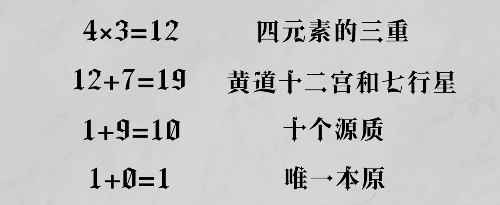

# 一、三重世界

世界分为三重，分别是`元素世界`、`天体世界`和`智性世界`。

- `元素世界`可以叫做自然世界、物质世界或月下世界，是实在可触摸的世界，我们生活的现实世界
- `天体世界`是星体运动的世界，相比物质世界是更高一层的世界。
- `智性世界`也称神圣世界，是属于天使、众神的领域。

三重世界的上级可以统治下级，下级世界的一切运动变化来自于上级的影响。

最上层的造物主，或称神、原型、太一、本源。各种天使按照造物主的意志工作，在天使的推动下，天体世界的星辰产生各种运动与影响，相应的现实世界出现各种事物。这一整个自上而下的链条，称为`显化之链`。

# 二、魔法是什么

> 魔法的能力持有巨大的力量，充满着至高的奥秘，沉思着深奥秘密的事物、性质、力量、特征、物质和德性，并综合了一切自然的理解。它教导我们事物彼此如何不同，如何相同。将事物彼此施用而结合，接纳其一致性，将下级和上级的赠礼和德行想和并嫁接，魔法便能产生奇妙的效果。

# 三、魔法与四元素学说

四元素即火、土、水、风，是一切有形事物的基础。元素构成物质是通过转化与统一的过程，而当事物毁灭后它们又会融入四元素中。

四元素学说经常与物质变化的过程关系起来，即`朴素唯物主义`；元素也有抽象的意义，认为四元素是一种普遍的、无形的本源或特征。比如**火**对应所有**热烈的、运动的、消耗的**事物等等。

## 四元素的性质
每种元素拥有`冷`、`热`、`干`、`湿`四种属性中的两种。其中，火是**热干**的，风是**热湿**的，土是**冷干**的，水是**冷湿**的。属性相反的元素是敌对的，有一个属性相同的元素可以互相转化。

或者有一种源自柏拉图的学说：

为元素赋予了三种性质，火元素与土元素为两极，剩余元素介于二者之间：

| 火 | 风 | 水 | 土 |
|----|----|----|----|
|锐利|迟钝|迟钝|迟钝|
|轻薄|轻薄|浓厚|浓厚|
|运动|运动|运动|静止|

> 四元素是一切自然事物和活动的源头，了解它我们就能产生奇迹，掌握自然魔法

### 论元素三重考量的原理

- 第一阶元素是纯净的、非混合的元素，不能变化、无法混合、不能破坏，可以视为理想的、不能实际存在的元素。一切自然事物能产生影响都是因为这些纯净的元素，但并不是由它们直接产生。
- 第二阶，混合的、多层的多变的以及不纯净的，可以通过某种技艺提炼为纯净元素，这种技术就是自然魔法的基石。
- 第三阶，并非元素本身，而是元素彼此之间的混合、变化，乐意理解为元素与元素之间的关系与互动。称为`中间性质`或`中间性质的灵魂`

> Therefore, without the triplicities of the elements and understanding of them, no one can confidently work in the occult sciences of magic and nature. But whoever can learn to reduce impurity in to purity, multiplicity into simplicity, and also discernibly know nature, virtue, strength in number, and degree and order without dividing substance, will easily possess the knowledge of all natural things and perfect operation of celestial secrets.

### 火元素的性质

火存在于万物之中，在万物中保持明亮地来回运动，任何明亮的事物中都存在火元素。

它浩瀚又无形，它的行为根植于自身的力量。火通过自己的行为而非他者的行为被了解；通过自己的力量而非它者的力量而行动。火是运动的、革新的、保护的、明澈的、离散的、回弹的、生长的、尖锐的、擢升的。

火不接收卑屈的侮辱，总是要行动起来或鼓动其他人行动。它能理解无法理解的事物，能独自升起，不依赖于他者，能向事物揭示其宏伟、主动、力量等。

火元素是坚决的、不容忽视的、具有掠夺性的。

火出现在天上，就是明亮之火；出现在地下，就是令人痛苦的阴暗之火。既能带来巨大的建设又能产生可怕的毁灭。

`天堂之火`是万物明亮、丰饶，能够给予生命；`地狱之火`毁灭一切，是黑暗和贫瘠的。

`天堂之火`、`天上之火`、`普通的火`对应三重世界。

### 土元素的性质

土元素是基础，土可以吸纳天体的光线，保存万物的种子。如果土因为其他元素和天体变得肥沃，其中保存的种子就会生长，万物都从其中生成。

土是承载、孕育的特征，土元素含有或者代表了万物的潜能，通过其他的元素和天体的作用，潜能才能变成现实。因此土也是一种让事物从无形到有形的元素。

### 水元素的性质

没有水，动植物不能生长，水是必需的元素。

灵性重生是必须要有水的，在赎罪和净化的目的上和火一样重要。水在魔法中最常见也最重要的用途是净化。

万物都依靠水的力量，通过它得到成长、哺育和加强。水是万物之先，是众元素最古老也最强大的，因为水能淹没大地、熄灭火焰、升上高空再降落回大地，象征它能支配所有其他元素。

### 风元素的性质

风是一种生命之气，或称精气，一种灵魂和形体之间的介质。

希伯来人认为风是把万事万物结合起来的中介。

风可以容纳天体的光线，然后把这些力量和其他的元素共享。因此某种程度上风像润滑剂和胶水，它在事物之间进行传递、结合、协调的工作。

风犹如一面镜子，能够携带各种自然和人造之物的信息，进入人和动物的毛孔，他们产生影响，由此出现了预知梦。各种事物的形象和话语在风中滋生，被人的感官吸收，然后影响了人们的想象力和灵魂。

#### 四方之风

- 诺托斯（Notus)：南风，多云潮湿，会带来雨水。
- 伯瑞阿斯（Boreas）：北风，驱散乌云，带来寒冷，猛烈的风。
- 泽费洛斯（Zephyrus）：西风，化解寒冬，让花朵绽放
- 欧洛斯（Eurus）：东风，带来潮湿和阴云

## 对应体系

把世界上的一切事物按照其特征归属于某个依附，这个特征可能是颜色、功能或者某种文化属性

物质世界存在的一切事物，都一定在天体世界和智性世界找得到对应物。虽然元素是属于物质世界的，但在更高的世界，在那些星辰、天使、灵体乃至神本身，也一定存在某种四元素的对应物。

在物质世界，元素具有比较稠密的、沉重的、物质的性质，而在天体世界，元素的形式会更崇高，土坚固但不稠密，水和风富有灵敏，火虽然炎热但不灼烧，而是带来光明和生命。

天使或者智性体也是有元素对应的，她们中恒定本质是土元素，虔信的仁慈是具有净化力量的水元素，精妙的气或灵是风元素，爱是火元素。

元素存在于万物之中，在物质世界是不洁且稠密的，在天体世界是纯净的，在智性世界是神圣的。元素最开始产生于原型的理念，在智性体或天使中成为散布的力量，在天体中成为德性，在物质中获得稠密的形态。

### 月亮的形象

> 显然，土元素的形象被天上的水吸引，月亮饮下这水，并且因为她与我们相近，将这水流向且分享给我们。

月亮是所有星体中最靠近我们的，所以被视为天体世界和物质世界的交界点，或者是一个联通两个世界的入口、大门。古代人认为月亮容纳天上的星光，然后把这些星光传递给我们，才因此产生了世界上的各种变化。

# 四、魔法与神秘德性

并不是事物所有的性质都可以用四元素的活动来解释。这些德性源自事物的外观与形态，这种德性只要很少的物质就能产生明显的效果。源于事物形态的德性，称之为事物的`神秘德性`。

> 难以放在常规解释框架下的事物活动的一个范畴

### 神秘德性如何通过世界灵魂、星光被理念灌输到各种事物中，以及那些事物最富有这种德性

> 按照柏拉图主义者们所言，所有下级的理念，都源于上级的理念。他们将理念定义为超越形体、灵魂、精神的形式，是单一的、完全的、不变的、不可见的、无实体的，以及永恒的，所有理念的性质都相同。

理念首先位于善本身之中，也即与神同在。`善`是一个终极的目的，一切事物都是朝着善发展。理念不断下降，到世界的灵魂，到自然，最终再到物质，通过一系列过程，变得越来越不统一越来越分化。

最初存在于神的精神中的理念，在世界的灵魂中，会变成很多叫做种子理性的东西，凭借这些东西，世界的灵魂在天上排布星辰的形态，又通过这些星辰，最终将各种德性、特性灌注给物质世界

### 不同的德性如何灌注进入不同的个体和种属之中

物质世界内德性的直接源头就是天体。

世界的灵魂、天体的灵魂，都可以依靠起思想或想象力去改变物质，人类的灵魂自然也拥有同样的力量。

第一因，也就是神，第二因，也就是天使和天体，控制着各种物质，并把万事万物联系在一起，就这样，神通过世界灵魂、特定形象的德性、智慧体、星辰的光线和角度，以及事物间的交感，最终将所有的这些德性赋予物质。

### 事物的神秘德性从何而来

神及其理念是所有德性的源头，智性体是具体的执行者，他们负责将德性赋予物质，天体和星辰则是作为执行工具，最终元素依照天体的影响生成物质。这样在物质中产生不同形态，在天体中体现为不同德性，在智性体中则是作为中介的理性，在原初中表现为不同的理念和原型。

第一因跳过第二因直接干涉事物，称为奇迹。

### 论世界的精气是什么，它如何结合神秘的德性

万物都充满着神灵。

- 灵魂是神圣的
- 事物的灵魂决定事物的性质
- 灵魂是能动的

灵魂凭借自己的意愿而产生运动，身体和形体是被动的。灵魂和形体通过`精气`结合起来

`世界的精气`即第五元素，传统上也认为第五元素是构成星辰的元素。

# 德性的相似、传播于自然事物的敌我关系

### 我们如何必须依靠事物的相容和相似来调查和检验事物的德性

万事万物都会天然向着一个与它相似的目标去运动，朝着它的上级去运动。

如果想拥有某种性质，就要去找拥有这种性质的动物、植物之类。

### 不同德性的活动如何从一物转移到另一物，他们如何彼此分有

自然事物的力量不仅会影响就近的东西，也会向其中灌注类似的力量。

### 事物的德性如何通过敌友来调查和检验

星体有基于星座主星和行星本身性质的敌友关系，这种行星之间的敌友关系可以延伸到具体的事物上