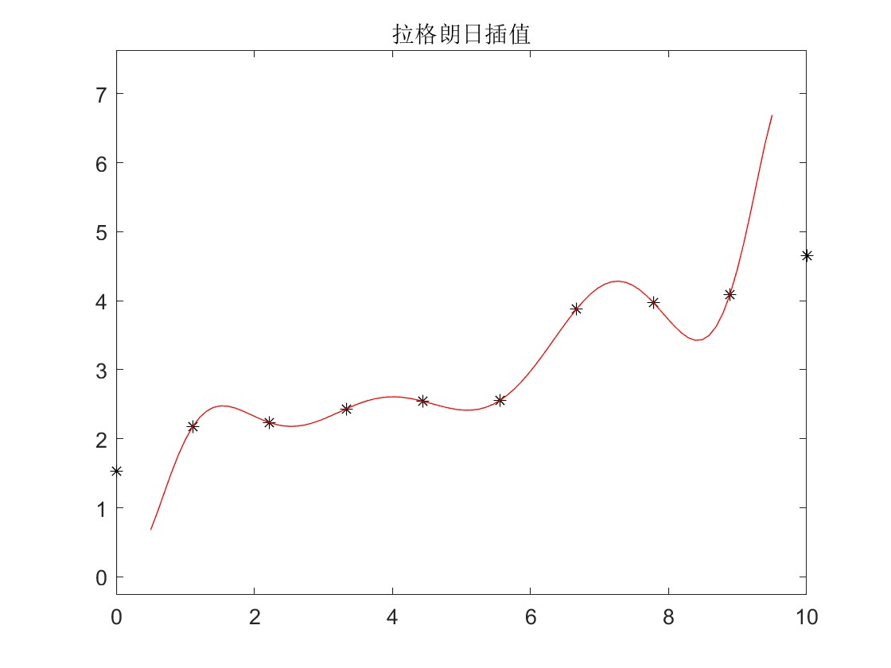

- `插值`：求过一直有限个数据点的近似函数
- `拟合`：不要求过已知数据点

# 插值
### 拉格朗日多项式插值
根据区间内$n+1$个点求$n$次多项式：

$
    \phi(x) = a_0 + a_1 x + \dots + a_n x^n
$

#### 求解
令：$l_i(x) = \dfrac {(x-x_0)\dots(x-x_{i-1})(x-x_{i+1})\dots(x-x_n)} {(x_i-x_0)\dots(x_i-x_{i-1})(x_i-x_{i+1})\dots(x_i-x_n)}$

则$l_i(x)$满足

$
    l_i(x_j) = \begin{cases} 0, \enspace j\neq i\\
    1, \enspace j = i \end{cases}
$

拉格朗日插值多项式：

$
    L_n(x)= \sum_{i=0}^ny_il_i(x)
$

#### 代码实现
```
function y = lagrange(x0, y0, x)
    % x0, y0 是已知节点向量，x为插值点
    
    m = length(x0); 
    a = ones(m);
    y = 0;
    for i=1:m
        for j=1:m
            if i ~= j
                a(i) = a(i)*(x-x0(j))/(x0(i)-x0(j));
            end
        end
        y = a(i)*y0(i) + y;
    end

end
```



### 牛顿插值
#### 差商
一阶差商：$f[x_i,x_j] = \dfrac {f(x_i) - f(x_j)} {x_i - x_j}$

二阶差商：$f[x_i, x_j, x_k] = dfrac {f[x_1, x_j] - f[x_j, x_k]} {x_0 - x_k}$

#### Newton插值公式

$
    N_n(x) = f(x_0) + (x-x_0)f[x_0, x_1] + \dots + (x-x_0)(x-x_1)\dots(x-x_{n-1})f[x_0, x_1, \dots , x_n]   \\
    N_{n+1}(x) = N_n(x) + (x-x_0)\dots(x-x_n)f[x_0,x_1,\dots, x_{n+1}]
$

#### 代码实现
```
function y = newtonInterpolation(x0, y0, x)
    n = length(x0); 
    m = length(x);
    A = zeros(n,n); A(:,1) = y0';
    y = zeros(1, n);
    for j=2:n
        for i=j:n
            A(i,j) = (A(i,j-1)- A(i-1,j-1)) / (x0(i)-x0(i-j+1));
        end
    end
    for t=1:m
        z = x(t);
        s = 0.0; y = 0.0;
        for k = 1:n
            p = 1.0;
            for j = 1:k-1
                p = p*(z-x0(j));
            end
            s = s+A(k,k)*p;        
        end
        y(t) = s;
    end
end
```

#### 差分
节点等距时，关于节点间差商可以用差分表示：
$
    \Delta f_k = f_{k+1} - f_{k}
$

二阶差分：
$
    \Delta ^2 f_k = \Delta f_{k+1} - \Delta f_k
$

还有`向后差分`与`中心差分`：
$
    \nabla f_k = f_k - f_{k-1}
$

$
    \delta f_k = f\left(x_k + \frac{h}{2}\right) - f\left(x_k - \frac{h}{2}\right)
$

用差分替代差商，有牛顿向前插值公式：
$
    N_n(x_0 + th) = f_0 + t\Delta f_0 + \cdots + \frac{t(t-1)\cdots(t-n+1)}{n!}\Delta^n f_0
$

### 分段线性插值
用函数表作插值计算时，分段线性插值精度足够。如数学、物理中的特殊函数表。

matlab自带分段线性插值逻辑：interp1

### 埃尔米特插值
要求插值函数与原函数有相同的一节、二阶甚至更高阶导数值：
$
    H(x_i) = y_i, \enspace H'(x_i) = y'_i
$

$
    H(x) = \sum_{i=0}^n h_i[(x_i-x)(2a_iy_i-y'_i)+y_i]
$
```
function y = hermite(x0, y0, y1, x)
    n = length(x0);
    m = length(x);
    for k=1:m
        yy = 0.0;
        for i=1:n
            h = 1.0;
            a = 0.0;
            for j = 1:n
                if j~=i
                    h = h*((x(k)-x0(j))/(x0(i)-x0(j))) ^2;
                    a = 1/(x0(i)-x0(j)) + a;
                end
            end
        yy = yy + h*((x0(i)-x(k))*(2*a*y0(i)-y1(i))+y0(i));
        end
        y(k) = yy;
    end
```
### 样条插值
连接点处有连续的曲率。k次样条函数：
- 每个小区间上市k次多项式
- 具有k-1阶连续导数

#### 二次样条插值
二次样条函数：
$
    s_2(x) = \alpha_0 + \alpha_1 x + \frac{\alpha_2}{2!} x^2 + \sum_{j=1}^{n-1} \frac{\beta_j}{2!} (x - x_j)_+^2 \in S_p(\Delta, 2), \\
    (x-x_j)^2_+ = \begin{cases}(x-x_j)^2,\enspace x\geq x_j\\0,\enspace x<x_j \end{cases}
$

1. 已知插值节点$x_i$和相应的函数值$y_i$以及一个端点的导数。

2. 已知插值节点$x_i$和相应的导数值$y'_i$，以及端点$x_0$处的函数值$y_0$。

令$X = (\alpha _0, \alpha _1, \alpha _2, \beta _1, \dots , \beta _{n-1})^T$，$C = (y_0, y_1, \dots , y_n, y'_0$

$
A = \begin{bmatrix}
1 & x_0 & \dfrac{1}{2}x_0^2 & 0 & \cdots & 0 \\
1 & x_1 & \dfrac{1}{2}x_1^2 & 0 & \cdots & 0 \\
1 & x_2 & \dfrac{1}{2}x_2^2 & \dfrac{1}{2}(x_2 - x_1)^2 & \cdots & 0 \\
\vdots & \vdots & \vdots & \vdots & & \vdots \\
1 & x_n & \dfrac{1}{2}x_n^2 & \dfrac{1}{2}(x_n - x_1)^2 & \cdots & \dfrac{1}{2}(x_n - x_{n-1})^2 \\
0 & 1 & x_0 & 0 & \cdots & 0
\end{bmatrix}
$

#### 三次样条插值
$ s_3(x) = \alpha_0 + \alpha_1 x + \frac{\alpha_2}{2!} x^2 + \frac{\alpha_3}{3!} x^3 + \sum_{j=1}^{n-1} \frac{\beta_j}{3!} (x - x_j)_+^3 \in S_p(\Delta, 3),\\(x-x_j)^3_+ = \begin{cases}(x-x_j)^3,\enspace x\geq x_j\\0,\enspace x<x_j \end{cases}$
### B样条函数插值方法

### 二维插值
