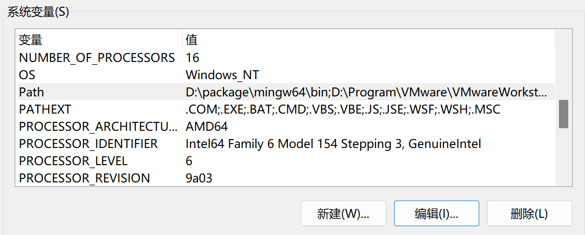
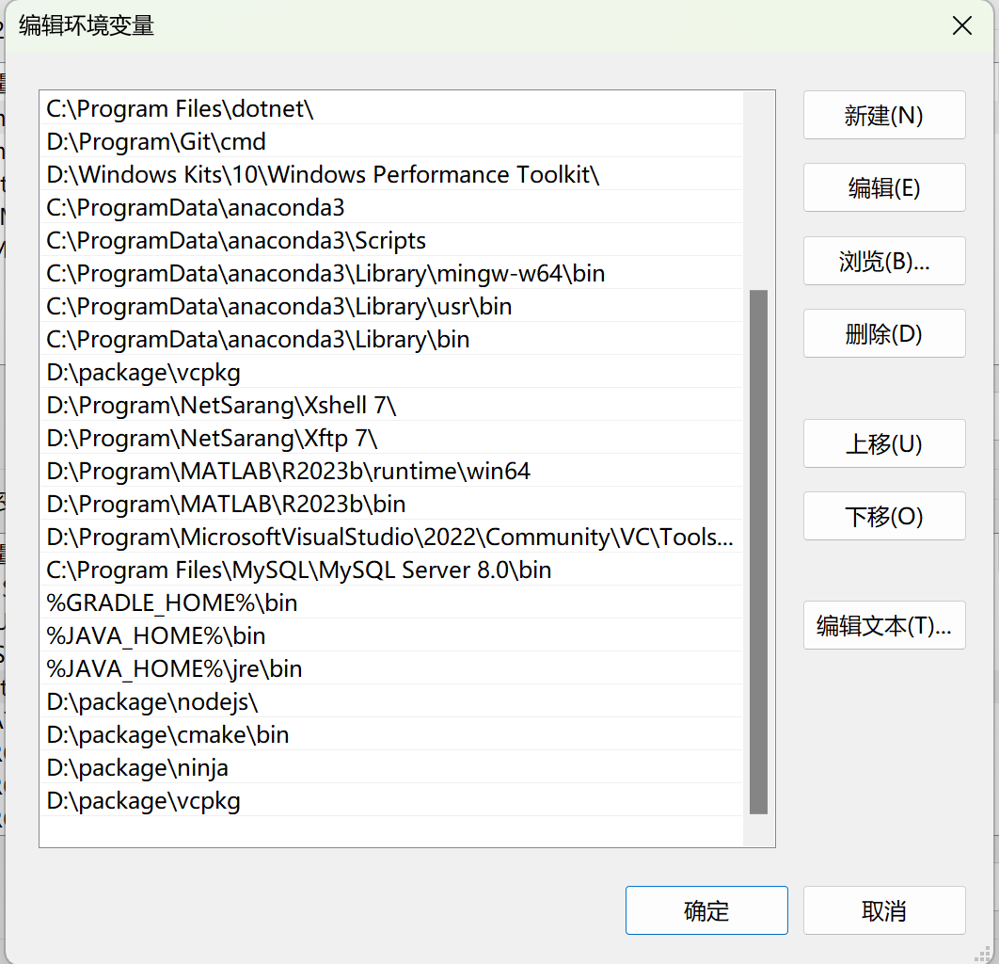

# 安装
## 1. 拉取源代码
在希望安装的位置打开命令行，输入：
```
$ git clone https://github.com/microsoft/vcpkg
```
这里遭遇了报错，因为目标仓库太大而网速太慢，链接就被关闭了：
```
PS D:\package> git clone https://github.com/microsoft/vcpkg
Cloning into 'vcpkg'...
remote: Enumerating objects: 253422, done.
remote: Counting objects: 100% (19699/19699), done.
remote: Compressing objects: 100% (890/890), done.
error: RPC failed; curl 92 HTTP/2 stream 5 was not closed cleanly: CANCEL (err 8)
error: 1948 bytes of body are still expected
fetch-pack: unexpected disconnect while reading sideband packet
fatal: early EOF
fatal: fetch-pack: invalid index-pack output
```
可以先进行浅层克隆然后更新，方法：
```
$ git clone http://github.com/large-repository --depth 1
$ cd large-repository
$ git fetch --unshallow
```
参考链接：
[error: RPC failed; curl 92 HTTP/2 stream 5 was not closed cleanly: CANCEL (err 8)](https://stackoverflow.com/questions/38618885/error-rpc-failed-curl-transfer-closed-with-outstanding-read-data-remaining)
成功复制。
## 2. 运行安装脚本
在安装根目录下运行
```
$  bootstrap-vcpkg.bat
```
出现以下内容即安装成功
```
vcpkg collects usage data in order to help us improve your experience.
The data collected by Microsoft is anonymous.
You can opt-out of telemetry by re-running the bootstrap-vcpkg script with -disableMetrics,
passing --disable-metrics to vcpkg on the command line,
or by setting the VCPKG_DISABLE_METRICS environment variable.

Read more about vcpkg telemetry at docs/about/privacy.md
```
## 3. 设置环境变量
为了能在任意路径下使用vcpkg，将安装目录设置到PATH变量中
)


## 4. 验证
```
C:\Users\18327>vcpkg list
No packages are installed. Did you mean `search`?
```
安装成功。

# 常用命令
```
vcpkg search [pat]	搜索可安装的包
vcpkg install <pkg>...	安装包
vcpkg remove <pkg>...	卸载包
vcpkg remove --outdated	卸载所有过期包
vcpkg list	列出已安装的包
vcpkg update	显示用于更新的包列表
vcpkg upgrade	重新生成所有过期包
vcpkg hash <file> [alg]	通过特定算法对文件执行哈希操作，默认为 SHA512
vcpkg integrate install	使已安装包在用户范围内可用。 首次使用时需要管理权限
vcpkg integrate remove	删除用户范围的集成
vcpkg integrate project	为使用单个 VS 项目生成引用 NuGet 包
vcpkg export <pkg>... [opt]...	导出包
vcpkg edit <pkg>	打开端口进行编辑（使用 %EDITOR%，默认为“code”）
vcpkg create <pkg> <url> [archivename]	创建新程序包
vcpkg cache	列出缓存的已编译包
vcpkg version	显示版本信息
vcpkg contact --survey	显示联系信息，以便发送反馈。
```