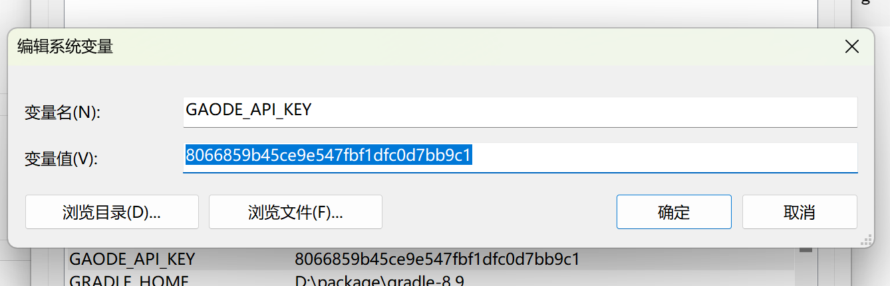
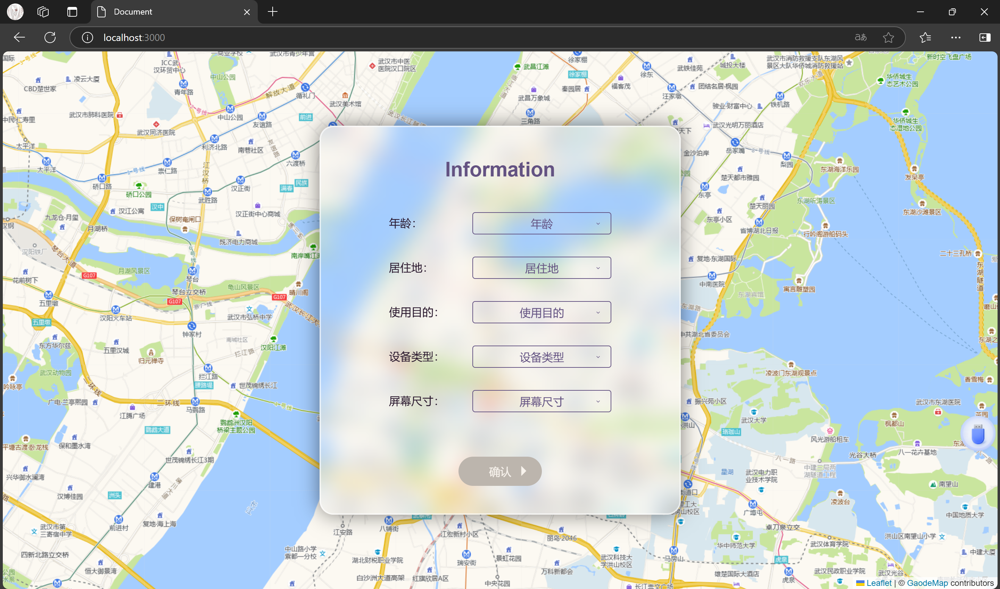
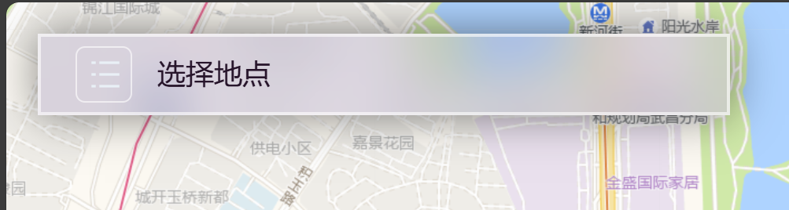
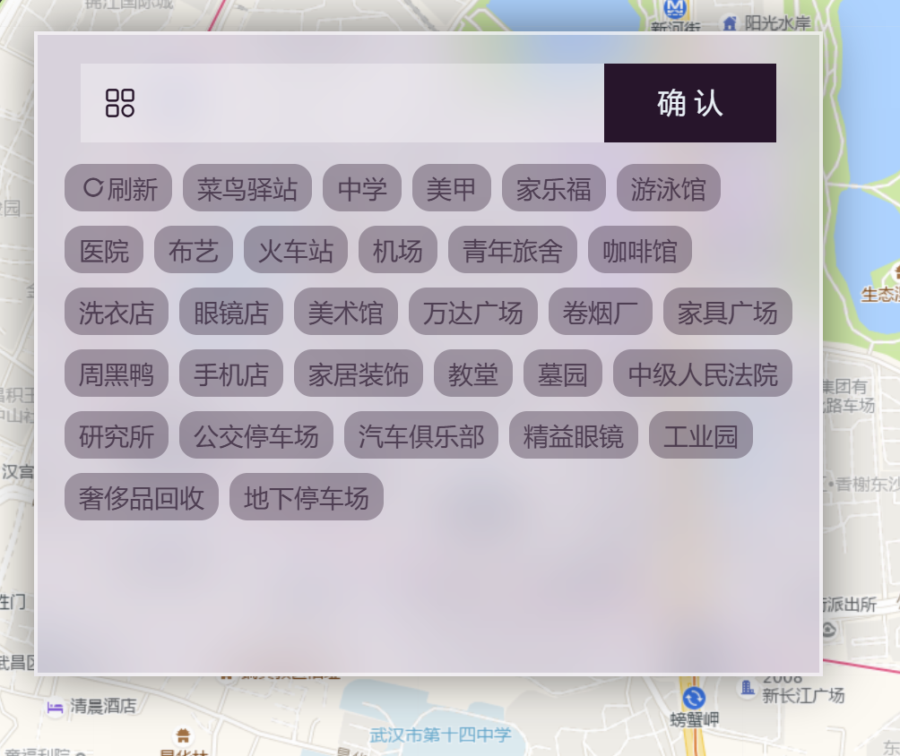
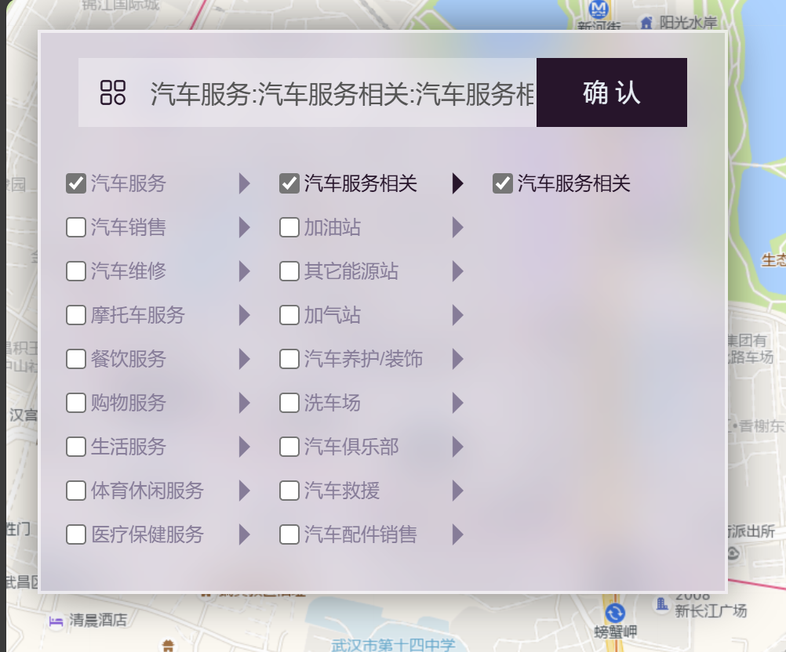
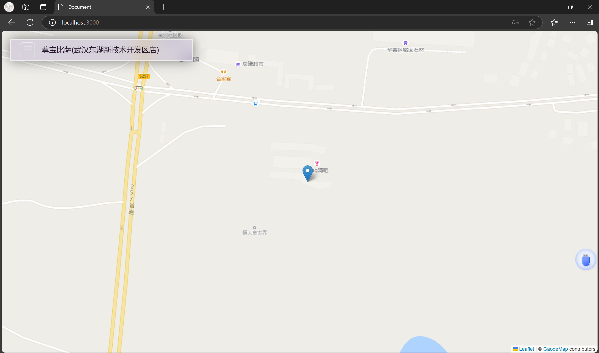
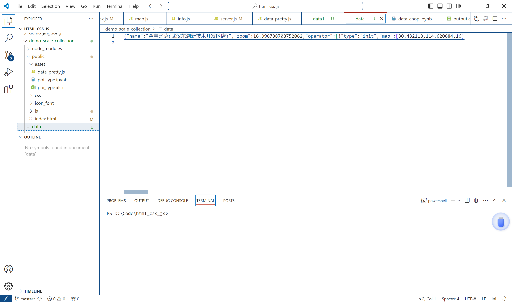

# Node.js安装
教程可参考：
[https://blog.csdn.net/WHF__/article/details/129362462](https://blog.csdn.net/WHF__/article/details/129362462)

完成后命令行安装express和body-parser包
```
npm install express body-parser -g
```

# 高德Web API
[高德Web API官网：https://lbs.amap.com/api/webservice/summary](https://lbs.amap.com/api/webservice/summary)

[密钥申请步骤：https://lbs.amap.com/api/webservice/create-project-and-key](https://lbs.amap.com/api/webservice/create-project-and-key)

将申请到的密钥设为环境变量`GAODE_API_KEY`：


# 运行
在项目根文件夹打开命令行

执行
```
node server.js
```

输出
```
Server is running on port 3000
```
表示项目正常运行。
不要关闭命令行，打开浏览器，输入地址
```
http://localhost:3000
```
应显示以下页面


# 使用测试
使用期间请勿关闭命令行。填写首页表单，点击确认。

左上角进入poi生成器

有两种模式，关键词检索与分类检索。


因为搜索api每日免费调用次数有限，请将结果列表中每个poi都进行一次录入。

将画面调整至合适比例尺，然后按下回车键，完成数据录入。
检查数据是否录入到本机。应出现data文件，刚刚选择的poi已经被写入。


# 结束
上述步骤出现任何问题，请联系开发者解决。