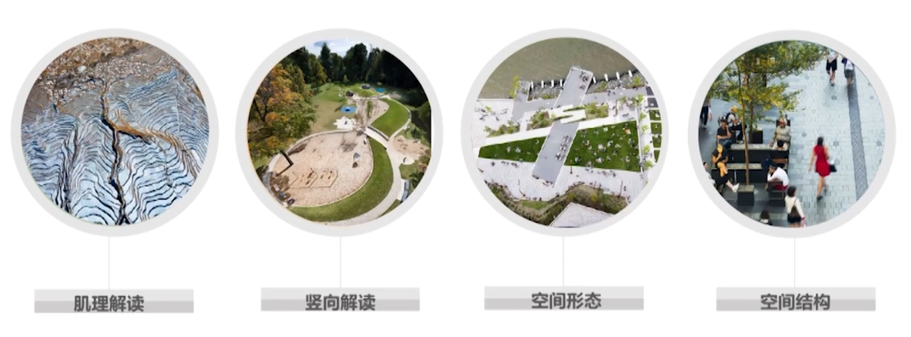
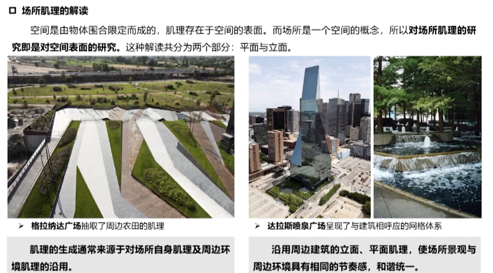
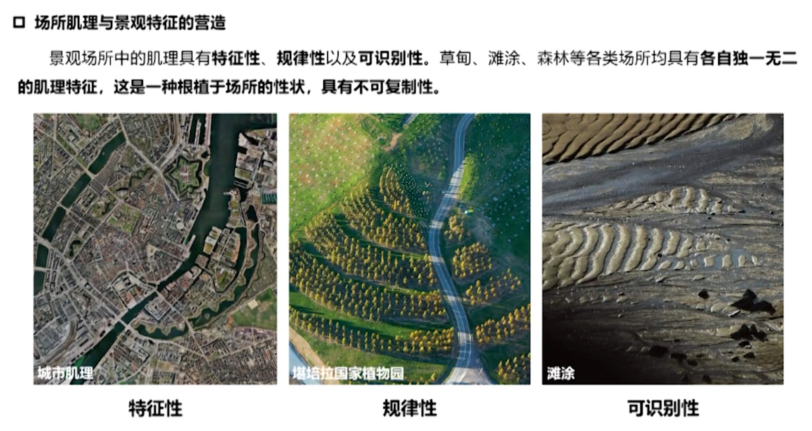
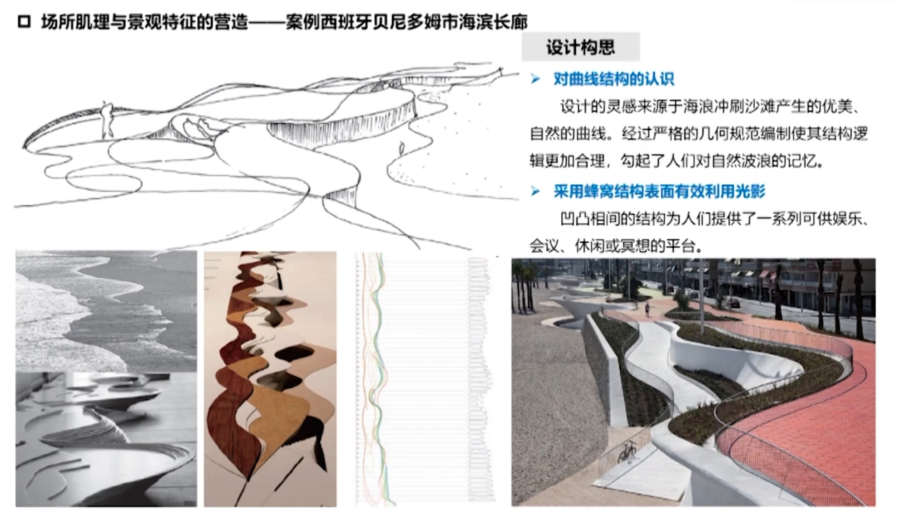
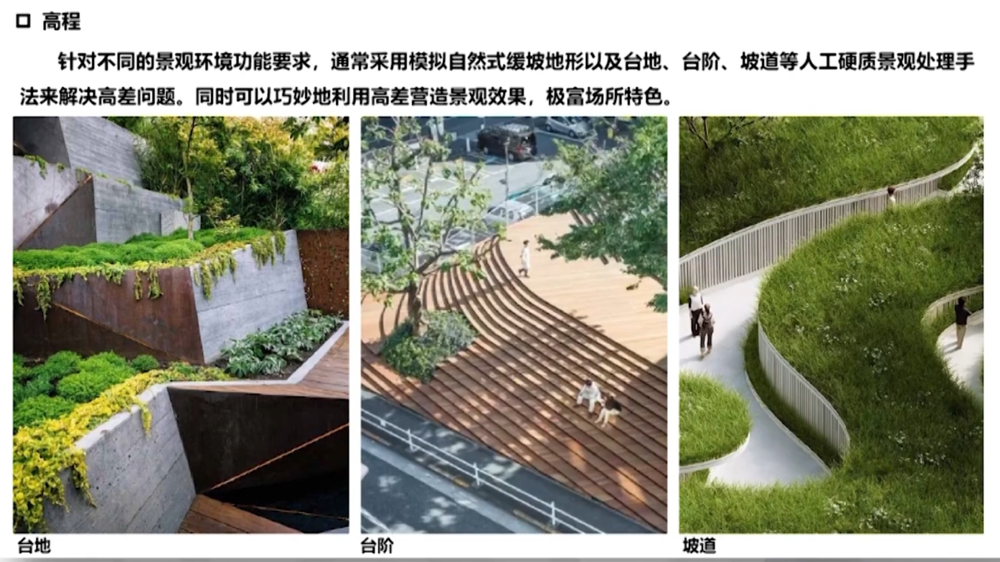
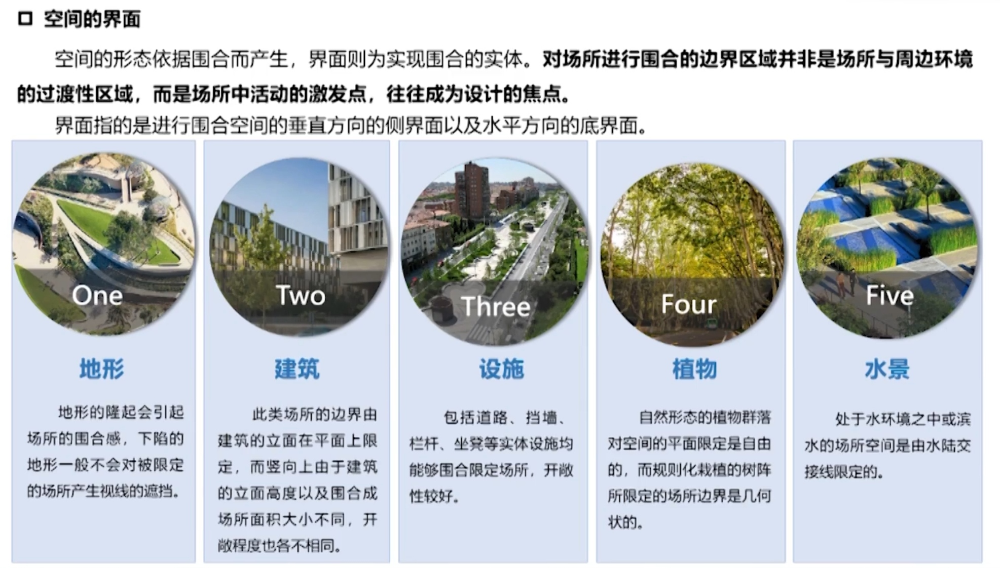

安排环境要素实现设计目标，生成有美感，有意味，有文化，能够统筹人类活动诉求的新的空间环境。

并非创造而是组织环境要素。更多的是直接使用，不改变它的原生属性。
> 我们不改变它的属性，不改变它的物理学属性，不改变它的化学属性，更不改变它的生物学属性，仅仅通过把位置存在的方式重新组合，生成一个全新的境遇。

### 多学科交叉
景观设计主要从事于外部空间环境归化与设计，涉及建筑学、城市规划、植物学、生态学等主要学科，集可以、人文、艺术特征于一体。

空间、生态、文化与功能是现代景园设计的基本面。
> 科学与艺术在山脚分手，回头又在山顶相遇。
### 三大秩序两大层面
- 自然秩序\功能秩序\美的秩序
- 空间层面\文化层面
### 21世纪风景园林学的发展
- 全尺度服务人居环境可持续发展：1）自然环境评价、保护、修复、引领，作为城乡空间利用规划的前提与先决条件；2）绿地系统规划不再是总体规划架构下的单一专项规划，土地生态十一性评价将作为城市土地利用规划的科学依据；3）景园规划将后置变为先导、变被动为主动，引领智慧型人居环境规划的发展。
- 统筹建成环境，凸显绿色基础设施的价值：1）城镇作为在自然本地上形成的认为生态体系，是自然过程和人文过程的载体。将基础设施的功能与城市的社会文化需要结合起来，使当今城市得以建造和延展；2）以海绵城市建设为先导，城乡开放空间系统的统筹规划、综合性地解决城市的基础功能，已成为绿色城市的标志；3）作为一种城市支撑结构，绿地空间必须成为能够兼容各种自然过程的生态基础设施。

# 景园设计的环境特征
### 景园环境的基本意义
- 景园环境由风景环境和建成环境构成，具有空间和生态双重属性。
- 景园环境的生态特征与风景环境、建成环境的生态特征有着密切的关系。
### 风景环境特征
没有或者少由人类活动干扰，属于自然生态系统，其景观的变化主要受自然因素的影响，生态环境整体复杂而有序。
风景环境是由相互作用、相互影响的生态系统组成，具有明确的空间范围与边界；生态系统之间的物质、能量和信息流动形成了整体的结构、功能、过程以及相互的动态变化规律。
### 建成环境特征
以人为中心，包括了其他生物物种生存和延续的生态系统。人们通过技术手段控制整个环境的物质循环和能量流动，实质最大限度地产生有利于使用者的功能输出，创造附合人们物质使用和精神审美需要的景观环境。

# 景园设计的四个基本面
风景园林的设计是有条件解决问题的过程，建构生态、空间、功能和文化多元和谐共生的景观环境过程。生态、空间、功能和文化，这是风景园林设计的四个基本面，且涉及景园设计的全过程。
## 景园环境的生态特征
景园环境是由建成环境与风景环境共同构成，景园环境的生态特征也是由风景环境的生态特征与建成环境的生态特征共同构成，因此应从其着手。
#### 风景环境的生态特征
- 整体性特征：以生物为主体，各要素稳定的网络式联系。
- 复杂的层级关系：生物多样性和相互关系的复杂性。
- 自我修复与更新的能力
- 动态演化的过程
#### 建成环境的生态特征
建成环境是由自然生物圈与人类文化圈交织而成的复合生态系统。与大尺度的自然生态系统不同，小尺度的建成环境生态系统不稳定，易受认为活动影响。
- 以人为主体的景观生态单元。
- 系统的不稳定性
- 耗散结构：就其规模而言，很难达到完全的自我维持的平衡状态。
- 高度的开放性：与外界由能量、物质和信息的交换
- 景观的异质性特征：建成环境是由异质单元所构成的镶嵌体，异质体来源于人工生产。

## 景园环境的空间特征
空间特征解读强调结合场地肌理，满足功能与生态要求，通过融合与重组建构景观空间。

场所不仅是单纯的物质空间，还是承载了历史、经验、情感、意义和符号的认知空间。针对不同的环境条件，在**生态优先**的大前提下，尊重**场地肌理**，结合人的游憩行为的需求。

### 空间特征解读

1. **肌理**

场所肌理由场所中信息要素构成，包括自然与人工两个层面。不仅是景观空间的构成元素之一，还是景观场所的特色所在。进行场所肌理解读基础上的设计是探求场所本质的过程，也是景观特色营造的重要部分。

2. **竖向**

对场所原地形的充分解读是下一步营造的基础，大地形尺度的人工改造及重塑的可能性很小，景观设计中对地形的塑造大多集中在小尺度的范围之内。

在设计中，设计师常常依地形设计路径，引导景观空间序列，烘托设计主题。

3. **形态**

场所中的信息蕴藏了构成空间形态的各个要素，信息的不同聚合方式对应了不同空间形态的形成。空间形态的认知主体是人，故对场所空间的解读要从对场所信息的聚合方式与人的体验同时入手。

景观环境中围合具有不确定性，实体限定的空间边界是模糊的、开放的，围合空间的实体是多变的。

景观环境中空间围合有两种方式：控制和限定。`控制`是以某一实体以一种中心的姿态出现，对周围的空间产生了控制力和向心性；`限定`空间的实体位于场所的边缘，底部或顶部，即所谓的顶界面。

4. **结构**

场所信息间的对位以及聚合形成了“场性”，在一定范围内具有控制力，对参照者形成导向型。景观空间的导向性强调引导人们对整体空间的认知，有助于场所特征的表现，从而增强场所的可识别性以及认同感，进而产生特定的场所印象

## 景园环境的行为特征
## 景园环境的文化特征
# 系统化的景园设计观
## 东西方景园设计思维比较
## 系统观与景园设计
# 景园特征的营造与彰显
## 场所的意义
## 和谐与共生
## 结合场所的设计
